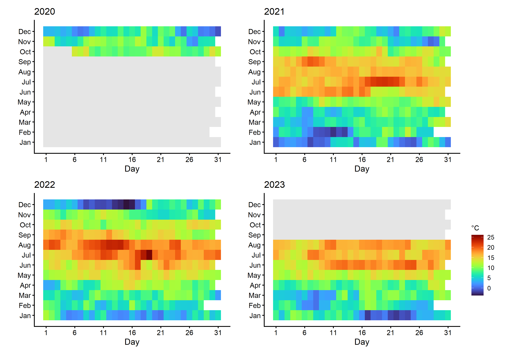
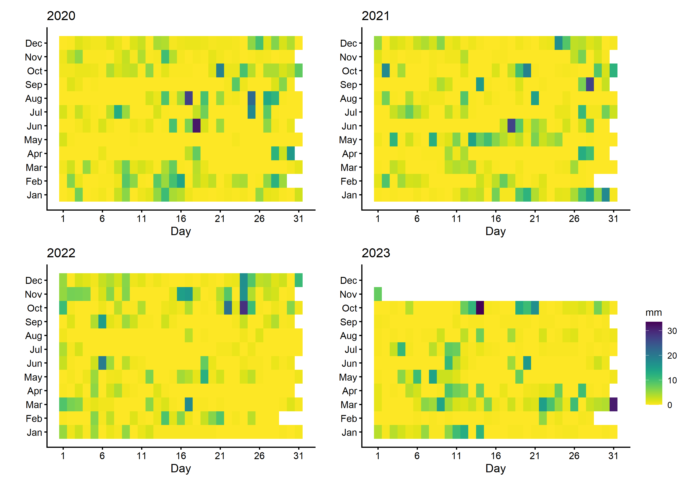
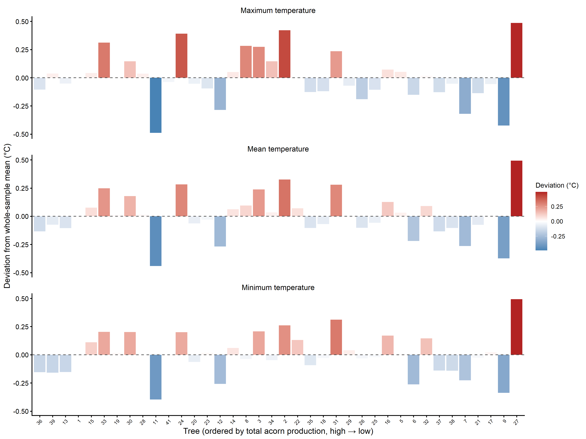

Wytham Masting Study — Microclimate Analysis
================
Wytham Masting Project
2026-07-29

# Overview

This document covers all **microclimate analyses** for the manuscript,
corresponding to Supplementary Figures 1–3 and Supplementary Table 9.

| Output | Description |
|----|----|
| SI Fig. 1 | Heatmap of daily mean temperature (2020–2023) |
| SI Fig. 2 | Heatmap of daily precipitation (2020–2023) |
| SI Fig. 3 | Individual tree deviations from mean microclimate |
| SI Table 9 | ANOVAs: microclimate ~ producer class × phenological period × year |

------------------------------------------------------------------------

# Packages and paths

``` r
library(tidyverse)
library(lubridate)
library(viridis)
library(car)       # Anova() type II
library(readxl)

# car loads MASS which masks dplyr::select — restore it
select <- dplyr::select
filter <- dplyr::filter

DATA_RAW <- file.path("..", "data", "raw")
FIG_OUT  <- file.path("..", "outputs", "figures")
TAB_OUT  <- file.path("..", "outputs", "tables")

dir.create(FIG_OUT, recursive = TRUE, showWarnings = FALSE)
dir.create(TAB_OUT, recursive = TRUE, showWarnings = FALSE)

source("proj_theme.R")
```

------------------------------------------------------------------------

# Data loading

## Tree microclimate logger data

Logger data were cleaned in `Logger_cleaning.R` (archived in
`obsolete/`) and saved as an RDS file containing daily mean, maximum,
and minimum temperatures per tree. Loggers were deployed in October
2020.

``` r
mc <- readRDS(file.path(DATA_RAW, "tree_microclimate_daily_2020_2023.rds"))

mc <- mc %>%
  mutate(
    Date = as.Date(Date),
    Tree = as.factor(Tree),
    year = year(Date),
    month = month(Date),
    day   = day(Date)
  ) %>%
  filter(Tree != "ET")

cat("Microclimate data:", nrow(mc), "rows\n")
```

    ## Microclimate data: 39927 rows

``` r
cat("Date range:", format(min(mc$Date)), "to", format(max(mc$Date)), "\n")
```

    ## Date range: 2020-10-06 to 2023-08-31

``` r
cat("Trees:", nlevels(mc$Tree), "\n")
```

    ## Trees: 39

## Precipitation data

Daily precipitation from the UK Environmental Change Network (ECN)
Wytham station (data courtesy of Stefanie M. Schäfer and Denise Palle).

``` r
precip <- read_csv(file.path(DATA_RAW, "wytham_daily_precipitation_2020_2023.csv"),
                   col_names = c("Date", "Rainfall_mm"),
                   show_col_types = FALSE) %>%
  mutate(
    Date       = dmy(Date),
    Rainfall_mm = suppressWarnings(as.numeric(Rainfall_mm)),
    year   = year(Date),
    month  = month(Date),
    day    = day(Date)
  ) %>%
  filter(!is.na(Date))

cat("Precipitation data:", nrow(precip), "rows |",
    format(min(precip$Date)), "to", format(max(precip$Date)), "\n")
```

    ## Precipitation data: 1402 rows | 2020-01-01 to 2023-11-01

## Producer class classification

Used for SI Table 9 grouping.

``` r
full_df <- read_excel(file.path(DATA_RAW, "wytham_full_dataset.xlsx"),
                      sheet = "Data") %>%
  filter(TREE_ID != "ET") %>%
  select(TREE_ID, PRODUCER) %>%
  distinct() %>%
  mutate(Tree     = as.factor(TREE_ID),
         PRODUCER = as.factor(PRODUCER))

mc <- mc %>% left_join(full_df, by = "Tree")
```

------------------------------------------------------------------------

# SI Figure 1: Daily mean temperature heatmap

The heatmap spans the full calendar years 2020–2023. Logger data begins
October 2020 (logger deployment date); cells for January–September 2020
are left blank (NA) in the per-tree data.

``` r
# Population-mean daily temperature across trees
mc_pop_daily <- mc %>%
  group_by(Date, year, month, day) %>%
  summarise(
    Temp_mean = mean(Temperature, na.rm = TRUE),
    n_trees   = sum(!is.na(Temperature)),
    .groups   = "drop"
  )

# Expand grid to include all calendar dates 2020–2023
all_dates <- tibble(Date = seq(as.Date("2020-01-01"),
                               as.Date("2023-12-31"), by = "day")) %>%
  mutate(year = year(Date), month = month(Date), day = day(Date))

mc_full_grid <- all_dates %>%
  left_join(mc_pop_daily, by = c("Date", "year", "month", "day"))

# Global temperature range for consistent scale
t_min <- min(mc_pop_daily$Temp_mean, na.rm = TRUE)
t_max <- max(mc_pop_daily$Temp_mean, na.rm = TRUE)

# One heatmap per year
plot_year_heatmap <- function(df, yr, legend = FALSE) {
  p <- df %>%
    filter(year == yr) %>%
    ggplot(aes(x = day, y = month, fill = Temp_mean)) +
    geom_tile() +
    scale_fill_viridis(option = "H", direction = 1,
                       limits = c(t_min, t_max),
                       name = "°C", na.value = "grey90") +
    scale_x_continuous(limits = c(0.5, 31.5),
                       breaks = seq(1, 31, by = 5)) +
    scale_y_continuous(limits = c(0.5, 12.5),
                       breaks = 1:12,
                       labels = month.abb) +
    labs(title = yr, x = "Day", y = "") +
    proj_theme +
    theme(panel.grid = element_blank(),
          axis.text.x = element_text(size = 10))

  if (!legend) p <- p + guides(fill = "none")
  p
}

library(patchwork)

p_2020 <- plot_year_heatmap(mc_full_grid, 2020)
p_2021 <- plot_year_heatmap(mc_full_grid, 2021)
p_2022 <- plot_year_heatmap(mc_full_grid, 2022)
p_2023 <- plot_year_heatmap(mc_full_grid, 2023, legend = TRUE)

si_fig1 <- (p_2020 | p_2021) / (p_2022 | p_2023)
si_fig1
```

<div class="figure">


<p class="caption">

SI Fig. 1. Heatmap of daily mean temperature (°C) averaged across all
tree-mounted loggers, 2020–2023. Grey cells indicate dates prior to
logger deployment (loggers deployed October 2020) or dates with no
logger data. The global colour scale spans -5.5°C to +28°C.
</p>

</div>

``` r
ggsave(file.path(FIG_OUT, "SI_Fig1_temperature_heatmap_2020_2023.pdf"),
       si_fig1, width = 170, height = 140, units = "mm")
ggsave(file.path(FIG_OUT, "SI_Fig1_temperature_heatmap_2020_2023.png"),
       si_fig1, width = 170, height = 140, units = "mm", dpi = 300)
```

------------------------------------------------------------------------

# SI Figure 2: Daily precipitation heatmap

``` r
prec_min <- 0
prec_max <- max(precip$Rainfall_mm, na.rm = TRUE)

plot_precip_heatmap <- function(df, yr, legend = FALSE) {
  p <- df %>%
    filter(year == yr) %>%
    ggplot(aes(x = day, y = month, fill = Rainfall_mm)) +
    geom_tile() +
    scale_fill_viridis(option = "D", direction = -1,
                       limits = c(prec_min, prec_max),
                       name = "mm", na.value = "grey90") +
    scale_x_continuous(limits = c(0.5, 31.5),
                       breaks = seq(1, 31, by = 5)) +
    scale_y_continuous(limits = c(0.5, 12.5),
                       breaks = 1:12,
                       labels = month.abb) +
    labs(title = yr, x = "Day", y = "") +
    proj_theme +
    theme(panel.grid = element_blank(),
          axis.text.x = element_text(size = 10))

  if (!legend) p <- p + guides(fill = "none")
  p
}

p2_2020 <- plot_precip_heatmap(precip, 2020)
p2_2021 <- plot_precip_heatmap(precip, 2021)
p2_2022 <- plot_precip_heatmap(precip, 2022)
p2_2023 <- plot_precip_heatmap(precip, 2023, legend = TRUE)

si_fig2 <- (p2_2020 | p2_2021) / (p2_2022 | p2_2023)

si_fig2
```

<div class="figure">


<p class="caption">

SI Fig. 2. Heatmap of daily total precipitation (mm) at Wytham Woods,
2020–2023, from the UK Environmental Change Network (ECN) station.
</p>

</div>

``` r
ggsave(file.path(FIG_OUT, "SI_Fig2_precipitation_heatmap_2020_2023.pdf"),
       si_fig2, width = 170, height = 140, units = "mm")
ggsave(file.path(FIG_OUT, "SI_Fig2_precipitation_heatmap_2020_2023.png"),
       si_fig2, width = 170, height = 140, units = "mm", dpi = 300)
```

------------------------------------------------------------------------

# SI Figure 3: Individual tree microclimate deviations

Differences between each individual tree’s daily mean/max/min
temperature and the population mean, ordered by acorn production rank
(high to low).

``` r
# Order trees by total visual count (needs visual count data)
viz <- read_excel(file.path(DATA_RAW, "visual_counts_2020_2023.xlsx"),
                  sheet = "Sheet1") %>%
  filter(Tree != "ET") %>%
  mutate(Tree = as.character(Tree))

tree_rank <- viz %>%
  group_by(Tree) %>%
  summarise(total_acorns = sum(Counts, na.rm = TRUE), .groups = "drop") %>%
  arrange(desc(total_acorns)) %>%
  mutate(rank = row_number())

tree_order_vec <- tree_rank$Tree
```

``` r
# Per-tree mean of daily mean, max, min temperature across all logger days
tree_temp_means <- mc %>%
  filter(!is.na(Tree)) %>%
  group_by(Tree) %>%
  summarise(
    Mean = mean(Temperature,         na.rm = TRUE),
    Max  = mean(Maximum.Temperature, na.rm = TRUE),
    Min  = mean(Minimum.Temperature, na.rm = TRUE),
    .groups = "drop"
  )

# Population mean for each metric
pop_means <- tree_temp_means %>%
  summarise(across(c(Mean, Max, Min), \(x) mean(x, na.rm = TRUE)))

# Deviation per tree per metric
mc_dev <- tree_temp_means %>%
  mutate(
    Mean = Mean - pop_means$Mean,
    Max  = Max  - pop_means$Max,
    Min  = Min  - pop_means$Min,
    Tree = factor(as.character(Tree), levels = tree_order_vec)
  ) %>%
  pivot_longer(c(Max, Mean, Min),
               names_to  = "Metric",
               values_to = "deviation") %>%
  mutate(Metric = factor(Metric, levels = c("Max", "Mean", "Min"),
                         labels = c("Maximum temperature",
                                    "Mean temperature",
                                    "Minimum temperature")))

si_fig3 <- ggplot(mc_dev, aes(x = Tree, y = deviation, fill = deviation)) +
  geom_col() +
  geom_hline(yintercept = 0, linetype = "dashed", colour = "grey30") +
  scale_fill_gradient2(low = "steelblue", mid = "white", high = "firebrick",
                       midpoint = 0, name = "Deviation (°C)") +
  facet_wrap(~ Metric, ncol = 1) +
  labs(
    x = "Tree (ordered by total acorn production, high → low)",
    y = "Deviation from whole-sample mean (°C)"
  ) +
  proj_theme +
  theme(
    axis.text.x     = element_text(size = 7, angle = 45, hjust = 1),
    panel.grid      = element_blank(),
    legend.position = "right"
  )

si_fig3
```

<div class="figure">


<p class="caption">

SI Fig. 3. Difference of maximum, minimum and mean temperature for 38
individual pedunculate oak trees at Wytham Woods, Oxford from means of
the whole sample. The x-axis is ordered by tree from high to low numbers
of total acorns produced in 2020–2023.
</p>

</div>

``` r
ggsave(file.path(FIG_OUT, "SI_Fig3_individual_tree_temp_deviations.pdf"),
       si_fig3, width = 170, height = 110, units = "mm")
ggsave(file.path(FIG_OUT, "SI_Fig3_individual_tree_temp_deviations.png"),
       si_fig3, width = 170, height = 110, units = "mm", dpi = 300)
```

------------------------------------------------------------------------

# SI Table 9: ANOVAs for microclimate × producer class

These linear models test whether trees classified as high, average, or
poor acorn producers differ in their microclimate, whether microclimate
differed across years, and whether there are producer class × year
interactions.

``` r
# Seasonal averages per tree per year
mc_seasonal <- mc %>%
  filter(!is.na(PRODUCER)) %>%
  mutate(
    season = case_when(
      month %in% 4:5  ~ "Budburst",
      month %in% 6:8  ~ "AcornDev",
      month %in% 10:12 ~ "PostLeafDrop",
      TRUE             ~ NA_character_
    )
  ) %>%
  filter(!is.na(season)) %>%
  group_by(Tree, PRODUCER, year, season) %>%
  summarise(
    mean_temp = mean(Temperature, na.rm = TRUE),
    max_temp  = mean(Maximum.Temperature, na.rm = TRUE),
    min_temp  = mean(Minimum.Temperature, na.rm = TRUE),
    .groups   = "drop"
  ) %>%
  mutate(
    year    = as.factor(year),
    season  = factor(season,
                     levels = c("Budburst", "AcornDev", "PostLeafDrop"),
                     labels = c("Budburst (Apr–May)",
                                "Acorn dev. (Jun–Aug)",
                                "Post-leaf-drop (Oct–Dec)"))
  )

# ANOVA function (type II)
run_mc_anova <- function(resp_var, label) {
  formula <- as.formula(
    paste(resp_var, "~ PRODUCER * year + season + PRODUCER:season")
  )
  m <- lm(formula, data = mc_seasonal)
  av <- Anova(m, type = "II")
  av_df <- as.data.frame(av) %>%
    rownames_to_column("Term") %>%
    mutate(Response = label) %>%
    rename(`Sum Sq` = `Sum Sq`, `Df` = Df, `F value` = `F value`, `Pr(>F)` = `Pr(>F)`)
  av_df
}

anova_results <- bind_rows(
  run_mc_anova("mean_temp", "Mean temperature"),
  run_mc_anova("max_temp",  "Maximum temperature"),
  run_mc_anova("min_temp",  "Minimum temperature")
)

anova_display <- anova_results %>%
  filter(Term != "Residuals") %>%   # Residuals row has no F/p — exclude from display
  mutate(
    `Sum Sq`   = round(`Sum Sq`, 3),
    `F value`  = round(`F value`, 3),
    `Pr(>F)`   = ifelse(`Pr(>F)` < 0.001, "<0.001", as.character(round(`Pr(>F)`, 4)))
  ) %>%
  dplyr::select(Response, Term, Df, `Sum Sq`, `F value`, `Pr(>F)`)

knitr::kable(anova_display,
             caption = "**SI Table 9.** Results of linear model ANOVAs
             (Type II SS) testing the effects of acorn producer class
             (High/Average/Poor), phenological season, year, and their
             interactions on daily mean, maximum, and minimum temperatures
             of 38 pedunculate oak trees at Wytham Woods.",
             align = "llrrrr")
```

| Response            | Term            |  Df |   Sum Sq |  F value | Pr(\>F) |
|:--------------------|:----------------|----:|---------:|---------:|--------:|
| Mean temperature    | PRODUCER        |   2 |    1.101 |    1.328 |  0.2664 |
| Mean temperature    | year            |   3 |  113.987 |   91.713 | \<0.001 |
| Mean temperature    | season          |   2 | 3723.088 | 4493.342 | \<0.001 |
| Mean temperature    | PRODUCER:year   |   6 |    0.158 |    0.064 |   0.999 |
| Mean temperature    | PRODUCER:season |   4 |    0.143 |    0.086 |  0.9866 |
| Maximum temperature | PRODUCER        |   2 |    1.921 |    2.321 |  0.0998 |
| Maximum temperature | year            |   3 |  114.054 |   91.858 | \<0.001 |
| Maximum temperature | season          |   2 | 3777.241 | 4563.260 | \<0.001 |
| Maximum temperature | PRODUCER:year   |   6 |    0.275 |    0.111 |  0.9951 |
| Maximum temperature | PRODUCER:season |   4 |    0.242 |    0.146 |  0.9646 |
| Minimum temperature | PRODUCER        |   2 |    0.767 |    0.896 |  0.4094 |
| Minimum temperature | year            |   3 |  112.292 |   87.408 | \<0.001 |
| Minimum temperature | season          |   2 | 3691.288 | 4309.919 | \<0.001 |
| Minimum temperature | PRODUCER:year   |   6 |    0.112 |    0.044 |  0.9997 |
| Minimum temperature | PRODUCER:season |   4 |    0.116 |    0.068 |  0.9915 |

**SI Table 9.** Results of linear model ANOVAs (Type II SS) testing the
effects of acorn producer class (High/Average/Poor), phenological
season, year, and their interactions on daily mean, maximum, and minimum
temperatures of 38 pedunculate oak trees at Wytham Woods.

``` r
write.csv(anova_display,
          file.path(TAB_OUT, "SI_Table9_microclimate_ANOVA.csv"),
          row.names = FALSE)
```

------------------------------------------------------------------------

# Session information

``` r
sessionInfo()
```

    ## R version 4.5.2 (2025-10-31 ucrt)
    ## Platform: x86_64-w64-mingw32/x64
    ## Running under: Windows 11 x64 (build 26200)
    ## 
    ## Matrix products: default
    ##   LAPACK version 3.12.1
    ## 
    ## locale:
    ## [1] LC_COLLATE=English_United Kingdom.utf8 
    ## [2] LC_CTYPE=English_United Kingdom.utf8   
    ## [3] LC_MONETARY=English_United Kingdom.utf8
    ## [4] LC_NUMERIC=C                           
    ## [5] LC_TIME=English_United Kingdom.utf8    
    ## 
    ## time zone: Europe/London
    ## tzcode source: internal
    ## 
    ## attached base packages:
    ## [1] stats     graphics  grDevices utils     datasets  methods   base     
    ## 
    ## other attached packages:
    ##  [1] patchwork_1.3.2    scales_1.4.0       car_3.1-5          carData_3.0-6     
    ##  [5] plotrix_3.8-14     geomtextpath_0.2.0 viridis_0.6.5      viridisLite_0.4.2 
    ##  [9] ggthemes_5.2.0     readxl_1.4.5       lubridate_1.9.4    forcats_1.0.1     
    ## [13] stringr_1.6.0      dplyr_1.1.4        purrr_1.2.2        readr_2.1.6       
    ## [17] tidyr_1.3.1        tibble_3.3.0       ggplot2_4.0.1      tidyverse_2.0.0   
    ## [21] rmarkdown_2.30    
    ## 
    ## loaded via a namespace (and not attached):
    ##  [1] gtable_0.3.6       xfun_0.57          lattice_0.22-7     tzdb_0.5.0        
    ##  [5] vctrs_0.7.3        tools_4.5.2        generics_0.1.4     parallel_4.5.2    
    ##  [9] pkgconfig_2.0.3    Matrix_1.7-4       RColorBrewer_1.1-3 S7_0.2.1          
    ## [13] lifecycle_1.0.5    compiler_4.5.2     farver_2.1.2       textshaping_1.0.5 
    ## [17] htmltools_0.5.9    yaml_2.3.12        Formula_1.2-5      crayon_1.5.3      
    ## [21] pillar_1.11.1      abind_1.4-8        nlme_3.1-168       tidyselect_1.2.1  
    ## [25] digest_0.6.39      stringi_1.8.7      labeling_0.4.3     splines_4.5.2     
    ## [29] fastmap_1.2.0      grid_4.5.2         cli_3.6.5          magrittr_2.0.4    
    ## [33] utf8_1.2.6         withr_3.0.2        bit64_4.6.0-1      timechange_0.3.0  
    ## [37] bit_4.6.0          otel_0.2.0         gridExtra_2.3      cellranger_1.1.0  
    ## [41] ragg_1.5.1         hms_1.1.4          evaluate_1.0.5     knitr_1.51        
    ## [45] mgcv_1.9-3         rlang_1.2.0        glue_1.8.0         vroom_1.7.0       
    ## [49] R6_2.6.1           systemfonts_1.3.2
