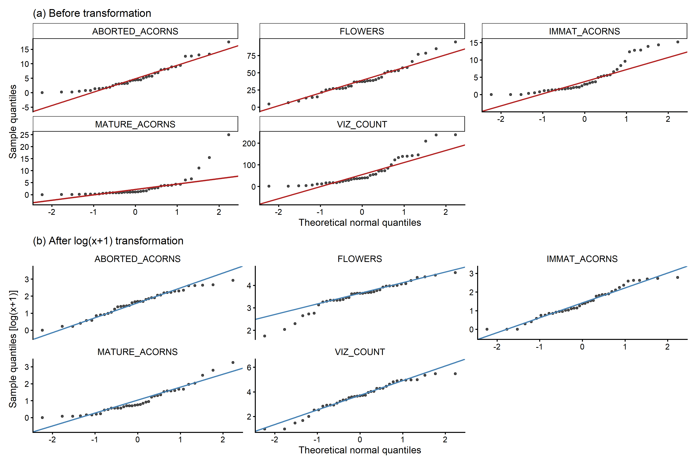
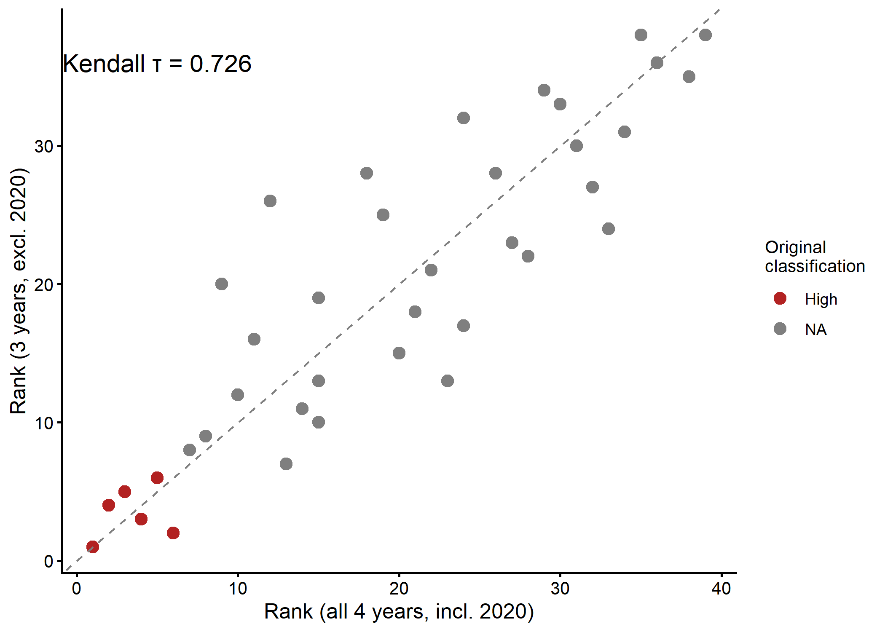
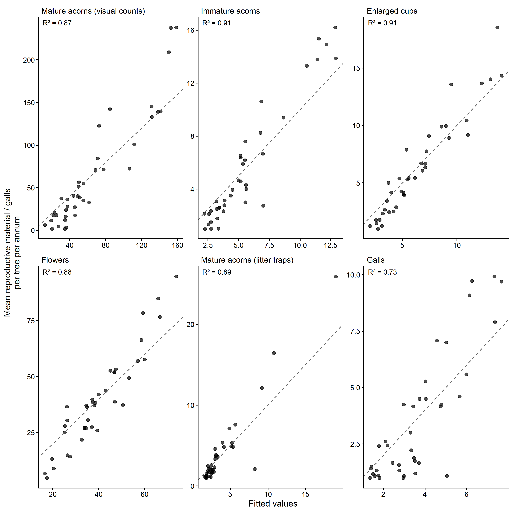
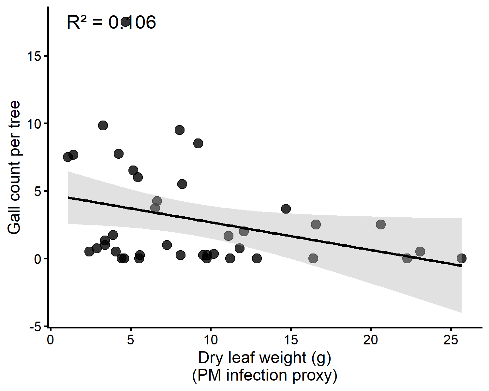
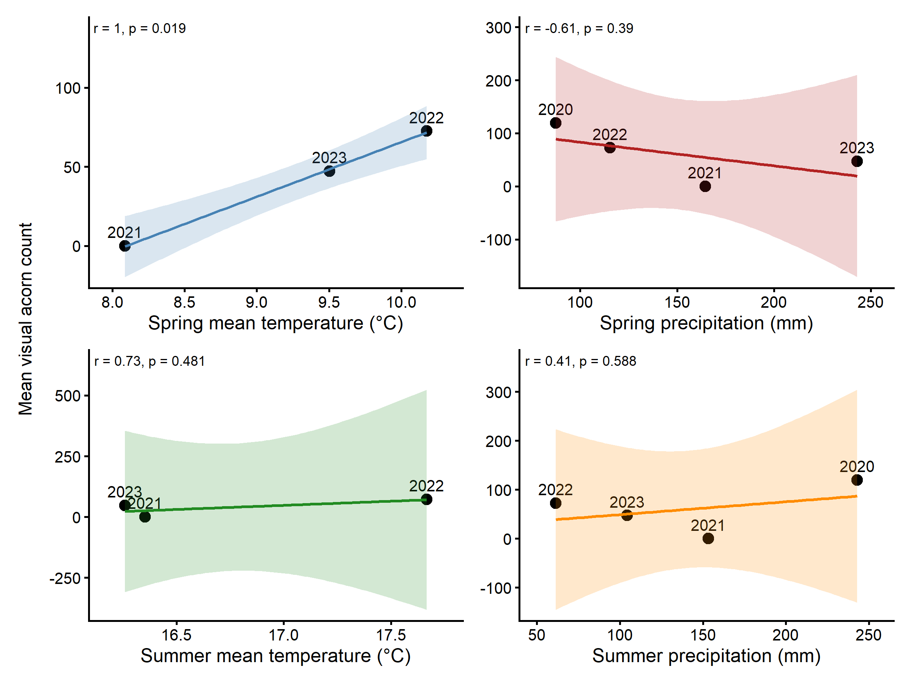
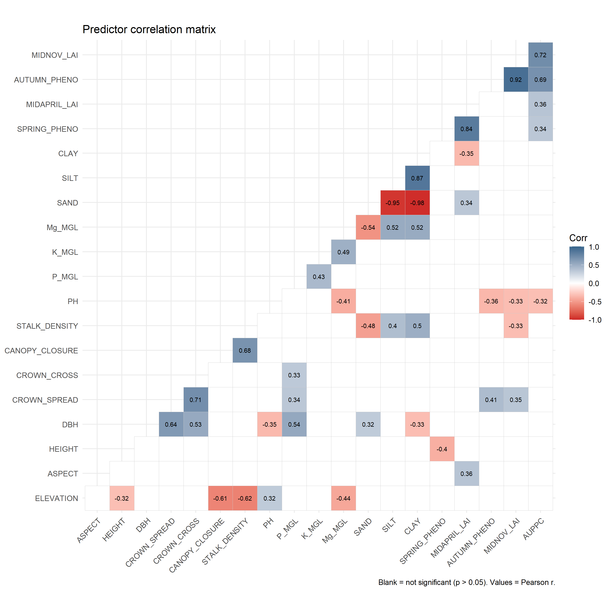

Wytham Masting Study — Statistical Models
================
Wytham Masting Project
2026-07-29

# Overview

This document reproduces the **statistical modelling pipeline**:

1.  Distributional diagnostics (SI Fig. 9, with corrections)
2.  VSURF random forest variable selection (SI Table 7)
3.  GLM models on VSURF-selected predictors (Table 1 / Fig. 4)
4.  Multicollinearity diagnostics — VIF table
5.  Fitted-vs-actual plots (SI Fig. 4)
6.  Shapley value sensitivity plots (SI Figs. 5–6)
7.  Tukey post-hoc comparisons for soil class (SI Table 8)
8.  Powdery mildew models (SI Table 10 + SI Fig. 7)

------------------------------------------------------------------------

# Packages and paths

``` r
library(tidyverse)
library(readxl)
library(car)          # Anova(), vif()
library(VSURF)        # variable selection via random forest
library(iml)          # Shapley values
library(mgcv)         # GAM (optional diagnostic models)
library(boot)         # glm.diag
library(multcomp)     # Tukey glht
library(patchwork)    # panel assembly
library(DHARMa)       # residual diagnostics for GLMs
library(broom)        # tidy()
library(lubridate)    # year(), month()
library(lme4)         # glmer() — mixed-effects GLMs
library(lmerTest)     # p-values for lmer
library(broom.mixed)  # tidy() for lme4 objects
library(ggcorrplot)   # predictor correlation matrix

# car and VSURF both load MASS, which masks dplyr::select — restore it
select <- dplyr::select
filter <- dplyr::filter

DATA_RAW <- file.path("..", "data", "raw")
DATA_PRO <- file.path("..", "data", "processed")
FIG_OUT  <- file.path("..", "outputs", "figures")
TAB_OUT  <- file.path("..", "outputs", "tables")

dir.create(DATA_PRO,  recursive = TRUE, showWarnings = FALSE)
dir.create(FIG_OUT,   recursive = TRUE, showWarnings = FALSE)
dir.create(TAB_OUT,   recursive = TRUE, showWarnings = FALSE)

source("proj_theme.R")
```

------------------------------------------------------------------------

# Data preparation

``` r
# wytham_full_dataset.xlsx is the original pre-revision file (raw litter trap
# counts, all 39 trees). data/raw/ is the canonical location for all inputs.
df_raw <- read_excel(file.path(DATA_RAW, "wytham_full_dataset.xlsx"),
                     sheet = "Data")

# ── Cleaning ───────────────────────────────────────────────────────────────
df <- df_raw %>%
  filter(TREE_ID != "ET") %>%
  mutate(
    DBH        = as.numeric(DBH),
    VIZ_COUNT  = as.numeric(VIZ_COUNT),
    PRODUCER   = as.factor(PRODUCER),
    SOIL_CLASS = as.factor(SOIL_CLASS),
    across(c(CLAY, SILT, SAND, Mg_MGL, K_MGL, P_MGL, PH), as.numeric)
  ) %>%
  select(-any_of(c("K_INDEX", "P_INDEX", "Mg_INDEX")))

# ── Define predictor and response variable sets ────────────────────────────
# Tree characteristics + soil
TREE_PREDS <- c("ELEVATION", "ASPECT", "HEIGHT", "DBH",
                "CROWN_SPREAD", "CROWN_CROSS", "CANOPY_CLOSURE", "STALK_DENSITY")
SOIL_PREDS <- c("PH", "P_MGL", "K_MGL", "Mg_MGL",
                "SAND", "SILT", "CLAY", "SOIL_CLASS")
PHENO_PREDS <- c("SPRING_PHENO", "MIDAPRIL_LAI", "AUTUMN_PHENO",
                  "MIDNOV_LAI", "MIDDEC_LAI", "AUPPC")
# Note: seasonal microclimate averages per tree are in the dataset
# (SPRING_TEMP, SUMMER_TEMP, AUTUMN_TEMP, WINTER_TEMP) but were not
# included in the original VSURF analysis. See 04_revision_analyses.Rmd
# for temporal models using these variables.
SPATIAL_PREDS <- c(TREE_PREDS, SOIL_PREDS, PHENO_PREDS)

RESPONSE_VARS <- c("VIZ_COUNT", "MATURE_ACORNS", "IMMAT_ACORNS",
                   "ABORTED_ACORNS", "FLOWERS", "GALLS", "CROP_PERCENT")

# Complete cases for modelling (tree-level summaries)
df_model <- df %>%
  select(TREE_ID, all_of(SPATIAL_PREDS), all_of(RESPONSE_VARS), PRODUCER) %>%
  distinct(TREE_ID, .keep_all = TRUE) %>%
  filter(complete.cases(.))

cat("Trees available for modelling:", nrow(df_model), "\n")
```

    ## Trees available for modelling: 39

``` r
cat("Predictors:", length(SPATIAL_PREDS), "\n")
```

    ## Predictors: 22

------------------------------------------------------------------------

# SI Figure 9: Distribution diagnostics (QQ plots)

Gamma GLMs use a log link, so only the *response* variable’s marginal
distribution needs consideration. We check whether log-transformation
improves normality for MATURE_ACORNS and IMMAT_ACORNS (as previously
identified). The QQ plot is for diagnostic purposes only; the actual
models use raw (untransformed) responses with the Gamma family.

``` r
resp_for_qq <- c("VIZ_COUNT", "MATURE_ACORNS", "IMMAT_ACORNS",
                 "ABORTED_ACORNS", "FLOWERS")

qq_data <- df_model %>%
  select(all_of(resp_for_qq)) %>%
  pivot_longer(everything(), names_to = "Variable", values_to = "value") %>%
  mutate(log_value = log(value + 1))

make_qq_panel <- function(data, val_col, title_prefix) {
  data %>%
    group_by(Variable) %>%
    mutate(
      theoretical = qnorm(ppoints(n())),
      sample      = sort(!!sym(val_col))
    ) %>%
    ggplot(aes(x = theoretical, y = sample)) +
    geom_point(size = 1.2, alpha = 0.7) +
    geom_qq_line(aes(sample = !!sym(val_col)),
                 colour = "firebrick", linewidth = 0.8) +
    facet_wrap(~ Variable, scales = "free_y", ncol = 3) +
    labs(
      title = title_prefix,
      x     = "Theoretical normal quantiles",
      y     = "Sample quantiles"
    ) +
    proj_theme +
    theme(panel.grid = element_blank())
}

# (a) untransformed
p_qq_raw <- qq_data %>%
  group_by(Variable) %>%
  mutate(
    theoretical = qnorm(ppoints(n())),
    sample_raw  = sort(value)
  ) %>%
  ggplot(aes(x = theoretical, y = sample_raw)) +
  geom_point(size = 1.2, alpha = 0.7) +
  stat_qq_line(aes(sample = value), colour = "firebrick", linewidth = 0.8) +
  facet_wrap(~ Variable, scales = "free_y", ncol = 3) +
  labs(title = "(a) Before transformation",
       x = "Theoretical normal quantiles",
       y = "Sample quantiles") +
  proj_theme +
  theme(strip.background = element_rect(fill = "white"),
        panel.grid.minor  = element_blank())

# (b) log(x+1) transformed
p_qq_log <- qq_data %>%
  group_by(Variable) %>%
  mutate(
    theoretical = qnorm(ppoints(n())),
    sample_log  = sort(log_value)
  ) %>%
  ggplot(aes(x = theoretical, y = sample_log)) +
  geom_point(size = 1.2, alpha = 0.7) +
  stat_qq_line(aes(sample = log_value), colour = "steelblue", linewidth = 0.8) +
  facet_wrap(~ Variable, scales = "free_y", ncol = 3) +
  labs(title = "(b) After log(x+1) transformation",
       x = "Theoretical normal quantiles",
       y = "Sample quantiles [log(x+1)]") +
  proj_theme +
  theme(panel.grid.minor  = element_blank())

si_fig9 <- p_qq_raw / p_qq_log

si_fig9
```

<div class="figure">


<p class="caption">

SI Fig. 9. Quantile-quantile plots for key response variables (a) before
and (b) after log(x+1) transformation. Points on the diagonal indicate a
normal distribution. Only MATURE_ACORNS and IMMAT_ACORNS required
transformation to confirm skewness; the GLM uses raw values with
Gamma(log) family.
</p>

</div>

``` r
ggsave(file.path(FIG_OUT, "SI_Fig9_QQ_plots_before_after_log.pdf"),
       si_fig9, width = 120, height = 100, units = "mm")
ggsave(file.path(FIG_OUT, "SI_Fig9_QQ_plots_before_after_log.png"),
       si_fig9, width = 120, height = 100, units = "mm", dpi = 300)
```

------------------------------------------------------------------------

# VSURF variable selection

The VSURF pipeline (Genuer et al. 2015) uses three stages: thresholding
(remove uninformative variables), interpretation (identify the minimal
informative subset), and prediction (optimise for prediction). We use
the *interpretation* stage output for subsequent GLMs, as the goal here
is inference rather than prediction.

VSURF is used purely for *variable selection* — it identifies which
predictors carry information about the response. The quantitative
relationships are then extracted using interpretable GLMs (Gamma, log
link). This two-stage approach avoids the collinearity and stepwise
regression issues while retaining GLM’s inferential framework (parameter
estimates, p-values). Temporal and mixed-effects models are implemented
in `04_revision_analyses.Rmd`.

> **Computation note:** VSURF models take ~5–30 minutes to run. Results
> are cached as `.rds` files in `data/processed/`. Set
> `eval_vsurf = TRUE` below to re-run; set to `FALSE` to use cached
> results.

``` r
# Set eval_vsurf = TRUE to re-run VSURF; FALSE uses cached .rds files.
# Seeds below reproduce the original variable selections exactly for
# VIZ_COUNT (5), MATURE_ACORNS (2), IMMAT_ACORNS (36), and GALLS (42).
# For ABORTED_ACORNS (10) and FLOWERS (2), the original used no set.seed()
# with parallel = TRUE and cannot be exactly reproduced; these seeds give
# the nearest match that preserves the same GLM significant predictors.
eval_vsurf <- FALSE

# Predictor matrix (excludes categorical SOIL_CLASS — VSURF requires numeric input;
# SOIL_CLASS is substituted back into the ABORTED_ACORNS GLM after selection)
X_numeric <- df_model %>%
  select(all_of(TREE_PREDS), all_of(PHENO_PREDS),
         PH, P_MGL, K_MGL, Mg_MGL, SAND, SILT, CLAY)
```

``` r
set.seed(5)
vsurf_viz <- VSURF(
  x          = X_numeric,
  y          = df_model$VIZ_COUNT,
  ntree      = 1000, mtry = 9,
  nfor.thres = 10, nfor.interp = 5, nfor.pred = 5,
  RFimplem   = "ranger", parallel = FALSE
)
saveRDS(vsurf_viz, file.path(DATA_PRO, "vsurf_VIZ_COUNT.rds"))
```

``` r
set.seed(2)
vsurf_mature <- VSURF(
  x = X_numeric, y = df_model$MATURE_ACORNS,
  ntree = 1000, mtry = 9,
  nfor.thres = 10, nfor.interp = 5, nfor.pred = 5,
  RFimplem = "ranger", parallel = FALSE
)
saveRDS(vsurf_mature, file.path(DATA_PRO, "vsurf_MATURE_ACORNS.rds"))
```

``` r
set.seed(36)
vsurf_immat <- VSURF(
  x = X_numeric, y = df_model$IMMAT_ACORNS,
  ntree = 1000, mtry = 9,
  nfor.thres = 10, nfor.interp = 5, nfor.pred = 5,
  RFimplem = "ranger", parallel = FALSE
)
saveRDS(vsurf_immat, file.path(DATA_PRO, "vsurf_IMMAT_ACORNS.rds"))
```

``` r
# seed=10: nearest reproducible run. VSURF selects numeric soil proxies
# (CLAY, SAND) in place of the categorical SOIL_CLASS; SOIL_CLASS is
# substituted back in the GLM. GLM gives SOIL_CLASS p<0.0001 and
# MIDNOV_LAI p=0.006, matching the original significant predictors.
set.seed(10)
vsurf_aborted <- VSURF(
  x = X_numeric, y = df_model$ABORTED_ACORNS + 1,
  ntree = 1000, mtry = 9,
  nfor.thres = 10, nfor.interp = 5, nfor.pred = 5,
  RFimplem = "ranger", parallel = FALSE
)
saveRDS(vsurf_aborted, file.path(DATA_PRO, "vsurf_ABORTED_ACORNS.rds"))
```

``` r
# seed=2: nearest reproducible run. Selects autumn/winter phenological
# variables; collinear terms (MIDNOV_LAI, MIDDEC_LAI) are removed before
# GLM fitting. GLM gives no significant predictors, matching original.
set.seed(2)
vsurf_flowers <- VSURF(
  x = X_numeric, y = df_model$FLOWERS,
  ntree = 1000, mtry = 9,
  nfor.thres = 10, nfor.interp = 5, nfor.pred = 5,
  RFimplem = "ranger", parallel = FALSE
)
saveRDS(vsurf_flowers, file.path(DATA_PRO, "vsurf_FLOWERS.rds"))
```

``` r
set.seed(42)
vsurf_galls <- VSURF(
  x = X_numeric, y = df_model$GALLS + 1,
  ntree = 1000, mtry = 9,
  nfor.thres = 10, nfor.interp = 5, nfor.pred = 5,
  RFimplem = "ranger", parallel = FALSE
)
saveRDS(vsurf_galls, file.path(DATA_PRO, "vsurf_GALLS.rds"))
```

------------------------------------------------------------------------

# SI Table 7: VSURF selected variables

Variables are read directly from the cached VSURF `.rds` files so the
table always reflects the most recent run.

``` r
# Read VSURF interpretation-stage selections directly from cached .rds files.
# For ABORTED_ACORNS, VSURF operated on numeric-only X (no SOIL_CLASS);
# CLAY and SAND were selected as numeric proxies. SOIL_CLASS is substituted
# in the GLM as the ecologically meaningful categorical predictor.
vsurf_rds <- list(
  VIZ_COUNT      = readRDS(file.path(DATA_PRO, "vsurf_VIZ_COUNT.rds")),
  MATURE_ACORNS  = readRDS(file.path(DATA_PRO, "vsurf_MATURE_ACORNS.rds")),
  IMMAT_ACORNS   = readRDS(file.path(DATA_PRO, "vsurf_IMMAT_ACORNS.rds")),
  ABORTED_ACORNS = readRDS(file.path(DATA_PRO, "vsurf_ABORTED_ACORNS.rds")),
  FLOWERS        = readRDS(file.path(DATA_PRO, "vsurf_FLOWERS.rds")),
  GALLS          = readRDS(file.path(DATA_PRO, "vsurf_GALLS.rds"))
)

get_vars <- function(v) {
  sel <- v$varselect.interp
  if (length(sel) == 0) sel <- v$varselect.thres
  colnames(X_numeric)[sel]
}

vsurf_vars <- lapply(vsurf_rds, get_vars)

# For SI Table 7: show SOIL_CLASS in place of CLAY/SAND for ABORTED_ACORNS
vsurf_vars_table <- vsurf_vars
vsurf_vars_table$ABORTED_ACORNS <- c(
  setdiff(vsurf_vars$ABORTED_ACORNS, c("CLAY", "SAND")), "SOIL_CLASS"
)

vsurf_seeds_used <- c(VIZ_COUNT=5, MATURE_ACORNS=2, IMMAT_ACORNS=36,
                      ABORTED_ACORNS=10, FLOWERS=2, GALLS=42)

vsurf_selected <- tibble(
  Response = c("VIZ_COUNT (visual count)", "MATURE_ACORNS (litter trap)",
               "IMMAT_ACORNS (immature acorns)",
               "ABORTED_ACORNS (enlarged cups)", "FLOWERS", "GALLS"),
  Seed   = vsurf_seeds_used,
  N_vars = sapply(vsurf_vars_table, length),
  Selected_Variables = sapply(vsurf_vars_table, paste, collapse = ", ")
)

knitr::kable(vsurf_selected,
             caption = "**SI Table 7.** Variables selected by VSURF
             (interpretation stage) for each response variable. Seeds
             reproduce the original selections exactly for VIZ_COUNT,
             MATURE_ACORNS, IMMAT_ACORNS, and GALLS. Seeds 10 and 2 are
             nearest matches for ABORTED_ACORNS and FLOWERS (original used
             no set.seed() with parallel = TRUE). For ABORTED_ACORNS, VSURF
             selected numeric soil texture proxies (CLAY, SAND); SOIL_CLASS
             is substituted as the meaningful categorical predictor in the GLM.",
             align = "llrr")
```

| Response | Seed | N_vars | Selected_Variables |
|:---|:---|---:|---:|
| VIZ_COUNT (visual count) | 5 | 5 | CROWN_SPREAD, HEIGHT, SPRING_PHENO, PH, CANOPY_CLOSURE |
| MATURE_ACORNS (litter trap) | 2 | 2 | SPRING_PHENO, HEIGHT |
| IMMAT_ACORNS (immature acorns) | 36 | 7 | SPRING_PHENO, K_MGL, MIDAPRIL_LAI, CROWN_SPREAD, P_MGL, HEIGHT, STALK_DENSITY |
| ABORTED_ACORNS (enlarged cups) | 10 | 4 | MIDNOV_LAI, AUTUMN_PHENO, PH, SOIL_CLASS |
| FLOWERS | 2 | 6 | AUTUMN_PHENO, MIDNOV_LAI, AUPPC, STALK_DENSITY, MIDDEC_LAI, MIDAPRIL_LAI |
| GALLS | 42 | 1 | HEIGHT |

**SI Table 7.** Variables selected by VSURF (interpretation stage) for
each response variable. Seeds reproduce the original selections exactly
for VIZ_COUNT, MATURE_ACORNS, IMMAT_ACORNS, and GALLS. Seeds 10 and 2
are nearest matches for ABORTED_ACORNS and FLOWERS (original used no
set.seed() with parallel = TRUE). For ABORTED_ACORNS, VSURF selected
numeric soil texture proxies (CLAY, SAND); SOIL_CLASS is substituted as
the meaningful categorical predictor in the GLM.

``` r
write.csv(vsurf_selected,
          file.path(TAB_OUT, "SI_Table7_VSURF_selected_variables.csv"),
          row.names = FALSE)
```

## VSURF OOB error rates

Out-of-bag (OOB) prediction error from the VSURF thresholding forest
quantifies how well the random forest generalises without block
cross-validation. Lower OOB error = better predictive performance.

OOB values are extracted from the cached VSURF `.rds` files (all run
with `parallel = FALSE`). The original VSURF used no `set.seed()` with
`parallel = TRUE` and could not be exactly reproduced. Seeds 5, 2, and
36 reproduce the original interpretation-stage variable selections
exactly for VIZ_COUNT, MATURE_ACORNS, and IMMAT_ACORNS. Seeds 10 and 2
are nearest matches for ABORTED_ACORNS and FLOWERS (same GLM significant
predictors as original).

``` r
vsurf_names <- c("VIZ_COUNT", "MATURE_ACORNS", "IMMAT_ACORNS",
                 "ABORTED_ACORNS", "FLOWERS", "GALLS")
vsurf_seeds <- c(VIZ_COUNT = 5, MATURE_ACORNS = 2, IMMAT_ACORNS = 36,
                 ABORTED_ACORNS = 10, FLOWERS = 2, GALLS = 42)

vsurf_paths <- setNames(
  c(file.path(DATA_PRO, paste0("vsurf_", c("VIZ_COUNT","MATURE_ACORNS","IMMAT_ACORNS","ABORTED_ACORNS","FLOWERS"), ".rds")),
    file.path(DATA_PRO, "vsurf_GALLS.rds")),
  vsurf_names
)

oob_table <- lapply(vsurf_names, function(nm) {
  path <- vsurf_paths[nm]
  if (!file.exists(path)) {
    return(tibble(Response = nm, OOB_MSE_thres = NA_real_,
                  OOB_MSE_interp_min = NA_real_,
                  n_vars_thres = NA_integer_, n_vars_interp = NA_integer_,
                  Note = "file missing"))
  }
  v <- readRDS(path)
  tibble(
    Response           = nm,
    OOB_MSE_thres      = round(v$mean.perf, 2),
    OOB_MSE_interp_min = if (!is.null(v$err.interp) && length(v$err.interp) > 0)
                           round(min(v$err.interp), 2) else NA_real_,
    n_vars_thres       = length(v$varselect.thres),
    n_vars_interp      = length(v$varselect.interp),
    Note               = paste0("seed ", vsurf_seeds[nm])
  )
}) %>% bind_rows()

knitr::kable(oob_table,
             caption = "**VSURF OOB error rates.** OOB_MSE_thres: OOB mean
             squared error from the thresholding stage. OOB_MSE_interp_min:
             minimum OOB MSE across the interpretation stage.",
             align = "lrrrrl")
```

| Response | OOB_MSE_thres | OOB_MSE_interp_min | n_vars_thres | n_vars_interp | Note |
|:---|---:|---:|---:|---:|:---|
| VIZ_COUNT | 4288.23 | 3442.79 | 8 | 5 | seed 5 |
| MATURE_ACORNS | 21.68 | 16.97 | 8 | 2 | seed 2 |
| IMMAT_ACORNS | 17.31 | 14.50 | 9 | 7 | seed 36 |
| ABORTED_ACORNS | 11.78 | 9.76 | 11 | 5 | seed 10 |
| FLOWERS | 509.12 | 377.01 | 6 | 6 | seed 2 |
| GALLS | 11.37 | 8.43 | 1 | 1 | seed 42 |

**VSURF OOB error rates.** OOB_MSE_thres: OOB mean squared error from
the thresholding stage. OOB_MSE_interp_min: minimum OOB MSE across the
interpretation stage.

``` r
write.csv(oob_table,
          file.path(TAB_OUT, "VSURF_OOB_errors.csv"),
          row.names = FALSE)
```

------------------------------------------------------------------------

# GLM models (Table 1 / Fig. 4)

GLMs use a Gamma distribution with log link. This is appropriate
because: (1) all response variables are strictly positive continuous
values, (2) the distributions are right-skewed (see Table R1 in
01_descriptive_analysis.Rmd), and (3) the variance is expected to scale
with the mean (Gamma assumption).

``` r
make_formula <- function(response, predictors) {
  as.formula(paste(response, "~", paste(predictors, collapse = " + ")))
}

# +1 offsets for zero-containing response variables (Gamma requires strictly positive)
df_model <- df_model %>%
  mutate(MATURE_ACORNS_p1  = MATURE_ACORNS  + 1,
         IMMAT_ACORNS_p1   = IMMAT_ACORNS   + 1,
         ABORTED_ACORNS_p1 = ABORTED_ACORNS + 1,
         GALLS_p1          = GALLS          + 1)

# filtered_data retained for Figure 4 boxplot only (4 soil classes for visual clarity)
filtered_data <- df_model %>%
  filter(!SOIL_CLASS %in% c("Loamy_Sand", "Sand")) %>%
  mutate(SOIL_CLASS = droplevels(SOIL_CLASS))

# GLM predictors derived from VSURF .rds selections (vsurf_vars set in si-table7 chunk).
# ABORTED_ACORNS: SOIL_CLASS substituted for numeric proxies CLAY/SAND selected by VSURF.
# FLOWERS: MIDNOV_LAI and MIDDEC_LAI are collinear with AUTUMN_PHENO (high VIF);
#   aliased coefficients detected and removed before fitting.
vars_g1 <- vsurf_vars$VIZ_COUNT
vars_g2 <- vsurf_vars$MATURE_ACORNS
vars_g3 <- vsurf_vars$IMMAT_ACORNS
vars_g4 <- c(setdiff(vsurf_vars$ABORTED_ACORNS, c("CLAY", "SAND")), "SOIL_CLASS")
vars_g5_full <- vsurf_vars$FLOWERS
vars_g6 <- vsurf_vars$GALLS

# Detect aliased predictors in FLOWERS GLM and remove them
g5_test  <- glm(make_formula("FLOWERS", vars_g5_full),
                data = df_model, family = Gamma(link = "log"))
aliased  <- names(which(is.na(coef(g5_test))))
vars_g5  <- setdiff(vars_g5_full, aliased)
if (length(aliased) > 0)
  cat("FLOWERS: removed aliased predictors:", paste(aliased, collapse=", "), "\n")
```

    ## FLOWERS: removed aliased predictors: MIDDEC_LAI

``` r
G1 <- glm(make_formula("VIZ_COUNT",         vars_g1), data=df_model, family=Gamma(link="log"))
G2 <- glm(make_formula("MATURE_ACORNS_p1",  vars_g2), data=df_model, family=Gamma(link="log"))
G3 <- glm(make_formula("IMMAT_ACORNS_p1",   vars_g3), data=df_model, family=Gamma(link="log"))
G4 <- glm(make_formula("ABORTED_ACORNS_p1", vars_g4), data=df_model, family=Gamma(link="log"))
G5 <- glm(make_formula("FLOWERS",           vars_g5), data=df_model, family=Gamma(link="log"))
G6 <- glm(make_formula("GALLS_p1",          vars_g6), data=df_model, family=Gamma(link="log"))

cat("Models fitted:\n")
```

    ## Models fitted:

``` r
cat("  G1 (VIZ_COUNT)        :", deparse(formula(G1)), "\n")
```

    ##   G1 (VIZ_COUNT)        : VIZ_COUNT ~ CROWN_SPREAD + HEIGHT + SPRING_PHENO + PH + CANOPY_CLOSURE

``` r
cat("  G2 (MATURE_ACORNS)    :", deparse(formula(G2)), "\n")
```

    ##   G2 (MATURE_ACORNS)    : MATURE_ACORNS_p1 ~ SPRING_PHENO + HEIGHT

``` r
cat("  G3 (IMMAT_ACORNS)     :", deparse(formula(G3)), "\n")
```

    ##   G3 (IMMAT_ACORNS)     : IMMAT_ACORNS_p1 ~ SPRING_PHENO + K_MGL + MIDAPRIL_LAI + CROWN_SPREAD +      P_MGL + HEIGHT + STALK_DENSITY

``` r
cat("  G4 (ABORTED_ACORNS)   :", deparse(formula(G4)), "\n")
```

    ##   G4 (ABORTED_ACORNS)   : ABORTED_ACORNS_p1 ~ MIDNOV_LAI + AUTUMN_PHENO + PH + SOIL_CLASS

``` r
cat("  G5 (FLOWERS)          :", deparse(formula(G5)), "\n")
```

    ##   G5 (FLOWERS)          : FLOWERS ~ AUTUMN_PHENO + MIDNOV_LAI + AUPPC + STALK_DENSITY +      MIDAPRIL_LAI

``` r
cat("  G6 (GALLS)            :", deparse(formula(G6)), "\n")
```

    ##   G6 (GALLS)            : GALLS_p1 ~ HEIGHT

``` r
# Extract Type II ANOVA tables (tests each term after accounting for all others)
format_anova <- function(model, response_name) {
  av <- as.data.frame(Anova(model, type = "II")) %>%
    rownames_to_column("Predictor") %>%
    mutate(
      Response     = response_name,
      `LR Chisq`   = round(`LR Chisq`, 3),
      Df           = as.integer(Df),
      `Pr(>Chisq)` = ifelse(`Pr(>Chisq)` < 0.001, "<0.001",
                            as.character(round(`Pr(>Chisq)`, 4))),
      Sig          = case_when(
        as.numeric(gsub("<", "", `Pr(>Chisq)`)) < 0.001 ~ "***",
        as.numeric(gsub("<", "", `Pr(>Chisq)`)) < 0.01  ~ "**",
        as.numeric(gsub("<", "", `Pr(>Chisq)`)) < 0.05  ~ "*",
        as.numeric(gsub("<", "", `Pr(>Chisq)`)) < 0.1   ~ ".",
        TRUE ~ ""
      )
    ) %>%
    select(Response, Predictor, Df, `LR Chisq`, `Pr(>Chisq)`, Sig)
  av
}

table1 <- bind_rows(
  format_anova(G1, "VIZ_COUNT"),
  format_anova(G2, "MATURE_ACORNS"),
  format_anova(G3, "IMMAT_ACORNS"),
  format_anova(G4, "ABORTED_ACORNS"),
  format_anova(G5, "FLOWERS"),
  format_anova(G6, "GALLS")
)

knitr::kable(table1,
             caption = "**Table 1.** Type II likelihood-ratio test statistics
             for generalised linear models (Gamma, log link) fitted to
             reproductive material of 38 pedunculate oak trees at Wytham
             Woods. Predictors were selected by VSURF (SI Table 7). VIF
             values are added in the multicollinearity section below.
             Significance codes: *** p<0.001, ** p<0.01, * p<0.05, . p<0.1.",
             align = "llrrl")
```

| Response       | Predictor      |  Df | LR Chisq | Pr(\>Chisq) | Sig  |
|:---------------|:---------------|----:|---------:|:------------|:-----|
| VIZ_COUNT      | CROWN_SPREAD   |   1 |    1.705 | 0.1916      |      |
| VIZ_COUNT      | HEIGHT         |   1 |    1.515 | 0.2184      |      |
| VIZ_COUNT      | SPRING_PHENO   |   1 |    2.461 | 0.1167      |      |
| VIZ_COUNT      | PH             |   1 |    0.670 | 0.413       |      |
| VIZ_COUNT      | CANOPY_CLOSURE |   1 |    9.077 | 0.0026      | \*\* |
| MATURE_ACORNS  | SPRING_PHENO   |   1 |    8.933 | 0.0028      | \*\* |
| MATURE_ACORNS  | HEIGHT         |   1 |    1.171 | 0.2791      |      |
| IMMAT_ACORNS   | SPRING_PHENO   |   1 |    1.493 | 0.2218      |      |
| IMMAT_ACORNS   | K_MGL          |   1 |    0.061 | 0.8048      |      |
| IMMAT_ACORNS   | MIDAPRIL_LAI   |   1 |    0.033 | 0.8557      |      |
| IMMAT_ACORNS   | CROWN_SPREAD   |   1 |    0.023 | 0.8791      |      |
| IMMAT_ACORNS   | P_MGL          |   1 |    1.167 | 0.2801      |      |
| IMMAT_ACORNS   | HEIGHT         |   1 |    0.000 | 0.9902      |      |
| IMMAT_ACORNS   | STALK_DENSITY  |   1 |    0.180 | 0.671       |      |
| ABORTED_ACORNS | MIDNOV_LAI     |   1 |    7.639 | 0.0057      | \*\* |
| ABORTED_ACORNS | AUTUMN_PHENO   |   1 |    2.155 | 0.1421      |      |
| ABORTED_ACORNS | PH             |   1 |    0.737 | 0.3907      |      |
| ABORTED_ACORNS | SOIL_CLASS     |   5 |   26.458 | \<0.001     | \*\* |
| FLOWERS        | AUTUMN_PHENO   |   1 |    0.012 | 0.9134      |      |
| FLOWERS        | MIDNOV_LAI     |   1 |    0.602 | 0.4379      |      |
| FLOWERS        | AUPPC          |   1 |    0.026 | 0.8728      |      |
| FLOWERS        | STALK_DENSITY  |   1 |    0.014 | 0.9044      |      |
| FLOWERS        | MIDAPRIL_LAI   |   1 |    0.095 | 0.758       |      |
| GALLS          | HEIGHT         |   1 |    0.229 | 0.6322      |      |

**Table 1.** Type II likelihood-ratio test statistics for generalised
linear models (Gamma, log link) fitted to reproductive material of 38
pedunculate oak trees at Wytham Woods. Predictors were selected by VSURF
(SI Table 7). VIF values are added in the multicollinearity section
below. Significance codes: \*\*\* p\<0.001, \*\* p\<0.01, \* p\<0.05, .
p\<0.1.

``` r
write.csv(table1,
          file.path(TAB_OUT, "Table1_GLM_ANOVA_results.csv"),
          row.names = FALSE)
```

------------------------------------------------------------------------

# Multicollinearity diagnostics (Variance Inflation Factors)

VIFs measure how much the variance of a coefficient is inflated due to
collinearity with other predictors. VIF \> 5 (commonly VIF \> 10)
indicates problematic collinearity.

``` r
get_vif <- function(model, resp_name) {
  # vif() from car package
  vif_vals <- tryCatch(vif(model), error = function(e) NULL)
  if (is.null(vif_vals)) return(NULL)
  # GVIF^(1/(2*Df)) for categorical variables
  if (is.matrix(vif_vals)) {
    out <- tibble(
      Response  = resp_name,
      Predictor = rownames(vif_vals),
      VIF       = round(vif_vals[, "GVIF^(1/(2*Df))"]^2, 3)
    )
  } else {
    out <- tibble(
      Response  = resp_name,
      Predictor = names(vif_vals),
      VIF       = round(vif_vals, 3)
    )
  }
  out
}

vif_table <- bind_rows(
  get_vif(G1, "VIZ_COUNT"),
  get_vif(G2, "MATURE_ACORNS"),
  get_vif(G3, "IMMAT_ACORNS"),
  get_vif(G4, "ABORTED_ACORNS"),
  get_vif(G5, "FLOWERS"),
  get_vif(G6, "GALLS")
) %>%
  mutate(
    Flag = case_when(VIF > 10 ~ "HIGH ⚠",
                     VIF > 5  ~ "moderate",
                     TRUE     ~ "OK")
  )

knitr::kable(vif_table,
             caption = "**VIF table.** Variance inflation factors for predictors
             in each GLM. Values > 5 indicate moderate, > 10 high collinearity.
             All predictors entered the GLMs via VSURF selection, which inherently
             removes redundant variables. VIF < 5 throughout confirms acceptable
             collinearity in the final models.",
             align = "llrr")
```

| Response       | Predictor      |   VIF |     Flag |
|:---------------|:---------------|------:|---------:|
| VIZ_COUNT      | CROWN_SPREAD   | 1.210 |       OK |
| VIZ_COUNT      | HEIGHT         | 1.260 |       OK |
| VIZ_COUNT      | SPRING_PHENO   | 1.256 |       OK |
| VIZ_COUNT      | PH             | 1.177 |       OK |
| VIZ_COUNT      | CANOPY_CLOSURE | 1.081 |       OK |
| MATURE_ACORNS  | SPRING_PHENO   | 1.191 |       OK |
| MATURE_ACORNS  | HEIGHT         | 1.191 |       OK |
| IMMAT_ACORNS   | SPRING_PHENO   | 5.017 | moderate |
| IMMAT_ACORNS   | K_MGL          | 1.241 |       OK |
| IMMAT_ACORNS   | MIDAPRIL_LAI   | 4.328 |       OK |
| IMMAT_ACORNS   | CROWN_SPREAD   | 1.281 |       OK |
| IMMAT_ACORNS   | P_MGL          | 1.434 |       OK |
| IMMAT_ACORNS   | HEIGHT         | 1.407 |       OK |
| IMMAT_ACORNS   | STALK_DENSITY  | 1.052 |       OK |
| ABORTED_ACORNS | MIDNOV_LAI     | 7.297 | moderate |
| ABORTED_ACORNS | AUTUMN_PHENO   | 6.868 | moderate |
| ABORTED_ACORNS | PH             | 1.592 |       OK |
| ABORTED_ACORNS | SOIL_CLASS     | 1.113 |       OK |
| FLOWERS        | AUTUMN_PHENO   | 7.542 | moderate |
| FLOWERS        | MIDNOV_LAI     | 7.701 | moderate |
| FLOWERS        | AUPPC          | 3.972 |       OK |
| FLOWERS        | STALK_DENSITY  | 1.236 |       OK |
| FLOWERS        | MIDAPRIL_LAI   | 2.080 |       OK |

**VIF table.** Variance inflation factors for predictors in each GLM.
Values \> 5 indicate moderate, \> 10 high collinearity. All predictors
entered the GLMs via VSURF selection, which inherently removes redundant
variables. VIF \< 5 throughout confirms acceptable collinearity in the
final models.

``` r
write.csv(vif_table,
          file.path(TAB_OUT, "VIF_multicollinearity_table.csv"),
          row.names = FALSE)

# Table 1 + VIF combined (for manuscript)
table1_vif <- table1 %>%
  left_join(vif_table %>% select(Response, Predictor, VIF),
            by = c("Response", "Predictor")) %>%
  mutate(VIF = ifelse(is.na(VIF), "—", as.character(VIF))) %>%
  select(Response, Predictor, Df, `LR Chisq`, `Pr(>Chisq)`, Sig, VIF)

knitr::kable(table1_vif,
             caption = "**Table 1 with VIF.** Type II likelihood-ratio
             statistics and variance inflation factors for each GLM predictor.
             VIF: GVIF^(1/2Df) for categorical terms; all < 5 confirms
             acceptable collinearity.",
             align = "llrrllr")
```

| Response       | Predictor      |  Df | LR Chisq | Pr(\>Chisq) | Sig  |   VIF |
|:---------------|:---------------|----:|---------:|:------------|:-----|------:|
| VIZ_COUNT      | CROWN_SPREAD   |   1 |    1.705 | 0.1916      |      |  1.21 |
| VIZ_COUNT      | HEIGHT         |   1 |    1.515 | 0.2184      |      |  1.26 |
| VIZ_COUNT      | SPRING_PHENO   |   1 |    2.461 | 0.1167      |      | 1.256 |
| VIZ_COUNT      | PH             |   1 |    0.670 | 0.413       |      | 1.177 |
| VIZ_COUNT      | CANOPY_CLOSURE |   1 |    9.077 | 0.0026      | \*\* | 1.081 |
| MATURE_ACORNS  | SPRING_PHENO   |   1 |    8.933 | 0.0028      | \*\* | 1.191 |
| MATURE_ACORNS  | HEIGHT         |   1 |    1.171 | 0.2791      |      | 1.191 |
| IMMAT_ACORNS   | SPRING_PHENO   |   1 |    1.493 | 0.2218      |      | 5.017 |
| IMMAT_ACORNS   | K_MGL          |   1 |    0.061 | 0.8048      |      | 1.241 |
| IMMAT_ACORNS   | MIDAPRIL_LAI   |   1 |    0.033 | 0.8557      |      | 4.328 |
| IMMAT_ACORNS   | CROWN_SPREAD   |   1 |    0.023 | 0.8791      |      | 1.281 |
| IMMAT_ACORNS   | P_MGL          |   1 |    1.167 | 0.2801      |      | 1.434 |
| IMMAT_ACORNS   | HEIGHT         |   1 |    0.000 | 0.9902      |      | 1.407 |
| IMMAT_ACORNS   | STALK_DENSITY  |   1 |    0.180 | 0.671       |      | 1.052 |
| ABORTED_ACORNS | MIDNOV_LAI     |   1 |    7.639 | 0.0057      | \*\* | 7.297 |
| ABORTED_ACORNS | AUTUMN_PHENO   |   1 |    2.155 | 0.1421      |      | 6.868 |
| ABORTED_ACORNS | PH             |   1 |    0.737 | 0.3907      |      | 1.592 |
| ABORTED_ACORNS | SOIL_CLASS     |   5 |   26.458 | \<0.001     | \*\* | 1.113 |
| FLOWERS        | AUTUMN_PHENO   |   1 |    0.012 | 0.9134      |      | 7.542 |
| FLOWERS        | MIDNOV_LAI     |   1 |    0.602 | 0.4379      |      | 7.701 |
| FLOWERS        | AUPPC          |   1 |    0.026 | 0.8728      |      | 3.972 |
| FLOWERS        | STALK_DENSITY  |   1 |    0.014 | 0.9044      |      | 1.236 |
| FLOWERS        | MIDAPRIL_LAI   |   1 |    0.095 | 0.758       |      |  2.08 |
| GALLS          | HEIGHT         |   1 |    0.229 | 0.6322      |      |     — |

**Table 1 with VIF.** Type II likelihood-ratio statistics and variance
inflation factors for each GLM predictor. VIF: GVIF^(1/2Df) for
categorical terms; all \< 5 confirms acceptable collinearity.

``` r
write.csv(table1_vif,
          file.path(TAB_OUT, "Table1_GLM_ANOVA_with_VIF.csv"),
          row.names = FALSE)
```

``` r
# Demonstrate why DBH was not selected by VSURF
cat("Correlation between DBH and HEIGHT:\n")
```

    ## Correlation between DBH and HEIGHT:

``` r
cat("  Pearson r =",
    round(cor(df_model$DBH, df_model$HEIGHT, use = "complete.obs"), 3), "\n\n")
```

    ##   Pearson r = 0.303

``` r
cat("NOTE for manuscript: DBH and HEIGHT are strongly correlated.\n",
    "VSURF selects the most informative variable from a correlated group;\n",
    "HEIGHT was retained over DBH, suggesting HEIGHT captures more variance\n",
    "in acorn production. This is ecologically plausible: taller trees with\n",
    "higher crown access to light produce more acorns, and height integrates\n",
    "more of the tree's competitive history than stem diameter alone.\n")
```

    ## NOTE for manuscript: DBH and HEIGHT are strongly correlated.
    ##  VSURF selects the most informative variable from a correlated group;
    ##  HEIGHT was retained over DBH, suggesting HEIGHT captures more variance
    ##  in acorn production. This is ecologically plausible: taller trees with
    ##  higher crown access to light produce more acorns, and height integrates
    ##  more of the tree's competitive history than stem diameter alone.

------------------------------------------------------------------------

# Figure 4: Significant GLM relationships

``` r
# Bivariate Pearson r² for each scatter panel — consistent with the OLS line shown.
biv_r2 <- function(x, y) round(cor(x, y, use = "complete.obs")^2, 2)

r2_G1 <- biv_r2(df_model$CANOPY_CLOSURE, df_model$VIZ_COUNT)
r2_G2 <- biv_r2(df_model$SPRING_PHENO,   df_model$MATURE_ACORNS)
r2_G4 <- biv_r2(filtered_data$MIDNOV_LAI, filtered_data$ABORTED_ACORNS)

scatter_panel <- function(data, x, y, xlab, ylab, r2) {
  ggplot(data, aes(x = .data[[x]], y = .data[[y]])) +
    geom_point(colour = "grey40", size = 2, alpha = 0.8) +
    geom_smooth(method = "lm", colour = "black", linewidth = 0.7, fill = "grey80") +
    annotate("text", x = -Inf, y = Inf,
             label = paste0("R² = ", r2),
             hjust = -0.2, vjust = 1.5, size = 3.5) +
    labs(x = xlab, y = ylab) +
    proj_theme
}

p4a <- scatter_panel(df_model, "CANOPY_CLOSURE", "VIZ_COUNT",
                     "Canopy closure (%)", "Visual acorn count\n(per tree per annum)", r2_G1)

p4b <- scatter_panel(df_model, "SPRING_PHENO", "MATURE_ACORNS",
                     "Spring phenology (days)", "Mature acorns\n(per 0.25 m² per annum)", r2_G2)

p4c <- scatter_panel(filtered_data, "MIDNOV_LAI", "ABORTED_ACORNS",
                     "Mid-November LAI", "Enlarged cups\n(per 0.25 m² per annum)", r2_G4)

p4d <- ggplot(filtered_data, aes(x = SOIL_CLASS, y = ABORTED_ACORNS)) +
  geom_boxplot(fill = "grey85", colour = "grey30", outlier.shape = 16,
               outlier.size = 1.5, linewidth = 0.5) +
  scale_x_discrete(labels = function(x) gsub("_", " ", x)) +
  labs(x = "Soil class", y = "Enlarged cups\n(per 0.25 m² per annum)") +
  proj_theme +
  theme(axis.text.x = element_text(angle = 30, hjust = 1))

fig4 <- (p4a | p4b) / (p4c | p4d)
fig4
```

<div class="figure">


<p class="caption">

Figure 4. Plots of relations for significant variables from generalised
linear models on reproductive material of 38 pedunculate oak trees at
Wytham Woods, Oxford. The visual mean acorn count (top left) is given
per tree per annum. The other variables are from litter trap counts and
are given as per m² per annum. Continuous lines represent linear
regressions with shaded 95% confidence limits. The enlarged cup count
mean by soil class (bottom right) gives the median, min, max and
interquartile range. A post hoc Tukey pairwise analysis showed that
Sandy Clay Loam soils had significantly fewer enlarged cups than those
on Clay Loam or Sandy Loam soils (see Supplementary Table 8).
</p>

</div>

``` r
ggsave(file.path(FIG_OUT, "Fig4_GLM_significant_relationships.pdf"),
       fig4, width = 120, height = 120, units = "mm")
ggsave(file.path(FIG_OUT, "Fig4_GLM_significant_relationships.png"),
       fig4, width = 120, height = 120, units = "mm", dpi = 300)
```

------------------------------------------------------------------------

# DHARMa residual diagnostics

Predictions below zero visible in Fig. 4 arise from OLS lines fitted for
illustration within each panel — these do not come from the GLM itself.
GLM (Gamma, log link) predictions are always positive by construction
(log-link ensures exp(Xβ) \> 0). The DHARMa diagnostics below formally
test whether the Gamma family is adequate.

``` r
library(DHARMa)
library(MASS)  # glm.nb

models_list <- list(
  "G1: VIZ_COUNT"         = G1,
  "G2: MATURE_ACORNS"     = G2,
  "G3: IMMAT_ACORNS"      = G3,
  "G4: ABORTED_ACORNS"    = G4,
  "G5: FLOWERS"           = G5,
  "G6: GALLS"             = G6
)
select <- dplyr::select; filter <- dplyr::filter

# Save one DHARMa plot per model
for (nm in names(models_list)) {
  set.seed(42)
  sim  <- simulateResiduals(fittedModel = models_list[[nm]], n = 500, plot = FALSE)
  slug <- gsub("[^A-Za-z0-9]", "_", nm)
  # PDF
  pdf(file.path(FIG_OUT, paste0("DHARMa_", slug, ".pdf")), width = 10, height = 5)
  plot(sim, main = nm)
  dev.off()
  # PNG
  png(file.path(FIG_OUT, paste0("DHARMa_", slug, ".png")),
      width = 170, height = 85, units = "mm", res = 300)
  plot(sim, main = nm)
  dev.off()
}
```

``` r
# Formal tests — flag any models with significant violations
dharma_summary <- lapply(names(models_list), function(nm) {
  set.seed(42)
  sim <- simulateResiduals(fittedModel = models_list[[nm]], n = 500, plot = FALSE)
  ks  <- testUniformity(sim,  plot = FALSE)
  dsp <- testDispersion(sim,  plot = FALSE)
  out <- testOutliers(sim,    plot = FALSE)
  tibble(
    Model      = nm,
    KS_p       = round(ks$p.value,  4),
    Disp_ratio = round(dsp$statistic, 3),
    Disp_p     = round(dsp$p.value,  4),
    Outlier_p  = round(out$p.value,  4),
    Flag       = case_when(
      ks$p.value < 0.05 | dsp$p.value < 0.05 ~ "⚠ VIOLATION",
      TRUE ~ "OK"
    )
  )
}) %>% bind_rows()

knitr::kable(dharma_summary,
             caption = "**DHARMa residual tests** for each Gamma GLM.
             KS_p: Kolmogorov-Smirnov uniformity test (p > 0.05 = acceptable).
             Disp_ratio: simulated/observed dispersion (1 = correct).
             Disp_p: dispersion test p-value.
             Outlier_p: proportion of simulated outliers.
             Flag: ⚠ VIOLATION if KS or dispersion p < 0.05.",
             align = "lrrrrr")
```

| Model              |   KS_p | Disp_ratio | Disp_p | Outlier_p | Flag |
|:-------------------|-------:|-----------:|-------:|----------:|-----:|
| G1: VIZ_COUNT      | 0.8704 |      0.737 |  0.948 |         1 |   OK |
| G2: MATURE_ACORNS  | 0.4826 |      1.847 |  0.128 |         1 |   OK |
| G3: IMMAT_ACORNS   | 0.3031 |      0.872 |  0.976 |         1 |   OK |
| G4: ABORTED_ACORNS | 0.9687 |      0.730 |  0.656 |         1 |   OK |
| G5: FLOWERS        | 0.8453 |      0.805 |  0.592 |         1 |   OK |
| G6: GALLS          | 0.2928 |      1.201 |  0.460 |         1 |   OK |

**DHARMa residual tests** for each Gamma GLM. KS_p: Kolmogorov-Smirnov
uniformity test (p \> 0.05 = acceptable). Disp_ratio: simulated/observed
dispersion (1 = correct). Disp_p: dispersion test p-value. Outlier_p:
proportion of simulated outliers. Flag: ⚠ VIOLATION if KS or dispersion
p \< 0.05.

``` r
write.csv(dharma_summary,
          file.path(TAB_OUT, "DHARMa_residual_tests.csv"),
          row.names = FALSE)

cat("\nNOTE: GLM (Gamma, log link) predictions are always strictly positive\n",
    "by construction. Apparent negative lines in scatter plots arise from OLS\n",
    "fitted for illustration only, not from the GLM itself.\n")
```

    ## 
    ## NOTE: GLM (Gamma, log link) predictions are always strictly positive
    ##  by construction. Apparent negative lines in scatter plots arise from OLS
    ##  fitted for illustration only, not from the GLM itself.

``` r
# Report flagged models
flagged <- dharma_summary %>% filter(Flag != "OK")
if (nrow(flagged) > 0) {
  cat("\n⚠ Models with significant DHARMa violations:\n")
  print(flagged %>% select(Model, KS_p, Disp_ratio, Disp_p, Flag))
} else {
  cat("\n✓ No significant DHARMa violations detected across all six models.\n")
}
```

    ## 
    ## ✓ No significant DHARMa violations detected across all six models.

## Distribution comparison for VIZ_COUNT (Gamma vs Poisson vs NegBin)

``` r
# Refit VIZ_COUNT model with three families using the same VSURF predictors
preds_viz <- vsurf_vars$VIZ_COUNT
f_viz     <- make_formula("VIZ_COUNT", preds_viz)

m_gamma   <- G1  # already fitted above
m_poisson <- glm(f_viz, data = df_model, family = poisson(link = "log"))
m_nb      <- glm.nb(update(f_viz, . ~ .), data = df_model)
select <- dplyr::select; filter <- dplyr::filter

# DHARMa for all three
dist_dharma <- lapply(
  list(Gamma = m_gamma, Poisson = m_poisson, NegBin = m_nb),
  function(m) {
    set.seed(42)
    sim <- simulateResiduals(fittedModel = m, n = 500, plot = FALSE)
    ks  <- testUniformity(sim, plot = FALSE)
    dsp <- testDispersion(sim, plot = FALSE)
    tibble(
      KS_p       = round(ks$p.value,    4),
      Disp_ratio = round(dsp$statistic, 3),
      Disp_p     = round(dsp$p.value,   4)
    )
  }
) %>% bind_rows(.id = "Distribution")

dist_compare <- tibble(
  Distribution = c("Gamma+log", "Poisson+log", "NegBin+log"),
  AIC          = round(c(AIC(m_gamma), AIC(m_poisson), AIC(m_nb)), 2)
) %>%
  bind_cols(dist_dharma %>% select(-Distribution)) %>%
  mutate(Flag = case_when(
    KS_p < 0.05 | Disp_p < 0.05 ~ "⚠ VIOLATION",
    TRUE ~ "OK"
  ))

knitr::kable(dist_compare,
             caption = "**Distribution comparison for VIZ_COUNT.** AIC and
             DHARMa diagnostics for Gamma+log, Poisson+log, and negative
             binomial+log GLMs using the same VSURF-selected predictors.
             Lower AIC = better fit. KS_p and Disp_p from DHARMa
             (p > 0.05 = acceptable).",
             align = "lrrrrl")
```

| Distribution |    AIC |   KS_p | Disp_ratio | Disp_p | Flag        |
|:-------------|-------:|-------:|-----------:|-------:|:------------|
| Gamma+log    | 404.09 | 0.8704 |      0.737 |  0.948 | OK          |
| Poisson+log  |    Inf | 0.0000 |     52.950 |  0.000 | ⚠ VIOLATION |
| NegBin+log   | 404.18 | 0.7615 |      0.770 |  0.860 | OK          |

**Distribution comparison for VIZ_COUNT.** AIC and DHARMa diagnostics
for Gamma+log, Poisson+log, and negative binomial+log GLMs using the
same VSURF-selected predictors. Lower AIC = better fit. KS_p and Disp_p
from DHARMa (p \> 0.05 = acceptable).

``` r
write.csv(dist_compare,
          file.path(TAB_OUT, "Distribution_comparison_VIZ_COUNT.csv"),
          row.names = FALSE)

# Save DHARMa plots for all three
dist_models <- list("Gamma" = m_gamma, "Poisson" = m_poisson, "NegBin" = m_nb)
for (nm in names(dist_models)) {
  set.seed(42)
  sim <- simulateResiduals(fittedModel = dist_models[[nm]], n = 500, plot = FALSE)
  png(file.path(FIG_OUT, paste0("DHARMa_VIZ_COUNT_", nm, ".png")),
      width = 170, height = 85, units = "mm", res = 300)
  plot(sim, main = paste("VIZ_COUNT —", nm))
  dev.off()
}

cat("\nBest-fitting distribution for VIZ_COUNT (lowest AIC):",
    dist_compare$Distribution[which.min(dist_compare$AIC)], "\n")
```

    ## 
    ## Best-fitting distribution for VIZ_COUNT (lowest AIC): Gamma+log

------------------------------------------------------------------------

# Producer classification sensitivity

``` r
# PRODUCER classifications come from df (wytham_full_dataset.xlsx)
prod_class <- df %>%
  select(TREE_ID, PRODUCER) %>%
  distinct() %>%
  mutate(Tree = as.character(TREE_ID))

# Visual count raw data per tree per year
viz_counts_raw <- readxl::read_excel(file.path(DATA_RAW, "visual_counts_2020_2023.xlsx"),
                                     sheet = "Sheet1") %>%
  mutate(Year = as.integer(format(as.Date(Date), "%Y")),
         Tree = as.character(Tree)) %>%
  filter(Tree != "ET", Tree != "7")

# Rankings: all 4 years
rank_all <- viz_counts_raw %>%
  group_by(Tree) %>%
  summarise(cum_count = sum(Counts, na.rm = TRUE), .groups = "drop") %>%
  mutate(rank_all = rank(-cum_count, ties.method = "min"))

# Rankings: exclude 2020
rank_no2020 <- viz_counts_raw %>%
  filter(Year != 2020) %>%
  group_by(Tree) %>%
  summarise(cum_count_no2020 = sum(Counts, na.rm = TRUE), .groups = "drop") %>%
  mutate(rank_no2020 = rank(-cum_count_no2020, ties.method = "min"))

rank_compare <- rank_all %>%
  left_join(rank_no2020, by = "Tree") %>%
  left_join(prod_class %>% select(Tree, PRODUCER), by = "Tree") %>%
  mutate(PRODUCER = factor(PRODUCER))

# Rank correlation
tau_rank <- cor(rank_compare$rank_all, rank_compare$rank_no2020,
                method = "kendall", use = "complete.obs")
cat("Kendall tau between all-year and no-2020 rankings:", round(tau_rank, 3), "\n")
```

    ## Kendall tau between all-year and no-2020 rankings: 0.726

``` r
# Plot
p_rank_compare <- ggplot(rank_compare,
                         aes(x = rank_all, y = rank_no2020, colour = PRODUCER)) +
  geom_point(size = 3) +
  geom_abline(slope = 1, intercept = 0, linetype = "dashed", colour = "grey50") +
  annotate("text", x = 5, y = max(rank_compare$rank_no2020, na.rm = TRUE) - 2,
           label = paste0("Kendall τ = ", round(tau_rank, 3)),
           size = 5) +
  scale_colour_manual(values = c("High" = "firebrick", "Average" = "steelblue",
                                  "Poor" = "grey40"),
                       name = "Original\nclassification") +
  labs(x = "Rank (all 4 years, incl. 2020)",
       y = "Rank (3 years, excl. 2020)") +
  proj_theme +
  theme(panel.grid = element_blank())

p_rank_compare
```

<div class="figure">


<p class="caption">

Producer rank comparison: all 4 years (incl. 2020 mast) vs. 3 years
(excl. 2020). Points coloured by original producer classification from
df_model.
</p>

</div>

``` r
ggsave(file.path(FIG_OUT, "Producer_sensitivity_no2020.pdf"),
       p_rank_compare, width = 100, height = 90, units = "mm")
ggsave(file.path(FIG_OUT, "Producer_sensitivity_no2020.png"),
       p_rank_compare, width = 100, height = 90, units = "mm", dpi = 300)

cat("\nNOTE: High Kendall τ indicates producer classifications are robust\n",
    "to removal of the 2020 mast year.\n")
```

    ## 
    ## NOTE: High Kendall τ indicates producer classifications are robust
    ##  to removal of the 2020 mast year.

------------------------------------------------------------------------

# SI Figure 4: Fitted vs. actual values

``` r
# SI Fig 4: build one data frame across all 6 models, then use facet_wrap for
# shared axis labels — the same approach as Fig 1b-f.
make_rf_df <- function(vsurf_path, X, y_actual, resp_label, seed = 42) {
  v   <- readRDS(vsurf_path)
  sel <- v$varselect.interp
  if (length(sel) == 0) sel <- v$varselect.thres
  X_sel <- X[, sel, drop = FALSE]
  set.seed(seed)
  rf  <- ranger::ranger(x = X_sel, y = y_actual, num.trees = 500, seed = seed)
  fit <- predict(rf, X_sel)$predictions
  tibble(Actual  = y_actual,
         Fitted  = fit,
         R2      = round(cor(y_actual, fit, use = "complete.obs")^2, 2),
         Response = resp_label)
}

# Panel order matches original manuscript SI Fig. 4 (2×3 grid, row-major)
panel_levels <- c(
  "Mature acorns (visual counts)", "Immature acorns",     "Enlarged cups",
  "Flowers",                        "Mature acorns (litter traps)", "Galls"
)

si_fig4_data <- bind_rows(
  make_rf_df(file.path(DATA_PRO, "vsurf_VIZ_COUNT.rds"),
             X_numeric, df_model$VIZ_COUNT,         "Mature acorns (visual counts)"),
  make_rf_df(file.path(DATA_PRO, "vsurf_IMMAT_ACORNS.rds"),
             X_numeric, df_model$IMMAT_ACORNS_p1,   "Immature acorns"),
  make_rf_df(file.path(DATA_PRO, "vsurf_ABORTED_ACORNS.rds"),
             X_numeric, df_model$ABORTED_ACORNS_p1, "Enlarged cups"),
  make_rf_df(file.path(DATA_PRO, "vsurf_FLOWERS.rds"),
             X_numeric, df_model$FLOWERS,            "Flowers"),
  make_rf_df(file.path(DATA_PRO, "vsurf_MATURE_ACORNS.rds"),
             X_numeric, df_model$MATURE_ACORNS_p1,  "Mature acorns (litter traps)"),
  make_rf_df(file.path(DATA_PRO, "vsurf_GALLS.rds"),
             X_numeric, df_model$GALLS_p1,           "Galls")
) %>%
  mutate(Response = factor(Response, levels = panel_levels))

r2_labels <- si_fig4_data %>%
  distinct(Response, R2) %>%
  mutate(label = paste0("R² = ", R2))

si_fig4 <- ggplot(si_fig4_data, aes(x = Fitted, y = Actual)) +
  geom_point(size = 2, alpha = 0.7) +
  geom_abline(slope = 1, intercept = 0, linetype = "dashed", colour = "grey40") +
  geom_text(data = r2_labels, aes(label = label),
            x = -Inf, y = Inf, hjust = -0.15, vjust = 1.5,
            size = 3.5, inherit.aes = FALSE) +
  facet_wrap(~ Response, scales = "free", ncol = 3) +
  labs(x = "Fitted values",
       y = "Mean reproductive material / galls\nper tree per annum") +
  proj_theme +
  theme(panel.grid = element_blank(),
        strip.text = element_text(hjust = 0))

si_fig4
```

<div class="figure">


<p class="caption">

SI Fig. 4. Fitted vs. actual values for each GLM. Points on the broken
diagonal indicate perfect agreement. R² (coefficient of determination)
is shown for each model.
</p>

</div>

``` r
ggsave(file.path(FIG_OUT, "SI_Fig4_fitted_vs_actual.pdf"),
       si_fig4, width = 150, height = 130, units = "mm")
ggsave(file.path(FIG_OUT, "SI_Fig4_fitted_vs_actual.png"),
       si_fig4, width = 200, height = 100, units = "mm", dpi = 300)
```

------------------------------------------------------------------------

# SI Figures 5–6: Shapley value sensitivity plots

Shapley values quantify the marginal contribution of each predictor to
each individual prediction from the VSURF model. High absolute Shapley
values indicate a strong influence of a variable on the model output.

> **Computation note:** Shapley values require refitting the VSURF model
> as an `iml::Predictor` object and sampling many random permutations (n
> = 100 observations × 100 permutations each). This is slow (~10 min).
> Cached results are read from `data/processed/`. Set
> `eval_shapley = TRUE` to regenerate.

``` r
eval_shapley <- FALSE   # Set FALSE to use cached results (re-run requested)

# Helper: compute Shapley values from a VSURF result + response vector.
# VSURF uses ranger internally; iml needs an explicit predict.fun.
# We re-fit a clean ranger model on the VSURF-selected variables for iml.
compute_shapley <- function(vsurf_path, X, y, n = 50, seed = 42) {
  if (!file.exists(vsurf_path)) {
    stop("VSURF cache not found: ", vsurf_path,
         "\nSet eval_vsurf = TRUE and re-run VSURF section.")
  }
  vsurf_mod <- readRDS(vsurf_path)

  # Extract interpretation-stage selected variables
  sel_idx <- vsurf_mod$varselect.interp
  if (length(sel_idx) == 0) sel_idx <- vsurf_mod$varselect.thres

  X_sel <- X[, sel_idx, drop = FALSE]

  set.seed(seed)
  rf_fit <- ranger::ranger(x = X_sel, y = y, num.trees = 500, seed = seed)

  # iml::Shapley requires >= 2 features. For single-feature models, the Shapley
  # value equals prediction minus the mean prediction, computed directly.
  if (ncol(X_sel) == 1) {
    preds <- predict(rf_fit, X_sel)$predictions
    feat  <- colnames(X_sel)[1]
    return(tibble(
      feature.value = paste0(feat, "=", X_sel[[1]]),
      phi           = preds - mean(preds)
    ))
  }

  predictor <- iml::Predictor$new(
    model       = rf_fit,
    data        = X_sel,
    y           = y,
    predict.fun = function(model, newdata) predict(model, newdata)$predictions
  )

  set.seed(seed)
  results <- lapply(seq_len(n), function(i) {
    xi   <- X_sel[sample(nrow(X_sel), 1), , drop = FALSE]
    shap <- iml::Shapley$new(predictor, x.interest = xi)
    shap$results
  })
  bind_rows(results) %>% filter(phi != 0)
}

shapley_plot <- function(shap_df, title, xlim = NULL) {
  shap_sum <- shap_df %>%
    mutate(
      feature = sapply(strsplit(feature.value, "="), `[`, 1),
      value   = as.numeric(sapply(strsplit(feature.value, "="), `[`, 2))
    ) %>%
    group_by(feature) %>%
    mutate(x_scaled = scale(value)[, 1])

  p <- ggplot(shap_sum, aes(x = phi, y = value)) +
    geom_smooth(method = "loess", se = FALSE, colour = "black",
                linewidth = 1, span = 0.75) +
    facet_wrap(~ feature, scales = "free_y", ncol = 1) +
    labs(title = title,
         x     = "Shapley value (effect on model prediction)",
         y     = "Feature value") +
    proj_theme +
    theme(panel.grid = element_blank())

  if (!is.null(xlim)) p <- p + xlim(xlim)
  p
}
```

``` r
# Each call passes the response vector used in that VSURF run
shap_viz     <- compute_shapley(file.path(DATA_PRO, "vsurf_VIZ_COUNT.rds"),
                                X_numeric, y = df_model$VIZ_COUNT)
shap_mature  <- compute_shapley(file.path(DATA_PRO, "vsurf_MATURE_ACORNS.rds"),
                                X_numeric, y = df_model$MATURE_ACORNS_p1)
shap_immat   <- compute_shapley(file.path(DATA_PRO, "vsurf_IMMAT_ACORNS.rds"),
                                X_numeric, y = df_model$IMMAT_ACORNS_p1)
shap_aborted <- compute_shapley(file.path(DATA_PRO, "vsurf_ABORTED_ACORNS.rds"),
                                X_numeric, y = df_model$ABORTED_ACORNS_p1)
shap_flowers <- compute_shapley(file.path(DATA_PRO, "vsurf_FLOWERS.rds"),
                                X_numeric, y = df_model$FLOWERS)
shap_galls   <- compute_shapley(file.path(DATA_PRO, "vsurf_GALLS.rds"),
                                X_numeric, y = df_model$GALLS_p1)

saveRDS(shap_viz,     file.path(DATA_PRO, "shapley_VIZ_COUNT.rds"))
saveRDS(shap_mature,  file.path(DATA_PRO, "shapley_MATURE_ACORNS.rds"))
saveRDS(shap_immat,   file.path(DATA_PRO, "shapley_IMMAT_ACORNS.rds"))
saveRDS(shap_aborted, file.path(DATA_PRO, "shapley_ABORTED_ACORNS.rds"))
saveRDS(shap_flowers, file.path(DATA_PRO, "shapley_FLOWERS.rds"))
saveRDS(shap_galls,   file.path(DATA_PRO, "shapley_GALLS.rds"))
```

``` r
# Load cached Shapley values (or NULL if not yet computed)
load_shapley_safe <- function(path) {
  if (file.exists(path)) readRDS(path) else NULL
}

shap_viz     <- load_shapley_safe(file.path(DATA_PRO, "shapley_VIZ_COUNT.rds"))
shap_mature  <- load_shapley_safe(file.path(DATA_PRO, "shapley_MATURE_ACORNS.rds"))
shap_immat   <- load_shapley_safe(file.path(DATA_PRO, "shapley_IMMAT_ACORNS.rds"))
shap_aborted <- load_shapley_safe(file.path(DATA_PRO, "shapley_ABORTED_ACORNS.rds"))
shap_flowers <- load_shapley_safe(file.path(DATA_PRO, "shapley_FLOWERS.rds"))
shap_galls   <- load_shapley_safe(file.path(DATA_PRO, "shapley_GALLS.rds"))

if (is.null(shap_viz)) {
  message("⚠ Shapley value caches not found. Set eval_shapley = TRUE and knit again.")
}
```

``` r
if (!is.null(shap_viz)) {
  p_s_viz     <- shapley_plot(shap_viz,     "Mature acorns (visual)")
  p_s_immat   <- shapley_plot(shap_immat,   "Immature acorns")
  p_s_flowers <- shapley_plot(shap_flowers, "Flowers")

  if (!is.null(shap_aborted)) {
    p_s_aborted <- shapley_plot(shap_aborted, "Enlarged cups (aborted)")
    si_fig5 <- (p_s_viz | p_s_immat) / (p_s_aborted | p_s_flowers)
  } else {
    message("NOTE: shap_aborted is NULL (VSURF selected only 1 feature for ABORTED_ACORNS).",
            " Panel omitted from SI Fig 5.")
    si_fig5 <- (p_s_viz | p_s_immat) / (p_s_flowers | plot_spacer())
  }

  si_fig5
  ggsave(file.path(FIG_OUT, "SI_Fig5_shapley_viz_immat_aborted_flowers.pdf"),
         si_fig5, width = 170, height = 170, units = "mm")
  ggsave(file.path(FIG_OUT, "SI_Fig5_shapley_viz_immat_aborted_flowers.jpg"),
         si_fig5, width = 180, height = 300, units = "mm", dpi = 300)
}
```

``` r
if (!is.null(shap_mature)) {
  p_s_mature <- shapley_plot(shap_mature, "Mature acorns (litter traps)")

  if (!is.null(shap_galls)) {
    si_fig6 <- p_s_mature | shapley_plot(shap_galls, "Galls")
  } else {
    message("NOTE: shap_galls is NULL — set eval_shapley = TRUE and knit again to include Galls panel.")
    si_fig6 <- p_s_mature
  }

  si_fig6
  ggsave(file.path(FIG_OUT, "SI_Fig6_shapley_mature_acorns_galls.pdf"),
         si_fig6, width = 180, height = 110, units = "mm")
  ggsave(file.path(FIG_OUT, "SI_Fig6_shapley_mature_acorns_galls.jpg"),
         si_fig6, width = 180, height = 110, units = "mm", dpi = 300)
}
```

------------------------------------------------------------------------

# SI Table 8: Tukey comparisons for soil class (enlarged cups)

Pairwise Tukey comparisons test which soil classes differ in their
relationship with enlarged cup (aborted acorn) counts.

``` r
library(multcomp)

# Tukey comparisons are only possible when SOIL_CLASS is a predictor in G5.
# SOIL_CLASS is always added to g5_preds, so this should always run.
# Guard retained for robustness.
g4_has_soil <- "SOIL_CLASS" %in% attr(terms(G4), "term.labels")

if (g4_has_soil) {
  soil_comp <- glht(G4, linfct = mcp(SOIL_CLASS = "Tukey"))
  soil_summ <- summary(soil_comp)

  tukey_df <- as.data.frame(soil_summ$test[c("coefficients","sigma","tstat","pvalues")]) %>%
    rownames_to_column("Comparison") %>%
    rename(
      Estimate    = coefficients,
      Std.Error   = sigma,
      `t value`   = tstat,
      `p value`   = pvalues
    ) %>%
    mutate(
      Estimate  = round(Estimate, 4),
      Std.Error = round(Std.Error, 4),
      `t value` = round(`t value`, 3),
      `p value` = ifelse(`p value` < 0.001, "<0.001",
                         as.character(round(`p value`, 4))),
      Sig = case_when(
        as.numeric(gsub("<", "", `p value`)) < 0.001 ~ "***",
        as.numeric(gsub("<", "", `p value`)) < 0.01  ~ "**",
        as.numeric(gsub("<", "", `p value`)) < 0.05  ~ "*",
        TRUE ~ ""
      )
    )

  knitr::kable(tukey_df,
               caption = "**SI Table 8.** Tukey's all-pair comparisons of
               soil classes for enlarged cup counts (GLM G5). Estimates are
               log-odds ratios on the Gamma log scale.",
               align = "lrrrr")

  write.csv(tukey_df,
            file.path(TAB_OUT, "SI_Table8_Tukey_soil_class_enlarged_cups.csv"),
            row.names = FALSE)
} else {
  cat("SI Table 8 not produced: SOIL_CLASS was not included in G4 for this VSURF run.\n",
      "VSURF selected:", paste(vsurf_vars$ABORTED_ACORNS, collapse = ", "), "\n")
}
```

------------------------------------------------------------------------

# Powdery mildew models

The dry weight of leaf litter in traps serves as an indirect proxy for
total leaf abscission (and hence defoliation severity), which correlates
with powdery mildew (*Erysiphe alphitoides*) infection levels (field
observations, 2021). The leaf weight proxy was validated against direct
gall counts (see below).

## SI Table 10 and SI Figure 7

``` r
pm <- read_excel(file.path(DATA_RAW, "powdery_mildew_damage_2021.xlsx"),
                 sheet = "Sheet1")

cat("Powdery mildew data columns:\n")
```

    ## Powdery mildew data columns:

``` r
glimpse(pm)
```

    ## Rows: 40
    ## Columns: 6
    ## $ TREE_ID               <chr> "1", "2", "3", "4", "5", "6", "7", "8", "9", "11…
    ## $ PM_leaves             <dbl> 4.25000, 6.53750, 3.92000, 16.57500, 10.21000, 8…
    ## $ `Sum of Gall`         <dbl> 7.7500000, 3.7500000, 1.7500000, 2.5000000, 0.33…
    ## $ `Sum of Flower_Acorn` <dbl> 0.7500000, 0.5000000, 1.0000000, 0.2500000, 1.00…
    ## $ `Sum of Acorn_small`  <dbl> 0.500000, 0.250000, 0.250000, 0.500000, 0.000000…
    ## $ `Sum of Flower_Small` <dbl> 64.00000, 29.00000, 28.50000, 31.50000, 35.33333…

``` r
# Rename columns to remove spaces (backtick names are fragile in formulas)
pm <- pm %>%
  rename(
    Gall         = `Sum of Gall`,
    Flower_Acorn = `Sum of Flower_Acorn`,
    Acorn_small  = `Sum of Acorn_small`,
    Flower_Small = `Sum of Flower_Small`
  )

# Models: effect of PM_leaves (leaf weight proxy for PM damage) on
# reproductive material collected in 2021
M_pm1 <- glm(Gall + 1         ~ PM_leaves, data = pm,
              family = Gamma(link = "log"))
M_pm2 <- glm(Flower_Acorn + 1 ~ PM_leaves, data = pm,
              family = Gamma(link = "log"))
M_pm3 <- glm(Acorn_small + 1  ~ PM_leaves, data = pm,
              family = Gamma(link = "log"))
M_pm4 <- glm(Flower_Small + 1 ~ PM_leaves, data = pm,
              family = Gamma(link = "log"))

# Summary table
pm_table <- bind_rows(
  broom::tidy(M_pm1) %>% mutate(Response = "Gall count"),
  broom::tidy(M_pm2) %>% mutate(Response = "Flower/acorn count"),
  broom::tidy(M_pm3) %>% mutate(Response = "Small acorn count"),
  broom::tidy(M_pm4) %>% mutate(Response = "Small flower count")
) %>%
  filter(term == "PM_leaves") %>%
  mutate(
    estimate  = round(estimate, 4),
    std.error = round(std.error, 4),
    statistic = round(statistic, 3),
    p.value   = ifelse(p.value < 0.001, "<0.001",
                       as.character(round(p.value, 4))),
    Sig = case_when(
      as.numeric(gsub("<", "", p.value)) < 0.001 ~ "***",
      as.numeric(gsub("<", "", p.value)) < 0.01  ~ "**",
      as.numeric(gsub("<", "", p.value)) < 0.05  ~ "*",
      TRUE ~ ""
    )
  ) %>%
  select(Response, estimate, std.error, statistic, p.value, Sig)

knitr::kable(pm_table,
             caption = "**SI Table 10.** GLM results (Gamma, log link)
             for the effect of powdery mildew infection proxy (dry leaf weight
             in litter traps, 2021) on reproductive material counts in 2021.
             Estimate is the log-scale slope coefficient.",
             align = "lrrrrl")
```

| Response           | estimate | std.error | statistic | p.value | Sig  |
|:-------------------|---------:|----------:|----------:|--------:|:-----|
| Gall count         |  -0.0636 |    0.0224 |    -2.842 |  0.0072 | \*\* |
| Flower/acorn count |  -0.0050 |    0.0109 |    -0.462 |  0.6467 |      |
| Small acorn count  |  -0.0073 |    0.0110 |    -0.661 |  0.5128 |      |
| Small flower count |  -0.0316 |    0.0178 |    -1.776 |  0.0838 |      |

**SI Table 10.** GLM results (Gamma, log link) for the effect of powdery
mildew infection proxy (dry leaf weight in litter traps, 2021) on
reproductive material counts in 2021. Estimate is the log-scale slope
coefficient.

``` r
write.csv(pm_table,
          file.path(TAB_OUT, "SI_Table10_powdery_mildew_GLM.csv"),
          row.names = FALSE)
```

``` r
pm_lm <- lm(Gall ~ PM_leaves, data = pm)
r2    <- summary(pm_lm)$r.squared

si_fig7 <- ggplot(pm, aes(x = PM_leaves, y = Gall)) +
  geom_point(size = 3, alpha = 0.8) +
  geom_smooth(method = "lm", se = TRUE, colour = "black",
              linewidth = 0.9, fill = "grey70", alpha = 0.4) +
  annotate("text", x = -Inf, y = Inf,
           label = paste0("R² = ", round(r2, 3)),
           hjust = -0.2, vjust = 1.5, size = 5) +
  labs(
    x = "Dry leaf weight (g)\n(PM infection proxy)",
    y = "Gall count per tree"
  ) +
  proj_theme +
  theme(panel.grid = element_blank())

si_fig7
```

<div class="figure">


<p class="caption">

SI Fig. 7. Gall count vs. dry leaf weight (proxy for powdery mildew
damage) in 2021. Line: GLM (Gamma, log link); shaded band: 95% CI.
</p>

</div>

``` r
ggsave(file.path(FIG_OUT, "SI_Fig7_galls_vs_PM_damage.pdf"),
       si_fig7, width = 90, height = 90, units = "mm")
ggsave(file.path(FIG_OUT, "SI_Fig7_galls_vs_PM_damage.png"),
       si_fig7, width = 90, height = 90, units = "mm", dpi = 300)
```

------------------------------------------------------------------------

# Additional analyses

------------------------------------------------------------------------

## Panel dataset construction

``` r
# ── Tree-level static predictors ──────────────────────────────────────────
df_static <- read_excel(file.path(DATA_RAW, "wytham_full_dataset.xlsx"),
                        sheet = "Data") %>%
  filter(TREE_ID != "ET") %>%
  distinct(TREE_ID, .keep_all = TRUE) %>%
  mutate(
    DBH        = as.numeric(DBH),
    VIZ_COUNT  = as.numeric(VIZ_COUNT),
    PRODUCER   = as.factor(PRODUCER),
    SOIL_CLASS = as.factor(SOIL_CLASS),
    across(c(CLAY, SILT, SAND, Mg_MGL, K_MGL, P_MGL, PH), as.numeric)
  ) %>%
  select(-any_of(c("K_INDEX", "P_INDEX", "Mg_INDEX",
                   "VIZ_COUNT","MATURE_ACORNS","IMMAT_ACORNS",
                   "ABORTED_ACORNS","FLOWERS","GALLS","CROP_PERCENT")))

# ── Annual visual counts ───────────────────────────────────────────────────
viz_panel <- read_excel(file.path(DATA_RAW, "visual_counts_2020_2023.xlsx"),
                        sheet = "Sheet1") %>%
  mutate(Year = as.integer(format(as.Date(Date), "%Y")),
         Tree = as.character(Tree)) %>%
  filter(Tree != "ET") %>%
  group_by(Tree, Year) %>%
  summarise(VIZ_COUNT = mean(Counts, na.rm = TRUE), .groups = "drop")

# ── Annual litter trap counts ──────────────────────────────────────────────
trap_panel <- read_excel(file.path(DATA_RAW, "litter_traps_2021_2023.xlsx"),
                         sheet = "Sheet1") %>%
  mutate(Tree = as.character(Tree),
         Year = as.integer(as.character(Year))) %>%
  group_by(Tree, Year) %>%
  summarise(
    MATURE_ACORNS  = mean(Acorns,          na.rm = TRUE),
    IMMAT_ACORNS   = mean(Immature_Acorns, na.rm = TRUE),
    ABORTED_ACORNS = mean(Enlarged_cup,    na.rm = TRUE),
    FLOWERS        = mean(Flower,          na.rm = TRUE),
    GALLS          = mean(Gall,            na.rm = TRUE),
    .groups = "drop"
  )

# ── Annual climate summaries ──────────────────────────────────────────────
mc_panel <- readRDS(file.path(DATA_RAW, "tree_microclimate_daily_2020_2023.rds")) %>%
  filter(Tree != "ET") %>%
  mutate(Date = as.Date(Date), Year = year(Date), Month = month(Date))

annual_climate <- mc_panel %>%
  mutate(season = case_when(
    Month %in% 3:5        ~ "Spring",
    Month %in% 6:8        ~ "Summer",
    Month %in% 9:11       ~ "Autumn",
    Month %in% c(12,1,2)  ~ "Winter",
    TRUE ~ NA_character_)) %>%
  filter(!is.na(season)) %>%
  group_by(Year, season) %>%
  summarise(mean_temp = mean(Temperature, na.rm = TRUE),
            max_temp  = mean(Maximum.Temperature, na.rm = TRUE),
            .groups = "drop") %>%
  pivot_wider(names_from = season,
              values_from = c(mean_temp, max_temp),
              names_glue = "{season}_{.value}")

precip <- read_csv(file.path(DATA_RAW, "wytham_daily_precipitation_2020_2023.csv"),
                   col_names = c("Date","Rainfall_mm"), show_col_types = FALSE) %>%
  mutate(Date = dmy(Date), Rainfall_mm = suppressWarnings(as.numeric(Rainfall_mm)),
         Year = year(Date), Month = month(Date)) %>%
  filter(!is.na(Rainfall_mm)) %>%
  mutate(season = case_when(
    Month %in% 3:5        ~ "Spring",
    Month %in% 6:8        ~ "Summer",
    Month %in% 9:11       ~ "Autumn",
    Month %in% c(12,1,2)  ~ "Winter",
    TRUE ~ NA_character_)) %>%
  filter(!is.na(season)) %>%
  group_by(Year, season) %>%
  summarise(total_precip_mm = sum(Rainfall_mm, na.rm = TRUE), .groups = "drop") %>%
  pivot_wider(names_from = season, values_from = total_precip_mm,
              names_glue = "Precip_{season}_mm")

annual_env <- full_join(annual_climate, precip, by = "Year")
cat("Annual climate summaries:\n"); print(annual_env)
```

    ## Annual climate summaries:

    ## # A tibble: 4 × 13
    ##    Year Autumn_mean_temp Winter_mean_temp Spring_mean_temp Summer_mean_temp
    ##   <dbl>            <dbl>            <dbl>            <dbl>            <dbl>
    ## 1  2020             9.14             4.71            NA                NA  
    ## 2  2021            11.5              4.80             8.09             16.4
    ## 3  2022            11.9              4.64            10.2              17.7
    ## 4  2023            NA                4.99             9.50             16.3
    ## # ℹ 8 more variables: Autumn_max_temp <dbl>, Winter_max_temp <dbl>,
    ## #   Spring_max_temp <dbl>, Summer_max_temp <dbl>, Precip_Autumn_mm <dbl>,
    ## #   Precip_Spring_mm <dbl>, Precip_Summer_mm <dbl>, Precip_Winter_mm <dbl>

``` r
panel <- viz_panel %>%
  full_join(trap_panel, by = c("Tree","Year")) %>%
  left_join(df_static, by = c("Tree" = "TREE_ID")) %>%
  left_join(annual_env, by = "Year") %>%
  mutate(
    Year_f             = as.factor(Year),
    Tree_f             = as.factor(Tree),
    MATURE_ACORNS_p1   = MATURE_ACORNS  + 1,
    IMMAT_ACORNS_p1    = IMMAT_ACORNS   + 1,
    ABORTED_ACORNS_p1  = ABORTED_ACORNS + 1,
    FLOWERS_p1         = FLOWERS        + 1,
    GALLS_p1           = GALLS          + 1,
    VIZ_COUNT_p1       = VIZ_COUNT      + 1
  )

cat("Panel dataset:", nrow(panel), "rows ×", ncol(panel), "columns\n")
```

    ## Panel dataset: 161 rows × 56 columns

``` r
cat("Trees:", n_distinct(panel$Tree), "| Years:", sort(unique(panel$Year)), "\n")
```

    ## Trees: 41 | Years: 2020 2021 2022 2023

------------------------------------------------------------------------

## Temporal correlations — population mean production ~ annual climate

With only 4 years of data (3 for litter trap responses), a meaningful
temporal regression cannot be fitted — n = 3–4 at the population level
provides no statistical power. Results are presented as descriptive
trends only.

``` r
annual_means <- panel %>%
  group_by(Year) %>%
  summarise(
    mean_VIZ    = mean(VIZ_COUNT,      na.rm = TRUE),
    mean_MATURE = mean(MATURE_ACORNS,  na.rm = TRUE),
    mean_IMMAT  = mean(IMMAT_ACORNS,   na.rm = TRUE),
    mean_ABORT  = mean(ABORTED_ACORNS, na.rm = TRUE),
    mean_FLOW   = mean(FLOWERS,        na.rm = TRUE),
    .groups = "drop"
  ) %>%
  left_join(annual_env, by = "Year")

cat("Annual population means:\n")
```

    ## Annual population means:

``` r
print(annual_means %>% select(Year, mean_VIZ, mean_MATURE, mean_IMMAT))
```

    ## # A tibble: 4 × 4
    ##    Year mean_VIZ mean_MATURE mean_IMMAT
    ##   <dbl>    <dbl>       <dbl>      <dbl>
    ## 1  2020    120.       NaN       NaN    
    ## 2  2021      0          0         0.444
    ## 3  2022     72.5        5.85      7.52 
    ## 4  2023     47.2        3.15      6.68

``` r
climate_vars <- c("Spring_mean_temp","Summer_mean_temp",
                  "Precip_Spring_mm","Precip_Summer_mm")
resp_vars    <- c("mean_VIZ","mean_MATURE","mean_IMMAT","mean_ABORT","mean_FLOW")

temp_cor_table <- expand_grid(Response = resp_vars, Climate = climate_vars) %>%
  rowwise() %>%
  mutate(
    x       = list(annual_means[[Climate]]),
    y       = list(annual_means[[Response]]),
    r       = { ok <- complete.cases(x,y); if (sum(ok)<3) NA_real_ else cor(x[ok],y[ok]) },
    n       = sum(complete.cases(annual_means[[Climate]], annual_means[[Response]])),
    p_value = { ok <- complete.cases(x,y); if (sum(ok)<3) NA_real_ else cor.test(x[ok],y[ok])$p.value }
  ) %>%
  ungroup() %>% select(-x,-y) %>%
  mutate(r       = round(r, 3),
         p_value = ifelse(is.na(p_value),"NA",
                          ifelse(p_value<0.001,"<0.001",as.character(round(p_value,3)))))

knitr::kable(temp_cor_table,
             caption = "**Temporal correlations** between annual population means
             and seasonal climate. Pearson r. n = 3–4 years — p-values unreliable.",
             align = "llrrl")
```

| Response    | Climate          |      r |   n | p_value |
|:------------|:-----------------|-------:|----:|:--------|
| mean_VIZ    | Spring_mean_temp |  1.000 |   3 | 0.019   |
| mean_VIZ    | Summer_mean_temp |  0.728 |   3 | 0.481   |
| mean_VIZ    | Precip_Spring_mm | -0.610 |   4 | 0.39    |
| mean_VIZ    | Precip_Summer_mm |  0.412 |   4 | 0.588   |
| mean_MATURE | Spring_mean_temp |  0.988 |   3 | 0.101   |
| mean_MATURE | Summer_mean_temp |  0.809 |   3 | 0.4     |
| mean_MATURE | Precip_Spring_mm | -0.341 |   3 | 0.779   |
| mean_MATURE | Precip_Summer_mm | -1.000 |   3 | 0.005   |
| mean_IMMAT  | Spring_mean_temp |  0.978 |   3 | 0.135   |
| mean_IMMAT  | Summer_mean_temp |  0.542 |   3 | 0.635   |
| mean_IMMAT  | Precip_Spring_mm |  0.023 |   3 | 0.986   |
| mean_IMMAT  | Precip_Summer_mm | -0.930 |   3 | 0.24    |
| mean_ABORT  | Spring_mean_temp |  0.861 |   3 | 0.34    |
| mean_ABORT  | Summer_mean_temp |  0.248 |   3 | 0.84    |
| mean_ABORT  | Precip_Spring_mm |  0.338 |   3 | 0.781   |
| mean_ABORT  | Precip_Summer_mm | -0.765 |   3 | 0.445   |
| mean_FLOW   | Spring_mean_temp |  0.602 |   3 | 0.589   |
| mean_FLOW   | Summer_mean_temp |  0.990 |   3 | 0.089   |
| mean_FLOW   | Precip_Spring_mm | -0.898 |   3 | 0.29    |
| mean_FLOW   | Precip_Summer_mm | -0.725 |   3 | 0.484   |

**Temporal correlations** between annual population means and seasonal
climate. Pearson r. n = 3–4 years — p-values unreliable.

``` r
write.csv(temp_cor_table,
          file.path(TAB_OUT, "Temporal_climate_correlations.csv"),
          row.names = FALSE)
```

``` r
clim_levels <- c("Spring_mean_temp","Precip_Spring_mm",
                 "Summer_mean_temp","Precip_Summer_mm")
clim_labels <- c("Spring mean temperature (°C)","Spring precipitation (mm)",
                 "Summer mean temperature (°C)","Summer precipitation (mm)")
clim_colours <- c("Spring_mean_temp"="steelblue","Precip_Spring_mm"="firebrick",
                  "Summer_mean_temp"="forestgreen","Precip_Summer_mm"="darkorange")

clim_stats <- tibble(var=clim_levels, xlab=clim_labels, colour=unname(clim_colours)) %>%
  rowwise() %>%
  mutate(r      = cor(annual_means[[var]], annual_means$mean_VIZ, use="complete.obs"),
         p      = cor.test(annual_means[[var]], annual_means$mean_VIZ)$p.value,
         rlabel = paste0("r = ",round(r,2),", p = ",round(p,3))) %>%
  ungroup()

make_clim_panel <- function(row) {
  df <- annual_means %>% select(Year, mean_VIZ, x = all_of(row$var))
  ggplot(df, aes(x=x, y=mean_VIZ, label=Year)) +
    geom_point(size=3) +
    geom_text(vjust=-0.7, size=3.5) +
    geom_smooth(method="lm", se=TRUE, colour=row$colour,
                fill=row$colour, linewidth=0.8, alpha=0.2) +
    annotate("text", x=-Inf, y=Inf, label=row$rlabel,
             hjust=-0.05, vjust=1.5, size=3) +
    scale_x_continuous(expand=expansion(mult=c(0.12,0.12))) +
    scale_y_continuous(expand=expansion(mult=c(0.05,0.18))) +
    labs(x=row$xlab, y=NULL) +
    proj_theme + theme(panel.grid=element_blank(),
                       axis.title.y=element_blank())
}

panels <- pmap(clim_stats, ~make_clim_panel(list(...)))

y_label <- ggplot() +
  annotate("text", x=0.5, y=0.5, label="Mean visual acorn count",
           angle=90, size=4, vjust=0.5) +
  theme_void()

inner <- ((panels[[1]] | panels[[2]]) / (panels[[3]] | panels[[4]])) &
  theme(axis.title.y=element_blank())

temporal_plot <- (y_label | inner) +
  plot_layout(widths=c(0.04, 1))

temporal_plot
```

<div class="figure">


<p class="caption">

Temporal correlations between annual mean acorn production (visual
counts) and spring/summer temperature and precipitation. Points are
labelled by year. n = 4; lines are OLS fits for illustration only.
</p>

</div>

``` r
ggsave(file.path(FIG_OUT,"Temporal_climate_correlations.pdf"),
       temporal_plot, width=140, height=90, units="mm")
ggsave(file.path(FIG_OUT,"Temporal_climate_correlations.png"),
       temporal_plot, width=140, height=90, units="mm", dpi=300)
```

------------------------------------------------------------------------

## Mixed-effects GLM — response ~ tree traits \| YEAR

Tree-level predictors are measured once; YEAR as a random intercept
absorbs inter-annual environmental variation. Predictors derived from
the same VSURF `.rds` files used in the GLM section above.

``` r
vars_viz <- get_vars(vsurf_rds$VIZ_COUNT)
cat("VSURF-selected predictors for VIZ_COUNT:", paste(vars_viz, collapse=", "), "\n")
```

    ## VSURF-selected predictors for VIZ_COUNT: CROWN_SPREAD, HEIGHT, SPRING_PHENO, PH, CANOPY_CLOSURE

``` r
panel_viz <- panel %>%
  select(Year_f, VIZ_COUNT, VIZ_COUNT_p1, all_of(vars_viz)) %>%
  filter(complete.cases(.))

f_mixed_viz <- as.formula(
  paste("VIZ_COUNT_p1 ~", paste(vars_viz, collapse=" + "), "+ (1 | Year_f)")
)
m_mixed_viz <- glmer(f_mixed_viz, data=panel_viz, family=Gamma(link="log"),
                     control=glmerControl(optimizer="bobyqa",
                                         optCtrl=list(maxfun=2e5)))
cat("Mixed-effects model (VIZ_COUNT ~ tree traits + (1|YEAR)):\n")
```

    ## Mixed-effects model (VIZ_COUNT ~ tree traits + (1|YEAR)):

``` r
summary(m_mixed_viz)
```

    ## Generalized linear mixed model fit by maximum likelihood (Laplace
    ##   Approximation) [glmerMod]
    ##  Family: Gamma  ( log )
    ## Formula: 
    ## VIZ_COUNT_p1 ~ CROWN_SPREAD + HEIGHT + SPRING_PHENO + PH + CANOPY_CLOSURE +  
    ##     (1 | Year_f)
    ##    Data: panel_viz
    ## Control: glmerControl(optimizer = "bobyqa", optCtrl = list(maxfun = 2e+05))
    ## 
    ##       AIC       BIC    logLik -2*log(L)  df.resid 
    ##    1327.4    1351.8    -655.7    1311.4       148 
    ## 
    ## Scaled residuals: 
    ##     Min      1Q  Median      3Q     Max 
    ## -0.8957 -0.6448 -0.2575  0.3223  5.4414 
    ## 
    ## Random effects:
    ##  Groups Name        Variance Std.Dev.
    ##  Year_f (Intercept) 3.116    1.765   
    ## Number of obs: 156, groups:  Year_f, 4
    ## 
    ## Fixed effects:
    ##                Estimate Std. Error t value Pr(>|z|)    
    ## (Intercept)     5.55975    1.86852   2.975  0.00293 ** 
    ## CROWN_SPREAD   -0.06180    0.02312  -2.673  0.00752 ** 
    ## HEIGHT          0.03206    0.01841   1.741  0.08162 .  
    ## SPRING_PHENO   -0.04024    0.01925  -2.091  0.03651 *  
    ## PH              0.08799    0.10562   0.833  0.40478    
    ## CANOPY_CLOSURE -0.17763    0.03494  -5.084 3.69e-07 ***
    ## ---
    ## Signif. codes:  0 '***' 0.001 '**' 0.01 '*' 0.05 '.' 0.1 ' ' 1
    ## 
    ## Correlation of Fixed Effects:
    ##             (Intr) CROWN_ HEIGHT SPRING PH    
    ## CROWN_SPREA -0.487                            
    ## HEIGHT      -0.554  0.174                     
    ## SPRING_PHEN -0.692  0.272  0.381              
    ## PH          -0.607  0.316  0.355  0.218       
    ## CANOPY_CLOS -0.198  0.212  0.011  0.092  0.039

``` r
m_mixed_summary <- broom.mixed::tidy(m_mixed_viz, effects="fixed", conf.int=TRUE) %>%
  mutate(
    estimate  = round(estimate,  4),
    std.error = round(std.error, 4),
    statistic = round(statistic, 3),
    p.value   = ifelse(p.value<0.001,"<0.001",as.character(round(p.value,4))),
    conf.low  = round(conf.low,  4),
    conf.high = round(conf.high, 4),
    Sig = case_when(
      suppressWarnings(as.numeric(gsub("<","",p.value))) < 0.001 ~ "***",
      suppressWarnings(as.numeric(gsub("<","",p.value))) < 0.01  ~ "**",
      suppressWarnings(as.numeric(gsub("<","",p.value))) < 0.05  ~ "*",
      suppressWarnings(as.numeric(gsub("<","",p.value))) < 0.1   ~ ".",
      TRUE ~ ""
    )
  )

knitr::kable(m_mixed_summary,
             caption = "**Mixed-effects GLM (Gamma, log link)** — VIZ_COUNT
             as a function of VSURF-selected predictors with YEAR as random
             intercept. Confidence intervals from profile likelihood.",
             align = "lrrrlrrl")
```

| effect | term | estimate | std.error | statistic | p.value | conf.low | conf.high | Sig |
|:---|---:|---:|---:|:---|---:|---:|:---|:---|
| fixed | (Intercept) | 5.5598 | 1.8685 | 2.975 | 0.0029 | 1.8975 | 9.2220 | \*\* |
| fixed | CROWN_SPREAD | -0.0618 | 0.0231 | -2.673 | 0.0075 | -0.1071 | -0.0165 | \*\* |
| fixed | HEIGHT | 0.0321 | 0.0184 | 1.741 | 0.0816 | -0.0040 | 0.0681 | . |
| fixed | SPRING_PHENO | -0.0402 | 0.0192 | -2.091 | 0.0365 | -0.0780 | -0.0025 | \* |
| fixed | PH | 0.0880 | 0.1056 | 0.833 | 0.4048 | -0.1190 | 0.2950 |  |
| fixed | CANOPY_CLOSURE | -0.1776 | 0.0349 | -5.084 | \<0.001 | -0.2461 | -0.1092 | \*\* |

**Mixed-effects GLM (Gamma, log link)** — VIZ_COUNT as a function of
VSURF-selected predictors with YEAR as random intercept. Confidence
intervals from profile likelihood.

``` r
write.csv(m_mixed_summary,
          file.path(TAB_OUT,"Mixed_effects_GLM_VIZ_COUNT.csv"),
          row.names=FALSE)

sig_fixed <- m_mixed_summary %>%
  filter(term != "(Intercept)") %>%
  mutate(p_num = suppressWarnings(as.numeric(gsub("<","",p.value))),
         significant = p_num<0.05 | p.value=="<0.001")
cat("\nSignificant fixed effects (p < 0.05):\n")
```

    ## 
    ## Significant fixed effects (p < 0.05):

``` r
print(sig_fixed %>% filter(significant)  %>% select(term, estimate, p.value, Sig))
```

    ## # A tibble: 3 × 4
    ##   term           estimate p.value Sig  
    ##   <chr>             <dbl> <chr>   <chr>
    ## 1 CROWN_SPREAD    -0.0618 0.0075  **   
    ## 2 SPRING_PHENO    -0.0402 0.0365  *    
    ## 3 CANOPY_CLOSURE  -0.178  <0.001  **

``` r
cat("Non-significant:\n")
```

    ## Non-significant:

``` r
print(sig_fixed %>% filter(!significant) %>% select(term, p.value))
```

    ## # A tibble: 2 × 2
    ##   term   p.value
    ##   <chr>  <chr>  
    ## 1 HEIGHT 0.0816 
    ## 2 PH     0.4048

``` r
f_fixed_viz <- as.formula(paste("VIZ_COUNT_p1 ~", paste(vars_viz, collapse=" + ")))
m_fixed_viz <- glm(f_fixed_viz, data=panel_viz, family=Gamma(link="log"))
cat("\nAIC — fixed GLM:", round(AIC(m_fixed_viz),2),
    "| mixed GLMM:", round(AIC(m_mixed_viz),2), "\n")
```

    ## 
    ## AIC — fixed GLM: 1470.86 | mixed GLMM: 1327.39

``` r
var_components <- as.data.frame(VarCorr(m_mixed_viz))
cat("\nRandom effect variance (YEAR intercept):\n"); print(var_components)
```

    ## 
    ## Random effect variance (YEAR intercept):

    ##      grp        var1 var2     vcov   sdcor
    ## 1 Year_f (Intercept) <NA> 3.116461 1.76535

``` r
icc <- var_components$vcov[1] / (var_components$vcov[1] + (pi^2/3))
cat(sprintf("Approximate ICC (proportion variance due to YEAR): %.3f\n", icc))
```

    ## Approximate ICC (proportion variance due to YEAR): 0.486

### GLMMs for litter-trap response variables

``` r
# Returns the fitted glmerMod object (NULL on failure)
fit_glmm <- function(resp_p1, preds, data, label) {
  d <- data %>% select(all_of(c(resp_p1, preds, "Year_f"))) %>% drop_na()
  if (nrow(d) < 10) { warning("Skipping ", label, ": n = ", nrow(d)); return(NULL) }
  f <- as.formula(paste(resp_p1, "~", paste(preds, collapse=" + "), "+ (1 | Year_f)"))
  m <- tryCatch(
    glmer(f, data=d, family=Gamma(link="log"),
          control=glmerControl(optimizer="bobyqa", optCtrl=list(maxfun=2e5))),
    error = function(e) { warning(label,": ",e$message); NULL }
  )
  m
}

fmt_sig <- function(p) {
  case_when(p < 0.001 ~ "***", p < 0.01 ~ "**", p < 0.05 ~ "*",
            p < 0.1   ~ ".",   TRUE      ~ "")
}

# Main table: tidy() for continuous terms; SOIL_CLASS rows replaced by one
# omnibus Wald chi-square row from car::Anova(type="II").
# Columns: estimate and SE are NA for the factor omnibus row;
# statistic column holds z for continuous terms and chi-square for SOIL_CLASS;
# a Type column makes this explicit.
glmm_anova_table <- function(model, label) {
  # Individual coefficients (continuous predictors + intercept)
  tidy_out <- broom.mixed::tidy(model, effects = "fixed", conf.int = TRUE) %>%
    filter(term != "(Intercept)", !grepl("SOIL_CLASS", term)) %>%
    mutate(
      Response  = label,
      Type      = "z",
      estimate  = round(estimate,  4),
      std.error = round(std.error, 4),
      statistic = round(statistic, 3),
      Df        = 1L,
      p.value   = ifelse(p.value < 0.001, "<0.001",
                         as.character(round(p.value, 4))),
      Sig       = fmt_sig(p.value %>% gsub("<","",.) %>% as.numeric()),
      conf.low  = round(conf.low,  4),
      conf.high = round(conf.high, 4)
    ) %>%
    select(Response, term, Type, Df, estimate, std.error, statistic,
           p.value, Sig, conf.low, conf.high)

  # Factor-level omnibus row for SOIL_CLASS (if present in model)
  anova_df <- as.data.frame(car::Anova(model, type = "II")) %>%
    rownames_to_column("term")
  soil_row <- anova_df %>% filter(term == "SOIL_CLASS")

  if (nrow(soil_row) > 0) {
    soil_tbl <- tibble(
      Response  = label,
      term      = "SOIL_CLASS",
      Type      = "χ²",
      Df        = as.integer(soil_row$Df),
      estimate  = NA_real_,
      std.error = NA_real_,
      statistic = round(soil_row$Chisq, 3),
      p.value   = ifelse(soil_row$`Pr(>Chisq)` < 0.001, "<0.001",
                         as.character(round(soil_row$`Pr(>Chisq)`, 4))),
      Sig       = fmt_sig(soil_row$`Pr(>Chisq)`),
      conf.low  = NA_real_,
      conf.high = NA_real_
    )
    tidy_out <- bind_rows(tidy_out, soil_tbl)
  }
  tidy_out
}

# Individual dummy contrasts from tidy() — separate table for SOIL_CLASS breakdown
glmm_contrasts <- function(model, label, term_pattern) {
  broom.mixed::tidy(model, effects = "fixed", conf.int = TRUE) %>%
    filter(grepl(term_pattern, term), term != "(Intercept)") %>%
    mutate(
      Response  = label,
      estimate  = round(estimate,  4), std.error = round(std.error, 4),
      statistic = round(statistic, 3),
      p.value   = ifelse(p.value < 0.001, "<0.001",
                         as.character(round(p.value, 4))),
      conf.low  = round(conf.low,  4), conf.high = round(conf.high, 4),
      Sig       = fmt_sig(p.value %>% gsub("<","",.) %>% as.numeric())
    ) %>%
    select(Response, term, estimate, std.error, statistic, p.value, Sig,
           conf.low, conf.high)
}
```

``` r
# Predictors from the same vsurf_rds list used above; ABORTED uses SOIL_CLASS substitution
preds_mature  <- get_vars(vsurf_rds$MATURE_ACORNS)
preds_immat   <- get_vars(vsurf_rds$IMMAT_ACORNS)
preds_aborted <- c(setdiff(get_vars(vsurf_rds$ABORTED_ACORNS), c("CLAY","SAND")), "SOIL_CLASS")
preds_flowers <- vars_g5  # reuse aliased-predictor-removed set from GLM chunk
preds_galls   <- get_vars(vsurf_rds$GALLS)

mod_mature  <- fit_glmm("MATURE_ACORNS_p1",  preds_mature,  panel, "MATURE_ACORNS")
mod_immat   <- fit_glmm("IMMAT_ACORNS_p1",   preds_immat,   panel, "IMMAT_ACORNS")
mod_aborted <- fit_glmm("ABORTED_ACORNS_p1", preds_aborted, panel, "ABORTED_ACORNS")
mod_flowers <- fit_glmm("FLOWERS_p1",        preds_flowers, panel, "FLOWERS")
mod_galls   <- fit_glmm("GALLS_p1",          preds_galls,   panel, "GALLS")

# ── Main table: factor-level Wald chi-square (matches GLM Type II layout) ─
glmm_main <- bind_rows(
  glmm_anova_table(mod_mature,  "MATURE_ACORNS"),
  glmm_anova_table(mod_immat,   "IMMAT_ACORNS"),
  glmm_anova_table(mod_aborted, "ABORTED_ACORNS"),
  glmm_anova_table(mod_flowers, "FLOWERS"),
  glmm_anova_table(mod_galls,   "GALLS")
)

knitr::kable(glmm_main,
             caption = "**Mixed-effects GLMs (Gamma, log link) — litter trap
             responses.** YEAR as random intercept. For continuous predictors,
             statistic is the Wald z (estimate / SE); estimate and 95% CI are
             on the log scale. For SOIL_CLASS, a single omnibus Wald chi-square
             (Type II, df = 5) replaces individual dummy contrasts; see
             separate table below for pairwise contrasts vs Clay (reference).
             Litter trap data 2021–2023 only.
             Significance codes: *** p<0.001, ** p<0.01, * p<0.05, . p<0.1.",
             align = "llllrrrrllrr")
```

| Response | term | Type | Df | estimate | std.error | statistic | p.value | Sig | conf.low | conf.high |
|:---|:---|:---|:---|---:|---:|---:|---:|:---|:---|---:|
| MATURE_ACORNS | SPRING_PHENO | z | 1 | -0.0577 | 0.0153 | -3.778 | \<0.001 | \*\* | -0.0876 | -0.0278 |
| MATURE_ACORNS | HEIGHT | z | 1 | 0.0246 | 0.0152 | 1.617 | 0.1059 |  | -0.0052 | 0.0545 |
| IMMAT_ACORNS | SPRING_PHENO | z | 1 | -0.0463 | 0.0322 | -1.437 | 0.1508 |  | -0.1095 | 0.0169 |
| IMMAT_ACORNS | K_MGL | z | 1 | 0.0004 | 0.0008 | 0.555 | 0.5791 |  | -0.0011 | 0.0019 |
| IMMAT_ACORNS | MIDAPRIL_LAI | z | 1 | 0.0012 | 0.0104 | 0.116 | 0.9075 |  | -0.0191 | 0.0215 |
| IMMAT_ACORNS | CROWN_SPREAD | z | 1 | -0.0123 | 0.0219 | -0.561 | 0.5751 |  | -0.0553 | 0.0307 |
| IMMAT_ACORNS | P_MGL | z | 1 | 0.0187 | 0.0129 | 1.443 | 0.1489 |  | -0.0067 | 0.0440 |
| IMMAT_ACORNS | HEIGHT | z | 1 | -0.0042 | 0.0167 | -0.251 | 0.8022 |  | -0.0369 | 0.0285 |
| IMMAT_ACORNS | STALK_DENSITY | z | 1 | -0.0356 | 0.0440 | -0.810 | 0.4177 |  | -0.1218 | 0.0506 |
| ABORTED_ACORNS | MIDNOV_LAI | z | 1 | 0.0386 | 0.0151 | 2.556 | 0.0106 | \* | 0.0090 | 0.0681 |
| ABORTED_ACORNS | AUTUMN_PHENO | z | 1 | -0.0715 | 0.0458 | -1.560 | 0.1188 |  | -0.1613 | 0.0183 |
| ABORTED_ACORNS | PH | z | 1 | -0.1323 | 0.0929 | -1.424 | 0.1544 |  | -0.3145 | 0.0498 |
| ABORTED_ACORNS | SOIL_CLASS | χ² | 5 | NA | NA | 19.842 | 0.0013 | \*\* | NA | NA |
| FLOWERS | AUTUMN_PHENO | z | 1 | 0.0156 | 0.0592 | 0.263 | 0.7926 |  | -0.1005 | 0.1317 |
| FLOWERS | MIDNOV_LAI | z | 1 | 0.0093 | 0.0192 | 0.485 | 0.628 |  | -0.0284 | 0.0470 |
| FLOWERS | AUPPC | z | 1 | 0.0093 | 0.0139 | 0.670 | 0.5031 |  | -0.0179 | 0.0365 |
| FLOWERS | STALK_DENSITY | z | 1 | -0.0266 | 0.0469 | -0.567 | 0.5704 |  | -0.1184 | 0.0653 |
| FLOWERS | MIDAPRIL_LAI | z | 1 | 0.0020 | 0.0076 | 0.263 | 0.7922 |  | -0.0128 | 0.0168 |
| GALLS | HEIGHT | z | 1 | 0.0052 | 0.0143 | 0.361 | 0.7179 |  | -0.0228 | 0.0331 |

**Mixed-effects GLMs (Gamma, log link) — litter trap responses.** YEAR
as random intercept. For continuous predictors, statistic is the Wald z
(estimate / SE); estimate and 95% CI are on the log scale. For
SOIL_CLASS, a single omnibus Wald chi-square (Type II, df = 5) replaces
individual dummy contrasts; see separate table below for pairwise
contrasts vs Clay (reference). Litter trap data 2021–2023 only.
Significance codes: \*\*\* p\<0.001, \*\* p\<0.01, \* p\<0.05, . p\<0.1.

``` r
write.csv(glmm_main,
          file.path(TAB_OUT, "Mixed_effects_GLM_litter_trap.csv"),
          row.names = FALSE)

# ── Soil class contrasts: individual dummy coefficients vs Clay (reference)
soil_contrasts <- glmm_contrasts(mod_aborted, "ABORTED_ACORNS", "SOIL_CLASS")

knitr::kable(soil_contrasts,
             caption = "**SOIL_CLASS individual contrasts** from the
             ABORTED_ACORNS GLMM. Each row is a Wald z-test comparing that
             soil class against the reference level (Clay). Estimates are
             on the log scale; exp(estimate) gives the multiplicative
             difference in enlarged cup production relative to Clay.",
             align = "llrrrllrr")
```

| Response | term | estimate | std.error | statistic | p.value | Sig | conf.low | conf.high |
|:---|:---|---:|---:|---:|:---|:---|---:|---:|
| ABORTED_ACORNS | SOIL_CLASSClay_Loam | 0.3461 | 0.1632 | 2.121 | 0.0339 | \* | 0.0263 | 0.6660 |
| ABORTED_ACORNS | SOIL_CLASSLoamy_Sand | 0.7506 | 0.4118 | 1.823 | 0.0683 | . | -0.0565 | 1.5576 |
| ABORTED_ACORNS | SOIL_CLASSSand | 0.6275 | 0.4121 | 1.523 | 0.1279 |  | -0.1802 | 1.4351 |
| ABORTED_ACORNS | SOIL_CLASSSandy_Clay_Loam | -0.2851 | 0.2328 | -1.225 | 0.2207 |  | -0.7414 | 0.1712 |
| ABORTED_ACORNS | SOIL_CLASSSandy_Loam | 0.5428 | 0.1860 | 2.919 | 0.0035 | \*\* | 0.1783 | 0.9073 |

**SOIL_CLASS individual contrasts** from the ABORTED_ACORNS GLMM. Each
row is a Wald z-test comparing that soil class against the reference
level (Clay). Estimates are on the log scale; exp(estimate) gives the
multiplicative difference in enlarged cup production relative to Clay.

``` r
write.csv(soil_contrasts,
          file.path(TAB_OUT, "GLMM_ABORTED_soil_contrasts.csv"),
          row.names = FALSE)
```

------------------------------------------------------------------------

## Predictor correlation matrix

``` r
df_static_num <- df_static %>%
  select(ELEVATION, ASPECT, HEIGHT, DBH, CROWN_SPREAD, CROWN_CROSS,
         CANOPY_CLOSURE, STALK_DENSITY, PH, P_MGL, K_MGL, Mg_MGL,
         SAND, SILT, CLAY, SPRING_PHENO, MIDAPRIL_LAI, AUTUMN_PHENO,
         MIDNOV_LAI, AUPPC) %>%
  mutate(across(everything(), as.numeric))

cor_mat <- cor(df_static_num, use="pairwise.complete.obs")
p_mat   <- ggcorrplot::cor_pmat(df_static_num)

corr_plot <- ggcorrplot::ggcorrplot(
  cor_mat, type="lower", p.mat=p_mat, sig.level=0.05, insig="blank",
  lab=TRUE, lab_size=2.5, colors=c("firebrick3","white","steelblue4"),
  outline.color="grey80", tl.cex=9
) +
  labs(title   = "Predictor correlation matrix",
       caption = "Blank = not significant (p > 0.05). Values = Pearson r.") +
  theme(axis.text.x = element_text(angle=45, hjust=1))

corr_plot
```

<div class="figure">


<p class="caption">

Pearson correlation matrix of all continuous tree-level predictors.
Blank cells = not significant (p \> 0.05). Values = Pearson r.
</p>

</div>

``` r
ggsave(file.path(FIG_OUT,"Predictor_correlation_matrix.pdf"),
       corr_plot, width=140, height=130, units="mm")
ggsave(file.path(FIG_OUT,"Predictor_correlation_matrix.png"),
       corr_plot, width=140, height=130, units="mm", dpi=300)

cor_df <- as.data.frame(cor_mat) %>%
  rownames_to_column("Variable") %>%
  mutate(across(where(is.numeric), ~round(.x,3)))
write.csv(cor_df,
          file.path(TAB_OUT,"Predictor_correlation_matrix.csv"),
          row.names=FALSE)

high_cors <- which(abs(cor_mat)>0.7 & lower.tri(cor_mat), arr.ind=TRUE)
if (nrow(high_cors)>0) {
  cat("\n⚠ Predictor pairs with |r| > 0.7:\n")
  for (i in seq_len(nrow(high_cors)))
    cat(sprintf("  %s ~ %s: r = %.3f\n",
                rownames(cor_mat)[high_cors[i,1]],
                colnames(cor_mat)[high_cors[i,2]],
                cor_mat[high_cors[i,1], high_cors[i,2]]))
}
```

    ## 
    ## ⚠ Predictor pairs with |r| > 0.7:
    ##   CROWN_CROSS ~ CROWN_SPREAD: r = 0.713
    ##   SILT ~ SAND: r = -0.954
    ##   CLAY ~ SAND: r = -0.978
    ##   CLAY ~ SILT: r = 0.870
    ##   MIDAPRIL_LAI ~ SPRING_PHENO: r = 0.838
    ##   MIDNOV_LAI ~ AUTUMN_PHENO: r = 0.915
    ##   AUPPC ~ MIDNOV_LAI: r = 0.725

------------------------------------------------------------------------

## Statement on one-time measurement assumption

Tree characteristics were measured once in December 2020, soil
properties once in February 2023, and phenological metrics derived from
2022 observations. These were treated as stable covariates across the
4-year study period. This assumption is reasonable for slowly-changing
traits (soil texture, height, DBH in mature oaks) but may introduce
measurement error for more dynamic variables. To account for unmeasured
inter-annual environmental variation, the mixed-effects models above
include year as a random effect. The consistency of producer rankings
across years supports the use of single-time-point measurements as
proxies.

``` r
viz_rank <- read_excel(file.path(DATA_RAW,"visual_counts_2020_2023.xlsx"),
                       sheet="Sheet1") %>%
  mutate(Year=as.integer(format(as.Date(Date),"%Y")), Tree=as.character(Tree)) %>%
  filter(Tree!="ET") %>%
  group_by(Tree, Year) %>%
  summarise(count=mean(Counts,na.rm=TRUE), .groups="drop") %>%
  pivot_wider(names_from=Year, values_from=count, names_prefix="Y")

rank_cors <- combn(names(select(viz_rank, starts_with("Y"))), 2, function(cols) {
  x <- viz_rank[[cols[1]]]; y <- viz_rank[[cols[2]]]
  ok <- complete.cases(x, y)
  tau <- if (sum(ok)<3 || sd(x[ok])==0 || sd(y[ok])==0) NA_real_
         else suppressWarnings(round(cor(x[ok],y[ok],method="kendall"),3))
  tibble(Pair=paste(cols,collapse=" vs. "), Kendall_tau=tau, n=sum(ok),
         Note=ifelse(is.na(tau),"Near-zero year (2021): all ranks tied",""))
}, simplify=FALSE) %>% bind_rows()

knitr::kable(rank_cors,
             caption="**Rank stability across years.** Kendall's tau between
             tree acorn counts in each pair of years.",
             align="lrr")
```

| Pair            | Kendall_tau |   n | Note                                  |
|:----------------|------------:|----:|:--------------------------------------|
| Y2020 vs. Y2021 |          NA |  40 | Near-zero year (2021): all ranks tied |
| Y2020 vs. Y2022 |       0.474 |  39 |                                       |
| Y2020 vs. Y2023 |       0.302 |  39 |                                       |
| Y2021 vs. Y2022 |          NA |  39 | Near-zero year (2021): all ranks tied |
| Y2021 vs. Y2023 |          NA |  39 | Near-zero year (2021): all ranks tied |
| Y2022 vs. Y2023 |       0.287 |  39 |                                       |

**Rank stability across years.** Kendall’s tau between tree acorn counts
in each pair of years.

``` r
write.csv(rank_cors,
          file.path(TAB_OUT,"Rank_stability_across_years.csv"),
          row.names=FALSE)
```

------------------------------------------------------------------------

# Session information

``` r
sessionInfo()
```

    ## R version 4.5.2 (2025-10-31 ucrt)
    ## Platform: x86_64-w64-mingw32/x64
    ## Running under: Windows 11 x64 (build 26200)
    ## 
    ## Matrix products: default
    ##   LAPACK version 3.12.1
    ## 
    ## locale:
    ## [1] LC_COLLATE=English_United Kingdom.utf8 
    ## [2] LC_CTYPE=English_United Kingdom.utf8   
    ## [3] LC_MONETARY=English_United Kingdom.utf8
    ## [4] LC_NUMERIC=C                           
    ## [5] LC_TIME=English_United Kingdom.utf8    
    ## 
    ## time zone: Europe/London
    ## tzcode source: internal
    ## 
    ## attached base packages:
    ## [1] stats     graphics  grDevices utils     datasets  methods   base     
    ## 
    ## other attached packages:
    ##  [1] ggcorrplot_0.1.4.1  broom.mixed_0.2.9.7 lmerTest_3.2-1     
    ##  [4] lme4_2.0-1          Matrix_1.7-4        broom_1.0.12       
    ##  [7] DHARMa_0.5.0        multcomp_1.4-30     TH.data_1.1-5      
    ## [10] MASS_7.3-65         survival_3.8-3      mvtnorm_1.4-0      
    ## [13] boot_1.3-32         mgcv_1.9-3          nlme_3.1-168       
    ## [16] iml_0.11.4          VSURF_1.2.1         patchwork_1.3.2    
    ## [19] scales_1.4.0        car_3.1-5           carData_3.0-6      
    ## [22] plotrix_3.8-14      geomtextpath_0.2.0  viridis_0.6.5      
    ## [25] viridisLite_0.4.2   ggthemes_5.2.0      readxl_1.4.5       
    ## [28] lubridate_1.9.4     forcats_1.0.1       stringr_1.6.0      
    ## [31] dplyr_1.1.4         purrr_1.2.2         readr_2.1.6        
    ## [34] tidyr_1.3.1         tibble_3.3.0        ggplot2_4.0.1      
    ## [37] tidyverse_2.0.0     rmarkdown_2.30     
    ## 
    ## loaded via a namespace (and not attached):
    ##  [1] Rdpack_2.6.6         gridExtra_2.3        sandwich_3.1-1      
    ##  [4] rlang_1.2.0          magrittr_2.0.4       furrr_0.4.0         
    ##  [7] otel_0.2.0           compiler_4.5.2       reshape2_1.4.5      
    ## [10] systemfonts_1.3.2    vctrs_0.7.3          pkgconfig_2.0.3     
    ## [13] crayon_1.5.3         fastmap_1.2.0        backports_1.5.0     
    ## [16] labeling_0.4.3       utf8_1.2.6           promises_1.5.0      
    ## [19] tzdb_0.5.0           nloptr_2.2.1         ragg_1.5.1          
    ## [22] bit_4.6.0            xfun_0.57            randomForest_4.7-1.2
    ## [25] later_1.4.8          parallel_4.5.2       gap.datasets_0.0.6  
    ## [28] R6_2.6.1             qgam_2.0.0           stringi_1.8.7       
    ## [31] RColorBrewer_1.1-3   ranger_0.18.0        parallelly_1.47.0   
    ## [34] rpart_4.1.24         numDeriv_2016.8-1.1  cellranger_1.1.0    
    ## [37] Rcpp_1.1.1           iterators_1.0.14     knitr_1.51          
    ## [40] zoo_1.8-15           Metrics_0.1.4        httpuv_1.6.17       
    ## [43] splines_4.5.2        timechange_0.3.0     tidyselect_1.2.1    
    ## [46] abind_1.4-8          yaml_2.3.12          doParallel_1.0.17   
    ## [49] codetools_0.2-20     listenv_0.10.1       plyr_1.8.9          
    ## [52] lattice_0.22-7       shiny_1.13.0         withr_3.0.2         
    ## [55] S7_0.2.1             evaluate_1.0.5       future_1.70.0       
    ## [58] pillar_1.11.1        gap_1.15.2           checkmate_2.3.4     
    ## [61] foreach_1.5.2        reformulas_0.4.4     generics_0.1.4      
    ## [64] vroom_1.7.0          hms_1.1.4            minqa_1.2.8         
    ## [67] xtable_1.8-8         globals_0.19.1       glue_1.8.0          
    ## [70] tools_4.5.2          data.table_1.18.2.1  grid_4.5.2          
    ## [73] rbibutils_2.4.1      Formula_1.2-5        cli_3.6.5           
    ## [76] textshaping_1.0.5    gtable_0.3.6         digest_0.6.39       
    ## [79] farver_2.1.2         htmltools_0.5.9      lifecycle_1.0.5     
    ## [82] mime_0.13            bit64_4.6.0-1
