Quercus robur Masting GWAS
================
Tin Hang Hung
2026-07-29

# Overview

End-to-end GWAS pipeline for *Quercus robur* masting, n=37 (all
samples). Input files are in ./. Heavy steps write checkpoint `.rds`
files to `output/r params$run_dir`/ so re-renders skip recomputation
automatically.

> **n36 note:** If running n36, set `params$excl_sample = "Ox002104"`
> and ensure `n36/` contains files from `run2.sh` + `gwas_impute.R` on
> the server.

------------------------------------------------------------------------

## Libraries

``` r
suppressPackageStartupMessages({
  library(LEA)
  library(data.table)
  library(parallel)
  library(tidyverse)
  library(ggrepel)
  library(ggpubr)
  library(patchwork)
  library(viridis)
  library(ggsci)
  library(qvalue)
  library(vegan)
})

# GenomicRanges / rtracklayer may be blocked by Application Control (Rsamtools.dll).
# Load conditionally — annotation section is skipped if unavailable.
ANNOTATION_AVAILABLE <- tryCatch({
  suppressPackageStartupMessages({
    library(GenomicRanges)
    library(rtracklayer)
  })
  TRUE
}, error = function(e) {
  message("NOTE: rtracklayer/GenomicRanges unavailable (", conditionMessage(e), ")")
  message("      CDS annotation section will be skipped.")
  FALSE
})

# clusterProfiler and its dependencies may be blocked by system security policy
# (ggiraph.dll). Load conditionally — enrichment section is skipped if unavailable.
source("proj_theme.R")

ENRICHMENT_AVAILABLE <- tryCatch({
  suppressPackageStartupMessages({
    library(clusterProfiler)
    library(org.At.tair.db)
    library(enrichplot)
  })
  TRUE
}, error = function(e) {
  message("NOTE: clusterProfiler unavailable (", conditionMessage(e), ")")
  message("      Enrichment section will be skipped.")
  FALSE
})
```

## Paths & configuration

``` r
RUN_DIR <- params$run_dir
OUT_DIR <- file.path("output", if (RUN_DIR == ".") "n37" else RUN_DIR)
REF_DIR <- "ref"
dir.create(OUT_DIR, recursive = TRUE, showWarnings = FALSE)

# Local file layout: all files are flat in RUN_DIR with prefix WWO_37WGS_pruned.
# GWAS was run on the LD-pruned + imputed set; results are in the server RDS.
PREFIX <- "WWO_37WGS_pruned"

# Input files
f_pruned     <- file.path(RUN_DIR, paste0(PREFIX, ".lfmm"))
f_imputed    <- file.path(RUN_DIR, paste0(PREFIX, "_imputed.lfmm"))
f_pos        <- file.path(RUN_DIR, paste0(PREFIX, "_imputed.012.pos"))
f_snmf_lfmm <- file.path(RUN_DIR, paste0(PREFIX, "_snmf_sub.lfmm"))
f_snmf_proj  <- file.path(RUN_DIR, paste0(PREFIX, "_snmf_sub.snmfProject"))
f_pca_vec    <- file.path(RUN_DIR, "pca.eigenvec")
f_pca_val    <- file.path(RUN_DIR, "pca.eigenval")
f_rel        <- file.path(RUN_DIR, "relatedness.relatedness2")
f_gff        <- file.path(REF_DIR, "Qrob_cds.gff")
f_annot      <- file.path(REF_DIR, "Qrob_araport_pep_annotation.tsv")
f_data       <- "WWO_37WGS_data.csv"

# Server GWAS result (list with $p, $q, $z, $gif, $loci)
f_gwas_server <- file.path(RUN_DIR, paste0("lfmm2_res_", PREFIX, "_imputed.rds"))

# Checkpoint files (written once, reloaded on re-render)
ck_snmf  <- file.path(OUT_DIR, "snmf_Q.rds")
ck_ce    <- file.path(OUT_DIR, "snmf_crossentropy.rds")
ck_gwas  <- file.path(OUT_DIR, "lfmm2_res.rds")
ck_annot <- file.path(OUT_DIR, "loci_annotated.rds")

cat("Run dir :", RUN_DIR, "\n")
```

    ## Run dir : .

``` r
cat("Prefix  :", PREFIX,  "\n")
```

    ## Prefix  : WWO_37WGS_pruned

``` r
cat("Output  :", OUT_DIR, "\n")
```

    ## Output  : output/n37

``` r
# Verify required files
missing <- Filter(Negate(file.exists), c(
  f_pruned, f_imputed, f_pos, f_pca_vec, f_pca_val, f_rel,
  f_gff, f_annot, f_data, f_gwas_server
))
if (length(missing) > 0) {
  cat("MISSING FILES:\n"); cat(" ", missing, sep="\n  ")
  stop("Missing input files — see above.")
}
cat("All required input files present.\n")
```

    ## All required input files present.

------------------------------------------------------------------------

# 0 · Relatedness QC

Pairwise KING-robust kinship coefficients from
`vcftools --relatedness2`, computed on the **full filtered SNP set**
(not LD-pruned — LD-pruned data produced artefactual inflation in pilot
runs).

Thresholds (Manichaikul et al. 2010):

| φ             | Relationship        |
|---------------|---------------------|
| \> 0.354      | Duplicate / MZ twin |
| 0.177–0.354   | 1st degree          |
| 0.0884–0.177  | 2nd degree          |
| 0.0442–0.0884 | 3rd degree          |
| \< 0.0442     | Unrelated           |

``` r
rel <- read.table(f_rel, header = TRUE)
rel <- rel[rel$INDV1 != rel$INDV2, ]   # remove self-comparisons

rel$degree <- cut(
  rel$RELATEDNESS_PHI,
  breaks = c(-Inf, 0.0442, 0.0884, 0.177, 0.354, Inf),
  labels = c("Unrelated", "3rd degree", "2nd degree", "1st degree", "Duplicate")
)

rel_counts <- as.data.frame(table(Relatedness = rel$degree))
knitr::kable(rel_counts, caption = "Pairwise relatedness classification")
```

| Relatedness | Freq |
|:------------|-----:|
| Unrelated   |    0 |
| 3rd degree  |    0 |
| 2nd degree  | 1256 |
| 1st degree  |   76 |
| Duplicate   |    0 |

Pairwise relatedness classification

``` r
write.table(rel_counts, file.path(OUT_DIR, "relatedness_counts.tsv"),
            sep = "\t", quote = FALSE, row.names = FALSE)
```

``` r
rel_close <- rel[rel$RELATEDNESS_PHI > 0.0884, ]
if (nrow(rel_close) > 0) {
  knitr::kable(
    rel_close[order(-rel_close$RELATEDNESS_PHI),
              c("INDV1", "INDV2", "RELATEDNESS_PHI", "degree")],
    digits = 4, caption = "Pairs at 2nd degree or closer"
  )
}
```

|      | INDV1    | INDV2    | RELATEDNESS_PHI | degree     |
|:-----|:---------|:---------|----------------:|:-----------|
| 245  | Ox002088 | Ox002104 |          0.2417 | 1st degree |
| 821  | Ox002104 | Ox002088 |          0.2417 | 1st degree |
| 578  | Ox002097 | Ox002104 |          0.2381 | 1st degree |
| 830  | Ox002104 | Ox002097 |          0.2381 | 1st degree |
| 848  | Ox002104 | Ox002116 |          0.2354 | 1st degree |
| 1244 | Ox002116 | Ox002104 |          0.2354 | 1st degree |
| 838  | Ox002104 | Ox002105 |          0.2336 | 1st degree |
| 874  | Ox002105 | Ox002104 |          0.2336 | 1st degree |
| 845  | Ox002104 | Ox002113 |          0.2331 | 1st degree |
| 1133 | Ox002113 | Ox002104 |          0.2331 | 1st degree |
| 839  | Ox002104 | Ox002106 |          0.2330 | 1st degree |
| 911  | Ox002106 | Ox002104 |          0.2330 | 1st degree |
| 846  | Ox002104 | Ox002114 |          0.2327 | 1st degree |
| 1170 | Ox002114 | Ox002104 |          0.2327 | 1st degree |
| 430  | Ox002093 | Ox002104 |          0.2326 | 1st degree |
| 826  | Ox002104 | Ox002093 |          0.2326 | 1st degree |
| 800  | Ox002103 | Ox002104 |          0.2321 | 1st degree |
| 836  | Ox002104 | Ox002103 |          0.2321 | 1st degree |
| 840  | Ox002104 | Ox002107 |          0.2319 | 1st degree |
| 948  | Ox002107 | Ox002104 |          0.2319 | 1st degree |
| 541  | Ox002096 | Ox002104 |          0.2316 | 1st degree |
| 829  | Ox002104 | Ox002096 |          0.2316 | 1st degree |
| 393  | Ox002092 | Ox002104 |          0.2312 | 1st degree |
| 825  | Ox002104 | Ox002092 |          0.2312 | 1st degree |
| 849  | Ox002104 | Ox002117 |          0.2308 | 1st degree |
| 1281 | Ox002117 | Ox002104 |          0.2308 | 1st degree |
| 841  | Ox002104 | Ox002108 |          0.2308 | 1st degree |
| 985  | Ox002108 | Ox002104 |          0.2308 | 1st degree |
| 615  | Ox002098 | Ox002104 |          0.2307 | 1st degree |
| 831  | Ox002104 | Ox002098 |          0.2307 | 1st degree |
| 356  | Ox002091 | Ox002104 |          0.2307 | 1st degree |
| 824  | Ox002104 | Ox002091 |          0.2307 | 1st degree |
| 319  | Ox002090 | Ox002104 |          0.2302 | 1st degree |
| 823  | Ox002104 | Ox002090 |          0.2302 | 1st degree |
| 208  | Ox002086 | Ox002104 |          0.2298 | 1st degree |
| 820  | Ox002104 | Ox002086 |          0.2298 | 1st degree |
| 842  | Ox002104 | Ox002109 |          0.2297 | 1st degree |
| 1022 | Ox002109 | Ox002104 |          0.2297 | 1st degree |
| 467  | Ox002094 | Ox002104 |          0.2294 | 1st degree |
| 827  | Ox002104 | Ox002094 |          0.2294 | 1st degree |
| 134  | Ox002084 | Ox002104 |          0.2293 | 1st degree |
| 818  | Ox002104 | Ox002084 |          0.2293 | 1st degree |
| 726  | Ox002101 | Ox002104 |          0.2288 | 1st degree |
| 834  | Ox002104 | Ox002101 |          0.2288 | 1st degree |
| 23   | Ox002081 | Ox002104 |          0.2284 | 1st degree |
| 815  | Ox002104 | Ox002081 |          0.2284 | 1st degree |
| 652  | Ox002099 | Ox002104 |          0.2283 | 1st degree |
| 832  | Ox002104 | Ox002099 |          0.2283 | 1st degree |
| 97   | Ox002083 | Ox002104 |          0.2282 | 1st degree |
| 817  | Ox002104 | Ox002083 |          0.2282 | 1st degree |
| 282  | Ox002089 | Ox002104 |          0.2281 | 1st degree |
| 822  | Ox002104 | Ox002089 |          0.2281 | 1st degree |
| 689  | Ox002100 | Ox002104 |          0.2280 | 1st degree |
| 833  | Ox002104 | Ox002100 |          0.2280 | 1st degree |
| 60   | Ox002082 | Ox002104 |          0.2279 | 1st degree |
| 816  | Ox002104 | Ox002082 |          0.2279 | 1st degree |
| 844  | Ox002104 | Ox002111 |          0.2273 | 1st degree |
| 1096 | Ox002111 | Ox002104 |          0.2273 | 1st degree |
| 843  | Ox002104 | Ox002110 |          0.2271 | 1st degree |
| 1059 | Ox002110 | Ox002104 |          0.2271 | 1st degree |
| 504  | Ox002095 | Ox002104 |          0.2269 | 1st degree |
| 828  | Ox002104 | Ox002095 |          0.2269 | 1st degree |
| 850  | Ox002104 | Ox002118 |          0.2265 | 1st degree |
| 1318 | Ox002118 | Ox002104 |          0.2265 | 1st degree |
| 851  | Ox002104 | Ox002119 |          0.2249 | 1st degree |
| 1355 | Ox002119 | Ox002104 |          0.2249 | 1st degree |
| 763  | Ox002102 | Ox002104 |          0.2246 | 1st degree |
| 835  | Ox002104 | Ox002102 |          0.2246 | 1st degree |
| 847  | Ox002104 | Ox002115 |          0.2245 | 1st degree |
| 1207 | Ox002115 | Ox002104 |          0.2245 | 1st degree |
| 171  | Ox002085 | Ox002104 |          0.2243 | 1st degree |
| 819  | Ox002104 | Ox002085 |          0.2243 | 1st degree |
| 328  | Ox002090 | Ox002114 |          0.2110 | 1st degree |
| 1156 | Ox002114 | Ox002090 |          0.2110 | 1st degree |
| 116  | Ox002084 | Ox002085 |          0.1940 | 1st degree |
| 152  | Ox002085 | Ox002084 |          0.1940 | 1st degree |
| 238  | Ox002088 | Ox002097 |          0.1651 | 2nd degree |
| 562  | Ox002097 | Ox002088 |          0.1651 | 2nd degree |
| 237  | Ox002088 | Ox002096 |          0.1638 | 2nd degree |
| 525  | Ox002096 | Ox002088 |          0.1638 | 2nd degree |
| 253  | Ox002088 | Ox002113 |          0.1588 | 2nd degree |
| 1117 | Ox002113 | Ox002088 |          0.1588 | 2nd degree |
| 460  | Ox002094 | Ox002097 |          0.1572 | 2nd degree |
| 568  | Ox002097 | Ox002094 |          0.1572 | 2nd degree |
| 579  | Ox002097 | Ox002105 |          0.1569 | 2nd degree |
| 867  | Ox002105 | Ox002097 |          0.1569 | 2nd degree |
| 230  | Ox002088 | Ox002089 |          0.1568 | 2nd degree |
| 266  | Ox002089 | Ox002088 |          0.1568 | 2nd degree |
| 254  | Ox002088 | Ox002114 |          0.1561 | 2nd degree |
| 1154 | Ox002114 | Ox002088 |          0.1561 | 2nd degree |
| 231  | Ox002088 | Ox002090 |          0.1555 | 2nd degree |
| 303  | Ox002090 | Ox002088 |          0.1555 | 2nd degree |
| 257  | Ox002088 | Ox002117 |          0.1555 | 2nd degree |
| 1265 | Ox002117 | Ox002088 |          0.1555 | 2nd degree |
| 247  | Ox002088 | Ox002106 |          0.1547 | 2nd degree |
| 895  | Ox002106 | Ox002088 |          0.1547 | 2nd degree |
| 44   | Ox002082 | Ox002088 |          0.1543 | 2nd degree |
| 224  | Ox002088 | Ox002082 |          0.1543 | 2nd degree |
| 192  | Ox002086 | Ox002088 |          0.1542 | 2nd degree |
| 228  | Ox002088 | Ox002086 |          0.1542 | 2nd degree |
| 232  | Ox002088 | Ox002091 |          0.1540 | 2nd degree |
| 340  | Ox002091 | Ox002088 |          0.1540 | 2nd degree |
| 255  | Ox002088 | Ox002115 |          0.1538 | 2nd degree |
| 1191 | Ox002115 | Ox002088 |          0.1538 | 2nd degree |
| 235  | Ox002088 | Ox002094 |          0.1534 | 2nd degree |
| 451  | Ox002094 | Ox002088 |          0.1534 | 2nd degree |
| 234  | Ox002088 | Ox002093 |          0.1529 | 2nd degree |
| 414  | Ox002093 | Ox002088 |          0.1529 | 2nd degree |
| 246  | Ox002088 | Ox002105 |          0.1528 | 2nd degree |
| 858  | Ox002105 | Ox002088 |          0.1528 | 2nd degree |
| 233  | Ox002088 | Ox002092 |          0.1528 | 2nd degree |
| 377  | Ox002092 | Ox002088 |          0.1528 | 2nd degree |
| 250  | Ox002088 | Ox002109 |          0.1527 | 2nd degree |
| 1006 | Ox002109 | Ox002088 |          0.1527 | 2nd degree |
| 582  | Ox002097 | Ox002108 |          0.1527 | 2nd degree |
| 978  | Ox002108 | Ox002097 |          0.1527 | 2nd degree |
| 127  | Ox002084 | Ox002097 |          0.1527 | 2nd degree |
| 559  | Ox002097 | Ox002084 |          0.1527 | 2nd degree |
| 587  | Ox002097 | Ox002114 |          0.1523 | 2nd degree |
| 1163 | Ox002114 | Ox002097 |          0.1523 | 2nd degree |
| 469  | Ox002094 | Ox002106 |          0.1520 | 2nd degree |
| 901  | Ox002106 | Ox002094 |          0.1520 | 2nd degree |
| 256  | Ox002088 | Ox002116 |          0.1519 | 2nd degree |
| 1228 | Ox002116 | Ox002088 |          0.1519 | 2nd degree |
| 236  | Ox002088 | Ox002095 |          0.1516 | 2nd degree |
| 488  | Ox002095 | Ox002088 |          0.1516 | 2nd degree |
| 496  | Ox002095 | Ox002096 |          0.1514 | 2nd degree |
| 532  | Ox002096 | Ox002095 |          0.1514 | 2nd degree |
| 242  | Ox002088 | Ox002101 |          0.1514 | 2nd degree |
| 710  | Ox002101 | Ox002088 |          0.1514 | 2nd degree |
| 349  | Ox002091 | Ox002097 |          0.1513 | 2nd degree |
| 565  | Ox002097 | Ox002091 |          0.1513 | 2nd degree |
| 240  | Ox002088 | Ox002099 |          0.1512 | 2nd degree |
| 636  | Ox002099 | Ox002088 |          0.1512 | 2nd degree |
| 81   | Ox002083 | Ox002088 |          0.1511 | 2nd degree |
| 225  | Ox002088 | Ox002083 |          0.1511 | 2nd degree |
| 244  | Ox002088 | Ox002103 |          0.1510 | 2nd degree |
| 784  | Ox002103 | Ox002088 |          0.1510 | 2nd degree |
| 239  | Ox002088 | Ox002098 |          0.1507 | 2nd degree |
| 599  | Ox002098 | Ox002088 |          0.1507 | 2nd degree |
| 258  | Ox002088 | Ox002118 |          0.1506 | 2nd degree |
| 1302 | Ox002118 | Ox002088 |          0.1506 | 2nd degree |
| 581  | Ox002097 | Ox002107 |          0.1505 | 2nd degree |
| 941  | Ox002107 | Ox002097 |          0.1505 | 2nd degree |
| 248  | Ox002088 | Ox002107 |          0.1505 | 2nd degree |
| 932  | Ox002107 | Ox002088 |          0.1505 | 2nd degree |
| 7    | Ox002081 | Ox002088 |          0.1503 | 2nd degree |
| 223  | Ox002088 | Ox002081 |          0.1503 | 2nd degree |
| 580  | Ox002097 | Ox002106 |          0.1500 | 2nd degree |
| 904  | Ox002106 | Ox002097 |          0.1500 | 2nd degree |
| 249  | Ox002088 | Ox002108 |          0.1499 | 2nd degree |
| 969  | Ox002108 | Ox002088 |          0.1499 | 2nd degree |
| 576  | Ox002097 | Ox002102 |          0.1495 | 2nd degree |
| 756  | Ox002102 | Ox002097 |          0.1495 | 2nd degree |
| 243  | Ox002088 | Ox002102 |          0.1494 | 2nd degree |
| 747  | Ox002102 | Ox002088 |          0.1494 | 2nd degree |
| 252  | Ox002088 | Ox002111 |          0.1494 | 2nd degree |
| 1080 | Ox002111 | Ox002088 |          0.1494 | 2nd degree |
| 259  | Ox002088 | Ox002119 |          0.1493 | 2nd degree |
| 1339 | Ox002119 | Ox002088 |          0.1493 | 2nd degree |
| 423  | Ox002093 | Ox002097 |          0.1489 | 2nd degree |
| 567  | Ox002097 | Ox002093 |          0.1489 | 2nd degree |
| 591  | Ox002097 | Ox002118 |          0.1489 | 2nd degree |
| 1311 | Ox002118 | Ox002097 |          0.1489 | 2nd degree |
| 584  | Ox002097 | Ox002110 |          0.1485 | 2nd degree |
| 1052 | Ox002110 | Ox002097 |          0.1485 | 2nd degree |
| 118  | Ox002084 | Ox002088 |          0.1485 | 2nd degree |
| 226  | Ox002088 | Ox002084 |          0.1485 | 2nd degree |
| 275  | Ox002089 | Ox002097 |          0.1485 | 2nd degree |
| 563  | Ox002097 | Ox002089 |          0.1485 | 2nd degree |
| 590  | Ox002097 | Ox002117 |          0.1479 | 2nd degree |
| 1274 | Ox002117 | Ox002097 |          0.1479 | 2nd degree |
| 586  | Ox002097 | Ox002113 |          0.1478 | 2nd degree |
| 1126 | Ox002113 | Ox002097 |          0.1478 | 2nd degree |
| 585  | Ox002097 | Ox002111 |          0.1478 | 2nd degree |
| 1089 | Ox002111 | Ox002097 |          0.1478 | 2nd degree |
| 251  | Ox002088 | Ox002110 |          0.1475 | 2nd degree |
| 1043 | Ox002110 | Ox002088 |          0.1475 | 2nd degree |
| 574  | Ox002097 | Ox002100 |          0.1473 | 2nd degree |
| 682  | Ox002100 | Ox002097 |          0.1473 | 2nd degree |
| 688  | Ox002100 | Ox002103 |          0.1470 | 2nd degree |
| 796  | Ox002103 | Ox002100 |          0.1470 | 2nd degree |
| 497  | Ox002095 | Ox002097 |          0.1466 | 2nd degree |
| 569  | Ox002097 | Ox002095 |          0.1466 | 2nd degree |
| 589  | Ox002097 | Ox002116 |          0.1464 | 2nd degree |
| 1237 | Ox002116 | Ox002097 |          0.1464 | 2nd degree |
| 327  | Ox002090 | Ox002113 |          0.1463 | 2nd degree |
| 1119 | Ox002113 | Ox002090 |          0.1463 | 2nd degree |
| 53   | Ox002082 | Ox002097 |          0.1463 | 2nd degree |
| 557  | Ox002097 | Ox002082 |          0.1463 | 2nd degree |
| 201  | Ox002086 | Ox002097 |          0.1463 | 2nd degree |
| 561  | Ox002097 | Ox002086 |          0.1463 | 2nd degree |
| 386  | Ox002092 | Ox002097 |          0.1463 | 2nd degree |
| 566  | Ox002097 | Ox002092 |          0.1463 | 2nd degree |
| 312  | Ox002090 | Ox002097 |          0.1460 | 2nd degree |
| 564  | Ox002097 | Ox002090 |          0.1460 | 2nd degree |
| 195  | Ox002086 | Ox002091 |          0.1460 | 2nd degree |
| 339  | Ox002091 | Ox002086 |          0.1460 | 2nd degree |
| 424  | Ox002093 | Ox002098 |          0.1457 | 2nd degree |
| 604  | Ox002098 | Ox002093 |          0.1457 | 2nd degree |
| 506  | Ox002095 | Ox002106 |          0.1457 | 2nd degree |
| 902  | Ox002106 | Ox002095 |          0.1457 | 2nd degree |
| 1030 | Ox002109 | Ox002113 |          0.1457 | 2nd degree |
| 1138 | Ox002113 | Ox002109 |          0.1457 | 2nd degree |
| 155  | Ox002085 | Ox002088 |          0.1456 | 2nd degree |
| 227  | Ox002088 | Ox002085 |          0.1456 | 2nd degree |
| 16   | Ox002081 | Ox002097 |          0.1453 | 2nd degree |
| 556  | Ox002097 | Ox002081 |          0.1453 | 2nd degree |
| 478  | Ox002094 | Ox002116 |          0.1452 | 2nd degree |
| 1234 | Ox002116 | Ox002094 |          0.1452 | 2nd degree |
| 164  | Ox002085 | Ox002097 |          0.1452 | 2nd degree |
| 560  | Ox002097 | Ox002085 |          0.1452 | 2nd degree |
| 476  | Ox002094 | Ox002114 |          0.1449 | 2nd degree |
| 1160 | Ox002114 | Ox002094 |          0.1449 | 2nd degree |
| 592  | Ox002097 | Ox002119 |          0.1448 | 2nd degree |
| 1348 | Ox002119 | Ox002097 |          0.1448 | 2nd degree |
| 1144 | Ox002113 | Ox002116 |          0.1443 | 2nd degree |
| 1252 | Ox002116 | Ox002113 |          0.1443 | 2nd degree |
| 1033 | Ox002109 | Ox002116 |          0.1438 | 2nd degree |
| 1249 | Ox002116 | Ox002109 |          0.1438 | 2nd degree |
| 534  | Ox002096 | Ox002097 |          0.1437 | 2nd degree |
| 570  | Ox002097 | Ox002096 |          0.1437 | 2nd degree |
| 471  | Ox002094 | Ox002108 |          0.1434 | 2nd degree |
| 975  | Ox002108 | Ox002094 |          0.1434 | 2nd degree |
| 802  | Ox002103 | Ox002106 |          0.1433 | 2nd degree |
| 910  | Ox002106 | Ox002103 |          0.1433 | 2nd degree |
| 572  | Ox002097 | Ox002098 |          0.1433 | 2nd degree |
| 608  | Ox002098 | Ox002097 |          0.1433 | 2nd degree |
| 368  | Ox002091 | Ox002117 |          0.1433 | 2nd degree |
| 1268 | Ox002117 | Ox002091 |          0.1433 | 2nd degree |
| 588  | Ox002097 | Ox002115 |          0.1433 | 2nd degree |
| 1200 | Ox002115 | Ox002097 |          0.1433 | 2nd degree |
| 811  | Ox002103 | Ox002116 |          0.1427 | 2nd degree |
| 1243 | Ox002116 | Ox002103 |          0.1427 | 2nd degree |
| 291  | Ox002089 | Ox002114 |          0.1427 | 2nd degree |
| 1155 | Ox002114 | Ox002089 |          0.1427 | 2nd degree |
| 583  | Ox002097 | Ox002109 |          0.1425 | 2nd degree |
| 1015 | Ox002109 | Ox002097 |          0.1425 | 2nd degree |
| 241  | Ox002088 | Ox002100 |          0.1425 | 2nd degree |
| 673  | Ox002100 | Ox002088 |          0.1425 | 2nd degree |
| 69   | Ox002082 | Ox002114 |          0.1423 | 2nd degree |
| 1149 | Ox002114 | Ox002082 |          0.1423 | 2nd degree |
| 1181 | Ox002114 | Ox002116 |          0.1422 | 2nd degree |
| 1253 | Ox002116 | Ox002114 |          0.1422 | 2nd degree |
| 323  | Ox002090 | Ox002108 |          0.1421 | 2nd degree |
| 971  | Ox002108 | Ox002090 |          0.1421 | 2nd degree |
| 402  | Ox002092 | Ox002114 |          0.1421 | 2nd degree |
| 1158 | Ox002114 | Ox002092 |          0.1421 | 2nd degree |
| 90   | Ox002083 | Ox002097 |          0.1420 | 2nd degree |
| 558  | Ox002097 | Ox002083 |          0.1420 | 2nd degree |
| 956  | Ox002107 | Ox002113 |          0.1420 | 2nd degree |
| 1136 | Ox002113 | Ox002107 |          0.1420 | 2nd degree |
| 992  | Ox002108 | Ox002111 |          0.1419 | 2nd degree |
| 1100 | Ox002111 | Ox002108 |          0.1419 | 2nd degree |
| 915  | Ox002106 | Ox002108 |          0.1418 | 2nd degree |
| 987  | Ox002108 | Ox002106 |          0.1418 | 2nd degree |
| 575  | Ox002097 | Ox002101 |          0.1416 | 2nd degree |
| 719  | Ox002101 | Ox002097 |          0.1416 | 2nd degree |
| 577  | Ox002097 | Ox002103 |          0.1415 | 2nd degree |
| 793  | Ox002103 | Ox002097 |          0.1415 | 2nd degree |
| 346  | Ox002091 | Ox002094 |          0.1415 | 2nd degree |
| 454  | Ox002094 | Ox002091 |          0.1415 | 2nd degree |
| 1142 | Ox002113 | Ox002114 |          0.1415 | 2nd degree |
| 1178 | Ox002114 | Ox002113 |          0.1415 | 2nd degree |
| 885  | Ox002105 | Ox002116 |          0.1415 | 2nd degree |
| 1245 | Ox002116 | Ox002105 |          0.1415 | 2nd degree |
| 464  | Ox002094 | Ox002101 |          0.1414 | 2nd degree |
| 716  | Ox002101 | Ox002094 |          0.1414 | 2nd degree |
| 466  | Ox002094 | Ox002103 |          0.1413 | 2nd degree |
| 790  | Ox002103 | Ox002094 |          0.1413 | 2nd degree |
| 573  | Ox002097 | Ox002099 |          0.1412 | 2nd degree |
| 645  | Ox002099 | Ox002097 |          0.1412 | 2nd degree |
| 395  | Ox002092 | Ox002106 |          0.1412 | 2nd degree |
| 899  | Ox002106 | Ox002092 |          0.1412 | 2nd degree |
| 143  | Ox002084 | Ox002114 |          0.1412 | 2nd degree |
| 1151 | Ox002114 | Ox002084 |          0.1412 | 2nd degree |
| 108  | Ox002083 | Ox002116 |          0.1409 | 2nd degree |
| 1224 | Ox002116 | Ox002083 |          0.1409 | 2nd degree |
| 441  | Ox002093 | Ox002116 |          0.1409 | 2nd degree |
| 1233 | Ox002116 | Ox002093 |          0.1409 | 2nd degree |
| 1104 | Ox002111 | Ox002113 |          0.1409 | 2nd degree |
| 1140 | Ox002113 | Ox002111 |          0.1409 | 2nd degree |
| 729  | Ox002101 | Ox002107 |          0.1409 | 2nd degree |
| 945  | Ox002107 | Ox002101 |          0.1409 | 2nd degree |
| 268  | Ox002089 | Ox002090 |          0.1409 | 2nd degree |
| 304  | Ox002090 | Ox002089 |          0.1409 | 2nd degree |
| 812  | Ox002103 | Ox002117 |          0.1407 | 2nd degree |
| 1280 | Ox002117 | Ox002103 |          0.1407 | 2nd degree |
| 322  | Ox002090 | Ox002107 |          0.1407 | 2nd degree |
| 934  | Ox002107 | Ox002090 |          0.1407 | 2nd degree |
| 344  | Ox002091 | Ox002092 |          0.1406 | 2nd degree |
| 380  | Ox002092 | Ox002091 |          0.1406 | 2nd degree |
| 549  | Ox002096 | Ox002113 |          0.1406 | 2nd degree |
| 1125 | Ox002113 | Ox002096 |          0.1406 | 2nd degree |
| 145  | Ox002084 | Ox002116 |          0.1403 | 2nd degree |
| 1225 | Ox002116 | Ox002084 |          0.1403 | 2nd degree |
| 1257 | Ox002116 | Ox002118 |          0.1403 | 2nd degree |
| 1329 | Ox002118 | Ox002116 |          0.1403 | 2nd degree |
| 382  | Ox002092 | Ox002093 |          0.1403 | 2nd degree |
| 418  | Ox002093 | Ox002092 |          0.1403 | 2nd degree |
| 1068 | Ox002110 | Ox002114 |          0.1401 | 2nd degree |
| 1176 | Ox002114 | Ox002110 |          0.1401 | 2nd degree |
| 513  | Ox002095 | Ox002114 |          0.1400 | 2nd degree |
| 1161 | Ox002114 | Ox002095 |          0.1400 | 2nd degree |
| 624  | Ox002098 | Ox002114 |          0.1400 | 2nd degree |
| 1164 | Ox002114 | Ox002098 |          0.1400 | 2nd degree |
| 293  | Ox002089 | Ox002116 |          0.1400 | 2nd degree |
| 1229 | Ox002116 | Ox002089 |          0.1400 | 2nd degree |
| 364  | Ox002091 | Ox002113 |          0.1400 | 2nd degree |
| 1120 | Ox002113 | Ox002091 |          0.1400 | 2nd degree |
| 438  | Ox002093 | Ox002113 |          0.1400 | 2nd degree |
| 1122 | Ox002113 | Ox002093 |          0.1400 | 2nd degree |
| 321  | Ox002090 | Ox002106 |          0.1400 | 2nd degree |
| 897  | Ox002106 | Ox002090 |          0.1400 | 2nd degree |
| 361  | Ox002091 | Ox002109 |          0.1399 | 2nd degree |
| 1009 | Ox002109 | Ox002091 |          0.1399 | 2nd degree |
| 354  | Ox002091 | Ox002102 |          0.1399 | 2nd degree |
| 750  | Ox002102 | Ox002091 |          0.1399 | 2nd degree |
| 475  | Ox002094 | Ox002113 |          0.1398 | 2nd degree |
| 1123 | Ox002113 | Ox002094 |          0.1398 | 2nd degree |
| 365  | Ox002091 | Ox002114 |          0.1398 | 2nd degree |
| 1157 | Ox002114 | Ox002091 |          0.1398 | 2nd degree |
| 1182 | Ox002114 | Ox002117 |          0.1398 | 2nd degree |
| 1290 | Ox002117 | Ox002114 |          0.1398 | 2nd degree |
| 216  | Ox002086 | Ox002113 |          0.1395 | 2nd degree |
| 1116 | Ox002113 | Ox002086 |          0.1395 | 2nd degree |
| 359  | Ox002091 | Ox002107 |          0.1395 | 2nd degree |
| 935  | Ox002107 | Ox002091 |          0.1395 | 2nd degree |
| 10   | Ox002081 | Ox002091 |          0.1394 | 2nd degree |
| 334  | Ox002091 | Ox002081 |          0.1394 | 2nd degree |
| 284  | Ox002089 | Ox002106 |          0.1393 | 2nd degree |
| 896  | Ox002106 | Ox002089 |          0.1393 | 2nd degree |
| 272  | Ox002089 | Ox002094 |          0.1393 | 2nd degree |
| 452  | Ox002094 | Ox002089 |          0.1393 | 2nd degree |
| 914  | Ox002106 | Ox002107 |          0.1391 | 2nd degree |
| 950  | Ox002107 | Ox002106 |          0.1391 | 2nd degree |
| 180  | Ox002085 | Ox002114 |          0.1391 | 2nd degree |
| 1152 | Ox002114 | Ox002085 |          0.1391 | 2nd degree |
| 309  | Ox002090 | Ox002094 |          0.1391 | 2nd degree |
| 453  | Ox002094 | Ox002090 |          0.1391 | 2nd degree |
| 283  | Ox002089 | Ox002105 |          0.1390 | 2nd degree |
| 859  | Ox002105 | Ox002089 |          0.1390 | 2nd degree |
| 404  | Ox002092 | Ox002116 |          0.1390 | 2nd degree |
| 1232 | Ox002116 | Ox002092 |          0.1390 | 2nd degree |
| 345  | Ox002091 | Ox002093 |          0.1390 | 2nd degree |
| 417  | Ox002093 | Ox002091 |          0.1390 | 2nd degree |
| 289  | Ox002089 | Ox002111 |          0.1389 | 2nd degree |
| 1081 | Ox002111 | Ox002089 |          0.1389 | 2nd degree |
| 307  | Ox002090 | Ox002092 |          0.1389 | 2nd degree |
| 379  | Ox002092 | Ox002090 |          0.1389 | 2nd degree |
| 406  | Ox002092 | Ox002118 |          0.1389 | 2nd degree |
| 1306 | Ox002118 | Ox002092 |          0.1389 | 2nd degree |
| 315  | Ox002090 | Ox002100 |          0.1387 | 2nd degree |
| 675  | Ox002100 | Ox002090 |          0.1387 | 2nd degree |
| 470  | Ox002094 | Ox002107 |          0.1386 | 2nd degree |
| 938  | Ox002107 | Ox002094 |          0.1386 | 2nd degree |
| 472  | Ox002094 | Ox002109 |          0.1386 | 2nd degree |
| 1012 | Ox002109 | Ox002094 |          0.1386 | 2nd degree |
| 286  | Ox002089 | Ox002108 |          0.1386 | 2nd degree |
| 970  | Ox002108 | Ox002089 |          0.1386 | 2nd degree |
| 351  | Ox002091 | Ox002099 |          0.1385 | 2nd degree |
| 639  | Ox002099 | Ox002091 |          0.1385 | 2nd degree |
| 996  | Ox002108 | Ox002116 |          0.1383 | 2nd degree |
| 1248 | Ox002116 | Ox002108 |          0.1383 | 2nd degree |
| 916  | Ox002106 | Ox002109 |          0.1383 | 2nd degree |
| 1024 | Ox002109 | Ox002106 |          0.1383 | 2nd degree |
| 46   | Ox002082 | Ox002090 |          0.1382 | 2nd degree |
| 298  | Ox002090 | Ox002082 |          0.1382 | 2nd degree |
| 398  | Ox002092 | Ox002109 |          0.1382 | 2nd degree |
| 1010 | Ox002109 | Ox002092 |          0.1382 | 2nd degree |
| 197  | Ox002086 | Ox002093 |          0.1382 | 2nd degree |
| 413  | Ox002093 | Ox002086 |          0.1382 | 2nd degree |
| 550  | Ox002096 | Ox002114 |          0.1381 | 2nd degree |
| 1162 | Ox002114 | Ox002096 |          0.1381 | 2nd degree |
| 1107 | Ox002111 | Ox002116 |          0.1381 | 2nd degree |
| 1251 | Ox002116 | Ox002111 |          0.1381 | 2nd degree |
| 353  | Ox002091 | Ox002101 |          0.1380 | 2nd degree |
| 713  | Ox002101 | Ox002091 |          0.1380 | 2nd degree |
| 433  | Ox002093 | Ox002107 |          0.1379 | 2nd degree |
| 937  | Ox002107 | Ox002093 |          0.1379 | 2nd degree |
| 290  | Ox002089 | Ox002113 |          0.1379 | 2nd degree |
| 1118 | Ox002113 | Ox002089 |          0.1379 | 2nd degree |
| 957  | Ox002107 | Ox002114 |          0.1378 | 2nd degree |
| 1173 | Ox002114 | Ox002107 |          0.1378 | 2nd degree |
| 121  | Ox002084 | Ox002091 |          0.1378 | 2nd degree |
| 337  | Ox002091 | Ox002084 |          0.1378 | 2nd degree |
| 330  | Ox002090 | Ox002116 |          0.1378 | 2nd degree |
| 1230 | Ox002116 | Ox002090 |          0.1378 | 2nd degree |
| 993  | Ox002108 | Ox002113 |          0.1378 | 2nd degree |
| 1137 | Ox002113 | Ox002108 |          0.1378 | 2nd degree |
| 106  | Ox002083 | Ox002114 |          0.1377 | 2nd degree |
| 1150 | Ox002114 | Ox002083 |          0.1377 | 2nd degree |
| 1029 | Ox002109 | Ox002111 |          0.1377 | 2nd degree |
| 1101 | Ox002111 | Ox002109 |          0.1377 | 2nd degree |
| 279  | Ox002089 | Ox002101 |          0.1377 | 2nd degree |
| 711  | Ox002101 | Ox002089 |          0.1377 | 2nd degree |
| 313  | Ox002090 | Ox002098 |          0.1377 | 2nd degree |
| 601  | Ox002098 | Ox002090 |          0.1377 | 2nd degree |
| 771  | Ox002102 | Ox002113 |          0.1376 | 2nd degree |
| 1131 | Ox002113 | Ox002102 |          0.1376 | 2nd degree |
| 737  | Ox002101 | Ox002116 |          0.1376 | 2nd degree |
| 1241 | Ox002116 | Ox002101 |          0.1376 | 2nd degree |
| 883  | Ox002105 | Ox002114 |          0.1376 | 2nd degree |
| 1171 | Ox002114 | Ox002105 |          0.1376 | 2nd degree |
| 551  | Ox002096 | Ox002115 |          0.1376 | 2nd degree |
| 1199 | Ox002115 | Ox002096 |          0.1376 | 2nd degree |
| 1031 | Ox002109 | Ox002114 |          0.1375 | 2nd degree |
| 1175 | Ox002114 | Ox002109 |          0.1375 | 2nd degree |
| 474  | Ox002094 | Ox002111 |          0.1374 | 2nd degree |
| 1086 | Ox002111 | Ox002094 |          0.1374 | 2nd degree |
| 131  | Ox002084 | Ox002101 |          0.1374 | 2nd degree |
| 707  | Ox002101 | Ox002084 |          0.1374 | 2nd degree |
| 306  | Ox002090 | Ox002091 |          0.1374 | 2nd degree |
| 342  | Ox002091 | Ox002090 |          0.1374 | 2nd degree |
| 50   | Ox002082 | Ox002094 |          0.1373 | 2nd degree |
| 446  | Ox002094 | Ox002082 |          0.1373 | 2nd degree |
| 271  | Ox002089 | Ox002093 |          0.1373 | 2nd degree |
| 415  | Ox002093 | Ox002089 |          0.1373 | 2nd degree |
| 331  | Ox002090 | Ox002117 |          0.1372 | 2nd degree |
| 1267 | Ox002117 | Ox002090 |          0.1372 | 2nd degree |
| 432  | Ox002093 | Ox002106 |          0.1371 | 2nd degree |
| 900  | Ox002106 | Ox002093 |          0.1371 | 2nd degree |
| 269  | Ox002089 | Ox002091 |          0.1371 | 2nd degree |
| 341  | Ox002091 | Ox002089 |          0.1371 | 2nd degree |
| 960  | Ox002107 | Ox002117 |          0.1371 | 2nd degree |
| 1284 | Ox002117 | Ox002107 |          0.1371 | 2nd degree |
| 952  | Ox002107 | Ox002108 |          0.1371 | 2nd degree |
| 988  | Ox002108 | Ox002107 |          0.1371 | 2nd degree |
| 363  | Ox002091 | Ox002111 |          0.1371 | 2nd degree |
| 1083 | Ox002111 | Ox002091 |          0.1371 | 2nd degree |
| 316  | Ox002090 | Ox002101 |          0.1370 | 2nd degree |
| 712  | Ox002101 | Ox002090 |          0.1370 | 2nd degree |
| 310  | Ox002090 | Ox002095 |          0.1370 | 2nd degree |
| 392  | Ox002092 | Ox002103 |          0.1370 | 2nd degree |
| 490  | Ox002095 | Ox002090 |          0.1370 | 2nd degree |
| 788  | Ox002103 | Ox002092 |          0.1370 | 2nd degree |
| 1180 | Ox002114 | Ox002115 |          0.1370 | 2nd degree |
| 1216 | Ox002115 | Ox002114 |          0.1370 | 2nd degree |
| 990  | Ox002108 | Ox002109 |          0.1370 | 2nd degree |
| 1026 | Ox002109 | Ox002108 |          0.1370 | 2nd degree |
| 920  | Ox002106 | Ox002114 |          0.1370 | 2nd degree |
| 1172 | Ox002114 | Ox002106 |          0.1370 | 2nd degree |
| 954  | Ox002107 | Ox002110 |          0.1370 | 2nd degree |
| 1062 | Ox002110 | Ox002107 |          0.1370 | 2nd degree |
| 734  | Ox002101 | Ox002113 |          0.1369 | 2nd degree |
| 1130 | Ox002113 | Ox002101 |          0.1369 | 2nd degree |
| 352  | Ox002091 | Ox002100 |          0.1368 | 2nd degree |
| 676  | Ox002100 | Ox002091 |          0.1368 | 2nd degree |
| 292  | Ox002089 | Ox002115 |          0.1368 | 2nd degree |
| 1192 | Ox002115 | Ox002089 |          0.1368 | 2nd degree |
| 41   | Ox002082 | Ox002084 |          0.1368 | 2nd degree |
| 113  | Ox002084 | Ox002082 |          0.1368 | 2nd degree |
| 8    | Ox002081 | Ox002089 |          0.1368 | 2nd degree |
| 260  | Ox002089 | Ox002081 |          0.1368 | 2nd degree |
| 294  | Ox002089 | Ox002117 |          0.1368 | 2nd degree |
| 1266 | Ox002117 | Ox002089 |          0.1368 | 2nd degree |
| 34   | Ox002081 | Ox002116 |          0.1367 | 2nd degree |
| 1222 | Ox002116 | Ox002081 |          0.1367 | 2nd degree |
| 618  | Ox002098 | Ox002107 |          0.1367 | 2nd degree |
| 942  | Ox002107 | Ox002098 |          0.1367 | 2nd degree |
| 32   | Ox002081 | Ox002114 |          0.1367 | 2nd degree |
| 1148 | Ox002114 | Ox002081 |          0.1367 | 2nd degree |
| 219  | Ox002086 | Ox002116 |          0.1367 | 2nd degree |
| 1227 | Ox002116 | Ox002086 |          0.1367 | 2nd degree |
| 730  | Ox002101 | Ox002108 |          0.1367 | 2nd degree |
| 982  | Ox002108 | Ox002101 |          0.1367 | 2nd degree |
| 544  | Ox002096 | Ox002107 |          0.1366 | 2nd degree |
| 940  | Ox002107 | Ox002096 |          0.1366 | 2nd degree |
| 735  | Ox002101 | Ox002114 |          0.1366 | 2nd degree |
| 1167 | Ox002114 | Ox002101 |          0.1366 | 2nd degree |
| 72   | Ox002082 | Ox002117 |          0.1366 | 2nd degree |
| 1260 | Ox002117 | Ox002082 |          0.1366 | 2nd degree |
| 477  | Ox002094 | Ox002115 |          0.1366 | 2nd degree |
| 1197 | Ox002115 | Ox002094 |          0.1366 | 2nd degree |
| 369  | Ox002091 | Ox002118 |          0.1366 | 2nd degree |
| 1305 | Ox002118 | Ox002091 |          0.1366 | 2nd degree |
| 308  | Ox002090 | Ox002093 |          0.1366 | 2nd degree |
| 416  | Ox002093 | Ox002090 |          0.1366 | 2nd degree |
| 1256 | Ox002116 | Ox002117 |          0.1366 | 2nd degree |
| 1292 | Ox002117 | Ox002116 |          0.1366 | 2nd degree |
| 1108 | Ox002111 | Ox002117 |          0.1366 | 2nd degree |
| 1288 | Ox002117 | Ox002111 |          0.1366 | 2nd degree |
| 512  | Ox002095 | Ox002113 |          0.1365 | 2nd degree |
| 1124 | Ox002113 | Ox002095 |          0.1365 | 2nd degree |
| 36   | Ox002081 | Ox002118 |          0.1365 | 2nd degree |
| 1296 | Ox002118 | Ox002081 |          0.1365 | 2nd degree |
| 998  | Ox002108 | Ox002118 |          0.1364 | 2nd degree |
| 1322 | Ox002118 | Ox002108 |          0.1364 | 2nd degree |
| 961  | Ox002107 | Ox002118 |          0.1364 | 2nd degree |
| 1321 | Ox002118 | Ox002107 |          0.1364 | 2nd degree |
| 350  | Ox002091 | Ox002098 |          0.1364 | 2nd degree |
| 602  | Ox002098 | Ox002091 |          0.1364 | 2nd degree |
| 627  | Ox002098 | Ox002117 |          0.1364 | 2nd degree |
| 1275 | Ox002117 | Ox002098 |          0.1364 | 2nd degree |
| 401  | Ox002092 | Ox002113 |          0.1363 | 2nd degree |
| 1121 | Ox002113 | Ox002092 |          0.1363 | 2nd degree |
| 801  | Ox002103 | Ox002105 |          0.1363 | 2nd degree |
| 873  | Ox002105 | Ox002103 |          0.1363 | 2nd degree |
| 698  | Ox002100 | Ox002114 |          0.1363 | 2nd degree |
| 1166 | Ox002114 | Ox002100 |          0.1363 | 2nd degree |
| 396  | Ox002092 | Ox002107 |          0.1362 | 2nd degree |
| 936  | Ox002107 | Ox002092 |          0.1362 | 2nd degree |
| 959  | Ox002107 | Ox002116 |          0.1362 | 2nd degree |
| 1247 | Ox002116 | Ox002107 |          0.1362 | 2nd degree |
| 270  | Ox002089 | Ox002092 |          0.1361 | 2nd degree |
| 378  | Ox002092 | Ox002089 |          0.1361 | 2nd degree |
| 924  | Ox002106 | Ox002118 |          0.1361 | 2nd degree |
| 1320 | Ox002118 | Ox002106 |          0.1361 | 2nd degree |
| 884  | Ox002105 | Ox002115 |          0.1361 | 2nd degree |
| 1208 | Ox002115 | Ox002105 |          0.1361 | 2nd degree |
| 367  | Ox002091 | Ox002116 |          0.1361 | 2nd degree |
| 1231 | Ox002116 | Ox002091 |          0.1361 | 2nd degree |
| 429  | Ox002093 | Ox002103 |          0.1361 | 2nd degree |
| 789  | Ox002103 | Ox002093 |          0.1361 | 2nd degree |
| 405  | Ox002092 | Ox002117 |          0.1361 | 2nd degree |
| 1269 | Ox002117 | Ox002092 |          0.1361 | 2nd degree |
| 439  | Ox002093 | Ox002114 |          0.1359 | 2nd degree |
| 1159 | Ox002114 | Ox002093 |          0.1359 | 2nd degree |
| 503  | Ox002095 | Ox002103 |          0.1359 | 2nd degree |
| 791  | Ox002103 | Ox002095 |          0.1359 | 2nd degree |
| 1035 | Ox002109 | Ox002118 |          0.1358 | 2nd degree |
| 1323 | Ox002118 | Ox002109 |          0.1358 | 2nd degree |
| 774  | Ox002102 | Ox002116 |          0.1358 | 2nd degree |
| 1242 | Ox002116 | Ox002102 |          0.1358 | 2nd degree |
| 57   | Ox002082 | Ox002101 |          0.1357 | 2nd degree |
| 705  | Ox002101 | Ox002082 |          0.1357 | 2nd degree |
| 123  | Ox002084 | Ox002093 |          0.1357 | 2nd degree |
| 411  | Ox002093 | Ox002084 |          0.1357 | 2nd degree |
| 1070 | Ox002110 | Ox002116 |          0.1357 | 2nd degree |
| 1250 | Ox002116 | Ox002110 |          0.1357 | 2nd degree |
| 1072 | Ox002110 | Ox002118 |          0.1357 | 2nd degree |
| 1324 | Ox002118 | Ox002110 |          0.1357 | 2nd degree |
| 146  | Ox002084 | Ox002117 |          0.1356 | 2nd degree |
| 1262 | Ox002117 | Ox002084 |          0.1356 | 2nd degree |
| 141  | Ox002084 | Ox002111 |          0.1355 | 2nd degree |
| 1077 | Ox002111 | Ox002084 |          0.1355 | 2nd degree |
| 104  | Ox002083 | Ox002111 |          0.1355 | 2nd degree |
| 1076 | Ox002111 | Ox002083 |          0.1355 | 2nd degree |
| 109  | Ox002083 | Ox002117 |          0.1355 | 2nd degree |
| 124  | Ox002084 | Ox002094 |          0.1355 | 2nd degree |
| 448  | Ox002094 | Ox002084 |          0.1355 | 2nd degree |
| 1261 | Ox002117 | Ox002083 |          0.1355 | 2nd degree |
| 479  | Ox002094 | Ox002117 |          0.1355 | 2nd degree |
| 1271 | Ox002117 | Ox002094 |          0.1355 | 2nd degree |
| 135  | Ox002084 | Ox002105 |          0.1355 | 2nd degree |
| 855  | Ox002105 | Ox002084 |          0.1355 | 2nd degree |
| 120  | Ox002084 | Ox002090 |          0.1355 | 2nd degree |
| 300  | Ox002090 | Ox002084 |          0.1355 | 2nd degree |
| 86   | Ox002083 | Ox002093 |          0.1355 | 2nd degree |
| 410  | Ox002093 | Ox002083 |          0.1355 | 2nd degree |
| 655  | Ox002099 | Ox002107 |          0.1354 | 2nd degree |
| 943  | Ox002107 | Ox002099 |          0.1354 | 2nd degree |
| 545  | Ox002096 | Ox002108 |          0.1354 | 2nd degree |
| 977  | Ox002108 | Ox002096 |          0.1354 | 2nd degree |
| 516  | Ox002095 | Ox002117 |          0.1354 | 2nd degree |
| 1272 | Ox002117 | Ox002095 |          0.1354 | 2nd degree |
| 919  | Ox002106 | Ox002113 |          0.1354 | 2nd degree |
| 1135 | Ox002113 | Ox002106 |          0.1354 | 2nd degree |
| 994  | Ox002108 | Ox002114 |          0.1353 | 2nd degree |
| 1174 | Ox002114 | Ox002108 |          0.1353 | 2nd degree |
| 921  | Ox002106 | Ox002115 |          0.1353 | 2nd degree |
| 1209 | Ox002115 | Ox002106 |          0.1353 | 2nd degree |
| 27   | Ox002081 | Ox002108 |          0.1353 | 2nd degree |
| 963  | Ox002108 | Ox002081 |          0.1353 | 2nd degree |
| 56   | Ox002082 | Ox002100 |          0.1353 | 2nd degree |
| 668  | Ox002100 | Ox002082 |          0.1353 | 2nd degree |
| 501  | Ox002095 | Ox002101 |          0.1353 | 2nd degree |
| 717  | Ox002101 | Ox002095 |          0.1353 | 2nd degree |
| 425  | Ox002093 | Ox002099 |          0.1353 | 2nd degree |
| 641  | Ox002099 | Ox002093 |          0.1353 | 2nd degree |
| 119  | Ox002084 | Ox002089 |          0.1352 | 2nd degree |
| 263  | Ox002089 | Ox002084 |          0.1352 | 2nd degree |
| 462  | Ox002094 | Ox002099 |          0.1352 | 2nd degree |
| 642  | Ox002099 | Ox002094 |          0.1352 | 2nd degree |
| 142  | Ox002084 | Ox002113 |          0.1352 | 2nd degree |
| 1114 | Ox002113 | Ox002084 |          0.1352 | 2nd degree |
| 320  | Ox002090 | Ox002105 |          0.1351 | 2nd degree |
| 860  | Ox002105 | Ox002090 |          0.1351 | 2nd degree |
| 358  | Ox002091 | Ox002106 |          0.1351 | 2nd degree |
| 898  | Ox002106 | Ox002091 |          0.1351 | 2nd degree |
| 617  | Ox002098 | Ox002106 |          0.1351 | 2nd degree |
| 905  | Ox002106 | Ox002098 |          0.1351 | 2nd degree |
| 1145 | Ox002113 | Ox002117 |          0.1351 | 2nd degree |
| 1289 | Ox002117 | Ox002113 |          0.1351 | 2nd degree |
| 612  | Ox002098 | Ox002101 |          0.1351 | 2nd degree |
| 720  | Ox002101 | Ox002098 |          0.1351 | 2nd degree |
| 1183 | Ox002114 | Ox002118 |          0.1350 | 2nd degree |
| 1327 | Ox002118 | Ox002114 |          0.1350 | 2nd degree |
| 11   | Ox002081 | Ox002092 |          0.1350 | 2nd degree |
| 371  | Ox002092 | Ox002081 |          0.1350 | 2nd degree |
| 762  | Ox002102 | Ox002103 |          0.1350 | 2nd degree |
| 798  | Ox002103 | Ox002102 |          0.1350 | 2nd degree |
| 179  | Ox002085 | Ox002113 |          0.1350 | 2nd degree |
| 1115 | Ox002113 | Ox002085 |          0.1350 | 2nd degree |
| 1146 | Ox002113 | Ox002118 |          0.1349 | 2nd degree |
| 1326 | Ox002118 | Ox002113 |          0.1349 | 2nd degree |
| 357  | Ox002091 | Ox002105 |          0.1349 | 2nd degree |
| 861  | Ox002105 | Ox002091 |          0.1349 | 2nd degree |
| 918  | Ox002106 | Ox002111 |          0.1349 | 2nd degree |
| 1098 | Ox002111 | Ox002106 |          0.1349 | 2nd degree |
| 326  | Ox002090 | Ox002111 |          0.1349 | 2nd degree |
| 1082 | Ox002111 | Ox002090 |          0.1349 | 2nd degree |
| 922  | Ox002106 | Ox002116 |          0.1349 | 2nd degree |
| 1246 | Ox002116 | Ox002106 |          0.1349 | 2nd degree |
| 156  | Ox002085 | Ox002089 |          0.1348 | 2nd degree |
| 264  | Ox002089 | Ox002085 |          0.1348 | 2nd degree |
| 196  | Ox002086 | Ox002092 |          0.1348 | 2nd degree |
| 376  | Ox002092 | Ox002086 |          0.1348 | 2nd degree |
| 765  | Ox002102 | Ox002106 |          0.1348 | 2nd degree |
| 909  | Ox002106 | Ox002102 |          0.1348 | 2nd degree |
| 348  | Ox002091 | Ox002096 |          0.1347 | 2nd degree |
| 528  | Ox002096 | Ox002091 |          0.1347 | 2nd degree |
| 876  | Ox002105 | Ox002106 |          0.1347 | 2nd degree |
| 912  | Ox002106 | Ox002105 |          0.1347 | 2nd degree |
| 657  | Ox002099 | Ox002109 |          0.1347 | 2nd degree |
| 1017 | Ox002109 | Ox002099 |          0.1347 | 2nd degree |
| 686  | Ox002100 | Ox002101 |          0.1347 | 2nd degree |
| 722  | Ox002101 | Ox002100 |          0.1347 | 2nd degree |
| 329  | Ox002090 | Ox002115 |          0.1346 | 2nd degree |
| 1193 | Ox002115 | Ox002090 |          0.1346 | 2nd degree |
| 886  | Ox002105 | Ox002117 |          0.1345 | 2nd degree |
| 1282 | Ox002117 | Ox002105 |          0.1345 | 2nd degree |
| 400  | Ox002092 | Ox002111 |          0.1345 | 2nd degree |
| 1084 | Ox002111 | Ox002092 |          0.1345 | 2nd degree |
| 923  | Ox002106 | Ox002117 |          0.1344 | 2nd degree |
| 1283 | Ox002117 | Ox002106 |          0.1344 | 2nd degree |
| 383  | Ox002092 | Ox002094 |          0.1344 | 2nd degree |
| 455  | Ox002094 | Ox002092 |          0.1344 | 2nd degree |
| 431  | Ox002093 | Ox002105 |          0.1344 | 2nd degree |
| 863  | Ox002105 | Ox002093 |          0.1344 | 2nd degree |
| 808  | Ox002103 | Ox002113 |          0.1344 | 2nd degree |
| 1132 | Ox002113 | Ox002103 |          0.1344 | 2nd degree |
| 807  | Ox002103 | Ox002111 |          0.1344 | 2nd degree |
| 1095 | Ox002111 | Ox002103 |          0.1344 | 2nd degree |
| 128  | Ox002084 | Ox002098 |          0.1342 | 2nd degree |
| 596  | Ox002098 | Ox002084 |          0.1342 | 2nd degree |
| 311  | Ox002090 | Ox002096 |          0.1342 | 2nd degree |
| 527  | Ox002096 | Ox002090 |          0.1342 | 2nd degree |
| 814  | Ox002103 | Ox002119 |          0.1342 | 2nd degree |
| 1354 | Ox002119 | Ox002103 |          0.1342 | 2nd degree |
| 546  | Ox002096 | Ox002109 |          0.1342 | 2nd degree |
| 1014 | Ox002109 | Ox002096 |          0.1342 | 2nd degree |
| 955  | Ox002107 | Ox002111 |          0.1341 | 2nd degree |
| 1099 | Ox002111 | Ox002107 |          0.1341 | 2nd degree |
| 1105 | Ox002111 | Ox002114 |          0.1341 | 2nd degree |
| 1177 | Ox002114 | Ox002111 |          0.1341 | 2nd degree |
| 347  | Ox002091 | Ox002095 |          0.1341 | 2nd degree |
| 491  | Ox002095 | Ox002091 |          0.1341 | 2nd degree |
| 768  | Ox002102 | Ox002109 |          0.1340 | 2nd degree |
| 1020 | Ox002109 | Ox002102 |          0.1340 | 2nd degree |
| 157  | Ox002085 | Ox002090 |          0.1340 | 2nd degree |
| 301  | Ox002090 | Ox002085 |          0.1340 | 2nd degree |
| 132  | Ox002084 | Ox002102 |          0.1340 | 2nd degree |
| 744  | Ox002102 | Ox002084 |          0.1340 | 2nd degree |
| 198  | Ox002086 | Ox002094 |          0.1340 | 2nd degree |
| 450  | Ox002094 | Ox002086 |          0.1340 | 2nd degree |
| 68   | Ox002082 | Ox002113 |          0.1340 | 2nd degree |
| 1112 | Ox002113 | Ox002082 |          0.1340 | 2nd degree |
| 809  | Ox002103 | Ox002114 |          0.1339 | 2nd degree |
| 1169 | Ox002114 | Ox002103 |          0.1339 | 2nd degree |
| 67   | Ox002082 | Ox002111 |          0.1339 | 2nd degree |
| 1075 | Ox002111 | Ox002082 |          0.1339 | 2nd degree |
| 210  | Ox002086 | Ox002106 |          0.1339 | 2nd degree |
| 894  | Ox002106 | Ox002086 |          0.1339 | 2nd degree |
| 422  | Ox002093 | Ox002096 |          0.1339 | 2nd degree |
| 530  | Ox002096 | Ox002093 |          0.1339 | 2nd degree |
| 770  | Ox002102 | Ox002111 |          0.1339 | 2nd degree |
| 1094 | Ox002111 | Ox002102 |          0.1339 | 2nd degree |
| 355  | Ox002091 | Ox002103 |          0.1339 | 2nd degree |
| 787  | Ox002103 | Ox002091 |          0.1339 | 2nd degree |
| 138  | Ox002084 | Ox002108 |          0.1339 | 2nd degree |
| 966  | Ox002108 | Ox002084 |          0.1339 | 2nd degree |
| 394  | Ox002092 | Ox002105 |          0.1338 | 2nd degree |
| 862  | Ox002105 | Ox002092 |          0.1338 | 2nd degree |
| 517  | Ox002095 | Ox002118 |          0.1338 | 2nd degree |
| 1309 | Ox002118 | Ox002095 |          0.1338 | 2nd degree |
| 459  | Ox002094 | Ox002096 |          0.1338 | 2nd degree |
| 531  | Ox002096 | Ox002094 |          0.1338 | 2nd degree |
| 733  | Ox002101 | Ox002111 |          0.1338 | 2nd degree |
| 1093 | Ox002111 | Ox002101 |          0.1338 | 2nd degree |
| 98   | Ox002083 | Ox002105 |          0.1338 | 2nd degree |
| 854  | Ox002105 | Ox002083 |          0.1338 | 2nd degree |
| 879  | Ox002105 | Ox002109 |          0.1338 | 2nd degree |
| 1023 | Ox002109 | Ox002105 |          0.1338 | 2nd degree |
| 221  | Ox002086 | Ox002118 |          0.1337 | 2nd degree |
| 1301 | Ox002118 | Ox002086 |          0.1337 | 2nd degree |
| 3    | Ox002081 | Ox002083 |          0.1337 | 2nd degree |
| 75   | Ox002083 | Ox002081 |          0.1337 | 2nd degree |
| 660  | Ox002099 | Ox002113 |          0.1337 | 2nd degree |
| 1128 | Ox002113 | Ox002099 |          0.1337 | 2nd degree |
| 480  | Ox002094 | Ox002118 |          0.1337 | 2nd degree |
| 1308 | Ox002118 | Ox002094 |          0.1337 | 2nd degree |
| 35   | Ox002081 | Ox002117 |          0.1337 | 2nd degree |
| 1259 | Ox002117 | Ox002081 |          0.1337 | 2nd degree |
| 136  | Ox002084 | Ox002106 |          0.1337 | 2nd degree |
| 892  | Ox002106 | Ox002084 |          0.1337 | 2nd degree |
| 84   | Ox002083 | Ox002091 |          0.1337 | 2nd degree |
| 336  | Ox002091 | Ox002083 |          0.1337 | 2nd degree |
| 691  | Ox002100 | Ox002106 |          0.1336 | 2nd degree |
| 907  | Ox002106 | Ox002100 |          0.1336 | 2nd degree |
| 653  | Ox002099 | Ox002105 |          0.1336 | 2nd degree |
| 869  | Ox002105 | Ox002099 |          0.1336 | 2nd degree |
| 1258 | Ox002116 | Ox002119 |          0.1336 | 2nd degree |
| 1366 | Ox002119 | Ox002116 |          0.1336 | 2nd degree |
| 772  | Ox002102 | Ox002114 |          0.1336 | 2nd degree |
| 1168 | Ox002114 | Ox002102 |          0.1336 | 2nd degree |
| 49   | Ox002082 | Ox002093 |          0.1336 | 2nd degree |
| 409  | Ox002093 | Ox002082 |          0.1336 | 2nd degree |
| 366  | Ox002091 | Ox002115 |          0.1335 | 2nd degree |
| 1194 | Ox002115 | Ox002091 |          0.1335 | 2nd degree |
| 625  | Ox002098 | Ox002115 |          0.1335 | 2nd degree |
| 1201 | Ox002115 | Ox002098 |          0.1335 | 2nd degree |
| 288  | Ox002089 | Ox002110 |          0.1334 | 2nd degree |
| 1044 | Ox002110 | Ox002089 |          0.1334 | 2nd degree |
| 461  | Ox002094 | Ox002098 |          0.1334 | 2nd degree |
| 605  | Ox002098 | Ox002094 |          0.1334 | 2nd degree |
| 880  | Ox002105 | Ox002110 |          0.1334 | 2nd degree |
| 1060 | Ox002110 | Ox002105 |          0.1334 | 2nd degree |
| 619  | Ox002098 | Ox002108 |          0.1334 | 2nd degree |
| 979  | Ox002108 | Ox002098 |          0.1334 | 2nd degree |
| 281  | Ox002089 | Ox002103 |          0.1333 | 2nd degree |
| 692  | Ox002100 | Ox002107 |          0.1333 | 2nd degree |
| 785  | Ox002103 | Ox002089 |          0.1333 | 2nd degree |
| 944  | Ox002107 | Ox002100 |          0.1333 | 2nd degree |
| 468  | Ox002094 | Ox002105 |          0.1333 | 2nd degree |
| 864  | Ox002105 | Ox002094 |          0.1333 | 2nd degree |
| 212  | Ox002086 | Ox002108 |          0.1333 | 2nd degree |
| 968  | Ox002108 | Ox002086 |          0.1333 | 2nd degree |
| 514  | Ox002095 | Ox002115 |          0.1333 | 2nd degree |
| 1198 | Ox002115 | Ox002095 |          0.1333 | 2nd degree |
| 105  | Ox002083 | Ox002113 |          0.1333 | 2nd degree |
| 1113 | Ox002113 | Ox002083 |          0.1333 | 2nd degree |
| 87   | Ox002083 | Ox002094 |          0.1333 | 2nd degree |
| 447  | Ox002094 | Ox002083 |          0.1333 | 2nd degree |
| 1109 | Ox002111 | Ox002118 |          0.1333 | 2nd degree |
| 1325 | Ox002118 | Ox002111 |          0.1333 | 2nd degree |
| 805  | Ox002103 | Ox002109 |          0.1332 | 2nd degree |
| 1021 | Ox002109 | Ox002103 |          0.1332 | 2nd degree |
| 47   | Ox002082 | Ox002091 |          0.1332 | 2nd degree |
| 335  | Ox002091 | Ox002082 |          0.1332 | 2nd degree |
| 435  | Ox002093 | Ox002109 |          0.1332 | 2nd degree |
| 1011 | Ox002109 | Ox002093 |          0.1332 | 2nd degree |
| 420  | Ox002093 | Ox002094 |          0.1332 | 2nd degree |
| 456  | Ox002094 | Ox002093 |          0.1332 | 2nd degree |
| 437  | Ox002093 | Ox002111 |          0.1332 | 2nd degree |
| 1085 | Ox002111 | Ox002093 |          0.1332 | 2nd degree |
| 389  | Ox002092 | Ox002100 |          0.1332 | 2nd degree |
| 677  | Ox002100 | Ox002092 |          0.1332 | 2nd degree |
| 540  | Ox002096 | Ox002103 |          0.1332 | 2nd degree |
| 792  | Ox002103 | Ox002096 |          0.1332 | 2nd degree |
| 443  | Ox002093 | Ox002118 |          0.1332 | 2nd degree |
| 1307 | Ox002118 | Ox002093 |          0.1332 | 2nd degree |
| 397  | Ox002092 | Ox002108 |          0.1332 | 2nd degree |
| 973  | Ox002108 | Ox002092 |          0.1332 | 2nd degree |
| 628  | Ox002098 | Ox002118 |          0.1331 | 2nd degree |
| 1312 | Ox002118 | Ox002098 |          0.1331 | 2nd degree |
| 1034 | Ox002109 | Ox002117 |          0.1331 | 2nd degree |
| 1286 | Ox002117 | Ox002109 |          0.1331 | 2nd degree |
| 997  | Ox002108 | Ox002117 |          0.1331 | 2nd degree |
| 1285 | Ox002117 | Ox002108 |          0.1331 | 2nd degree |
| 690  | Ox002100 | Ox002105 |          0.1331 | 2nd degree |
| 870  | Ox002105 | Ox002100 |          0.1331 | 2nd degree |
| 882  | Ox002105 | Ox002113 |          0.1331 | 2nd degree |
| 1134 | Ox002113 | Ox002105 |          0.1331 | 2nd degree |
| 285  | Ox002089 | Ox002107 |          0.1330 | 2nd degree |
| 933  | Ox002107 | Ox002089 |          0.1330 | 2nd degree |
| 508  | Ox002095 | Ox002108 |          0.1330 | 2nd degree |
| 976  | Ox002108 | Ox002095 |          0.1330 | 2nd degree |
| 728  | Ox002101 | Ox002106 |          0.1330 | 2nd degree |
| 908  | Ox002106 | Ox002101 |          0.1330 | 2nd degree |
| 137  | Ox002084 | Ox002107 |          0.1330 | 2nd degree |
| 929  | Ox002107 | Ox002084 |          0.1330 | 2nd degree |
| 953  | Ox002107 | Ox002109 |          0.1329 | 2nd degree |
| 1025 | Ox002109 | Ox002107 |          0.1329 | 2nd degree |
| 538  | Ox002096 | Ox002101 |          0.1328 | 2nd degree |
| 718  | Ox002101 | Ox002096 |          0.1328 | 2nd degree |
| 697  | Ox002100 | Ox002113 |          0.1328 | 2nd degree |
| 1129 | Ox002113 | Ox002100 |          0.1328 | 2nd degree |
| 30   | Ox002081 | Ox002111 |          0.1328 | 2nd degree |
| 1074 | Ox002111 | Ox002081 |          0.1328 | 2nd degree |
| 140  | Ox002084 | Ox002110 |          0.1327 | 2nd degree |
| 1040 | Ox002110 | Ox002084 |          0.1327 | 2nd degree |
| 193  | Ox002086 | Ox002089 |          0.1327 | 2nd degree |
| 265  | Ox002089 | Ox002086 |          0.1327 | 2nd degree |
| 147  | Ox002084 | Ox002118 |          0.1327 | 2nd degree |
| 1299 | Ox002118 | Ox002084 |          0.1327 | 2nd degree |
| 24   | Ox002081 | Ox002105 |          0.1327 | 2nd degree |
| 852  | Ox002105 | Ox002081 |          0.1327 | 2nd degree |
| 73   | Ox002082 | Ox002118 |          0.1327 | 2nd degree |
| 1297 | Ox002118 | Ox002082 |          0.1327 | 2nd degree |
| 287  | Ox002089 | Ox002109 |          0.1326 | 2nd degree |
| 1007 | Ox002109 | Ox002089 |          0.1326 | 2nd degree |
| 426  | Ox002093 | Ox002100 |          0.1326 | 2nd degree |
| 678  | Ox002100 | Ox002093 |          0.1326 | 2nd degree |
| 1032 | Ox002109 | Ox002115 |          0.1326 | 2nd degree |
| 1212 | Ox002115 | Ox002109 |          0.1326 | 2nd degree |
| 96   | Ox002083 | Ox002103 |          0.1325 | 2nd degree |
| 780  | Ox002103 | Ox002083 |          0.1325 | 2nd degree |
| 174  | Ox002085 | Ox002107 |          0.1325 | 2nd degree |
| 930  | Ox002107 | Ox002085 |          0.1325 | 2nd degree |
| 63   | Ox002082 | Ox002107 |          0.1325 | 2nd degree |
| 927  | Ox002107 | Ox002082 |          0.1325 | 2nd degree |
| 318  | Ox002090 | Ox002103 |          0.1325 | 2nd degree |
| 786  | Ox002103 | Ox002090 |          0.1325 | 2nd degree |
| 553  | Ox002096 | Ox002117 |          0.1325 | 2nd degree |
| 1273 | Ox002117 | Ox002096 |          0.1325 | 2nd degree |
| 656  | Ox002099 | Ox002108 |          0.1325 | 2nd degree |
| 980  | Ox002108 | Ox002099 |          0.1325 | 2nd degree |
| 295  | Ox002089 | Ox002118 |          0.1325 | 2nd degree |
| 1303 | Ox002118 | Ox002089 |          0.1325 | 2nd degree |
| 500  | Ox002095 | Ox002100 |          0.1324 | 2nd degree |
| 680  | Ox002100 | Ox002095 |          0.1324 | 2nd degree |
| 28   | Ox002081 | Ox002109 |          0.1324 | 2nd degree |
| 1000 | Ox002109 | Ox002081 |          0.1324 | 2nd degree |
| 325  | Ox002090 | Ox002110 |          0.1324 | 2nd degree |
| 1045 | Ox002110 | Ox002090 |          0.1324 | 2nd degree |
| 1071 | Ox002110 | Ox002117 |          0.1324 | 2nd degree |
| 1287 | Ox002117 | Ox002110 |          0.1324 | 2nd degree |
| 878  | Ox002105 | Ox002108 |          0.1323 | 2nd degree |
| 986  | Ox002108 | Ox002105 |          0.1323 | 2nd degree |
| 78   | Ox002083 | Ox002084 |          0.1323 | 2nd degree |
| 114  | Ox002084 | Ox002083 |          0.1323 | 2nd degree |
| 391  | Ox002092 | Ox002102 |          0.1322 | 2nd degree |
| 751  | Ox002102 | Ox002092 |          0.1322 | 2nd degree |
| 434  | Ox002093 | Ox002108 |          0.1322 | 2nd degree |
| 974  | Ox002108 | Ox002093 |          0.1322 | 2nd degree |
| 61   | Ox002082 | Ox002105 |          0.1322 | 2nd degree |
| 853  | Ox002105 | Ox002082 |          0.1322 | 2nd degree |
| 623  | Ox002098 | Ox002113 |          0.1322 | 2nd degree |
| 1127 | Ox002113 | Ox002098 |          0.1322 | 2nd degree |
| 160  | Ox002085 | Ox002093 |          0.1321 | 2nd degree |
| 412  | Ox002093 | Ox002085 |          0.1321 | 2nd degree |
| 463  | Ox002094 | Ox002100 |          0.1321 | 2nd degree |
| 679  | Ox002100 | Ox002094 |          0.1321 | 2nd degree |
| 25   | Ox002081 | Ox002106 |          0.1321 | 2nd degree |
| 889  | Ox002106 | Ox002081 |          0.1321 | 2nd degree |
| 14   | Ox002081 | Ox002095 |          0.1320 | 2nd degree |
| 482  | Ox002095 | Ox002081 |          0.1320 | 2nd degree |
| 505  | Ox002095 | Ox002105 |          0.1320 | 2nd degree |
| 865  | Ox002105 | Ox002095 |          0.1320 | 2nd degree |
| 888  | Ox002105 | Ox002119 |          0.1320 | 2nd degree |
| 1356 | Ox002119 | Ox002105 |          0.1320 | 2nd degree |
| 724  | Ox002101 | Ox002102 |          0.1320 | 2nd degree |
| 760  | Ox002102 | Ox002101 |          0.1320 | 2nd degree |
| 206  | Ox002086 | Ox002102 |          0.1320 | 2nd degree |
| 746  | Ox002102 | Ox002086 |          0.1320 | 2nd degree |
| 122  | Ox002084 | Ox002092 |          0.1320 | 2nd degree |
| 374  | Ox002092 | Ox002084 |          0.1320 | 2nd degree |
| 158  | Ox002085 | Ox002091 |          0.1320 | 2nd degree |
| 338  | Ox002091 | Ox002085 |          0.1320 | 2nd degree |
| 958  | Ox002107 | Ox002115 |          0.1320 | 2nd degree |
| 1210 | Ox002115 | Ox002107 |          0.1320 | 2nd degree |
| 314  | Ox002090 | Ox002099 |          0.1319 | 2nd degree |
| 638  | Ox002099 | Ox002090 |          0.1319 | 2nd degree |
| 622  | Ox002098 | Ox002111 |          0.1319 | 2nd degree |
| 1090 | Ox002111 | Ox002098 |          0.1319 | 2nd degree |
| 542  | Ox002096 | Ox002105 |          0.1319 | 2nd degree |
| 866  | Ox002105 | Ox002096 |          0.1319 | 2nd degree |
| 360  | Ox002091 | Ox002108 |          0.1319 | 2nd degree |
| 972  | Ox002108 | Ox002091 |          0.1319 | 2nd degree |
| 1143 | Ox002113 | Ox002115 |          0.1319 | 2nd degree |
| 1215 | Ox002115 | Ox002113 |          0.1319 | 2nd degree |
| 654  | Ox002099 | Ox002106 |          0.1318 | 2nd degree |
| 906  | Ox002106 | Ox002099 |          0.1318 | 2nd degree |
| 442  | Ox002093 | Ox002117 |          0.1317 | 2nd degree |
| 1270 | Ox002117 | Ox002093 |          0.1317 | 2nd degree |
| 725  | Ox002101 | Ox002103 |          0.1317 | 2nd degree |
| 797  | Ox002103 | Ox002101 |          0.1317 | 2nd degree |
| 209  | Ox002086 | Ox002105 |          0.1317 | 2nd degree |
| 857  | Ox002105 | Ox002086 |          0.1317 | 2nd degree |
| 172  | Ox002085 | Ox002105 |          0.1317 | 2nd degree |
| 856  | Ox002105 | Ox002085 |          0.1317 | 2nd degree |
| 502  | Ox002095 | Ox002102 |          0.1316 | 2nd degree |
| 754  | Ox002102 | Ox002095 |          0.1316 | 2nd degree |
| 13   | Ox002081 | Ox002094 |          0.1316 | 2nd degree |
| 445  | Ox002094 | Ox002081 |          0.1316 | 2nd degree |
| 274  | Ox002089 | Ox002096 |          0.1316 | 2nd degree |
| 526  | Ox002096 | Ox002089 |          0.1316 | 2nd degree |
| 616  | Ox002098 | Ox002105 |          0.1316 | 2nd degree |
| 868  | Ox002105 | Ox002098 |          0.1316 | 2nd degree |
| 278  | Ox002089 | Ox002100 |          0.1315 | 2nd degree |
| 674  | Ox002100 | Ox002089 |          0.1315 | 2nd degree |
| 324  | Ox002090 | Ox002109 |          0.1315 | 2nd degree |
| 1008 | Ox002109 | Ox002090 |          0.1315 | 2nd degree |
| 1294 | Ox002117 | Ox002118 |          0.1314 | 2nd degree |
| 1330 | Ox002118 | Ox002117 |          0.1314 | 2nd degree |
| 45   | Ox002082 | Ox002089 |          0.1314 | 2nd degree |
| 261  | Ox002089 | Ox002082 |          0.1314 | 2nd degree |
| 211  | Ox002086 | Ox002107 |          0.1314 | 2nd degree |
| 931  | Ox002107 | Ox002086 |          0.1314 | 2nd degree |
| 26   | Ox002081 | Ox002107 |          0.1314 | 2nd degree |
| 926  | Ox002107 | Ox002081 |          0.1314 | 2nd degree |
| 917  | Ox002106 | Ox002110 |          0.1313 | 2nd degree |
| 1061 | Ox002110 | Ox002106 |          0.1313 | 2nd degree |
| 881  | Ox002105 | Ox002111 |          0.1313 | 2nd degree |
| 1097 | Ox002111 | Ox002105 |          0.1313 | 2nd degree |
| 535  | Ox002096 | Ox002098 |          0.1313 | 2nd degree |
| 607  | Ox002098 | Ox002096 |          0.1313 | 2nd degree |
| 507  | Ox002095 | Ox002107 |          0.1313 | 2nd degree |
| 939  | Ox002107 | Ox002095 |          0.1313 | 2nd degree |
| 427  | Ox002093 | Ox002101 |          0.1313 | 2nd degree |
| 715  | Ox002101 | Ox002093 |          0.1313 | 2nd degree |
| 384  | Ox002092 | Ox002095 |          0.1312 | 2nd degree |
| 492  | Ox002095 | Ox002092 |          0.1312 | 2nd degree |
| 85   | Ox002083 | Ox002092 |          0.1312 | 2nd degree |
| 373  | Ox002092 | Ox002083 |          0.1312 | 2nd degree |
| 40   | Ox002082 | Ox002083 |          0.1312 | 2nd degree |
| 76   | Ox002083 | Ox002082 |          0.1312 | 2nd degree |
| 273  | Ox002089 | Ox002095 |          0.1311 | 2nd degree |
| 489  | Ox002095 | Ox002089 |          0.1311 | 2nd degree |
| 110  | Ox002083 | Ox002118 |          0.1311 | 2nd degree |
| 1298 | Ox002118 | Ox002083 |          0.1311 | 2nd degree |
| 738  | Ox002101 | Ox002117 |          0.1311 | 2nd degree |
| 1278 | Ox002117 | Ox002101 |          0.1311 | 2nd degree |
| 9    | Ox002081 | Ox002090 |          0.1311 | 2nd degree |
| 297  | Ox002090 | Ox002081 |          0.1311 | 2nd degree |
| 803  | Ox002103 | Ox002107 |          0.1311 | 2nd degree |
| 947  | Ox002107 | Ox002103 |          0.1311 | 2nd degree |
| 280  | Ox002089 | Ox002102 |          0.1310 | 2nd degree |
| 748  | Ox002102 | Ox002089 |          0.1310 | 2nd degree |
| 70   | Ox002082 | Ox002115 |          0.1310 | 2nd degree |
| 1186 | Ox002115 | Ox002082 |          0.1310 | 2nd degree |
| 182  | Ox002085 | Ox002116 |          0.1310 | 2nd degree |
| 1226 | Ox002116 | Ox002085 |          0.1310 | 2nd degree |
| 511  | Ox002095 | Ox002111 |          0.1310 | 2nd degree |
| 1087 | Ox002111 | Ox002095 |          0.1310 | 2nd degree |
| 1218 | Ox002115 | Ox002116 |          0.1310 | 2nd degree |
| 1254 | Ox002116 | Ox002115 |          0.1310 | 2nd degree |
| 4    | Ox002081 | Ox002084 |          0.1309 | 2nd degree |
| 112  | Ox002084 | Ox002081 |          0.1309 | 2nd degree |
| 552  | Ox002096 | Ox002116 |          0.1309 | 2nd degree |
| 1236 | Ox002116 | Ox002096 |          0.1309 | 2nd degree |
| 80   | Ox002083 | Ox002086 |          0.1309 | 2nd degree |
| 188  | Ox002086 | Ox002083 |          0.1309 | 2nd degree |
| 700  | Ox002100 | Ox002116 |          0.1308 | 2nd degree |
| 1240 | Ox002116 | Ox002100 |          0.1308 | 2nd degree |
| 31   | Ox002081 | Ox002113 |          0.1308 | 2nd degree |
| 1111 | Ox002113 | Ox002081 |          0.1308 | 2nd degree |
| 663  | Ox002099 | Ox002116 |          0.1308 | 2nd degree |
| 727  | Ox002101 | Ox002105 |          0.1308 | 2nd degree |
| 871  | Ox002105 | Ox002101 |          0.1308 | 2nd degree |
| 1239 | Ox002116 | Ox002099 |          0.1308 | 2nd degree |
| 387  | Ox002092 | Ox002098 |          0.1308 | 2nd degree |
| 603  | Ox002098 | Ox002092 |          0.1308 | 2nd degree |
| 702  | Ox002100 | Ox002118 |          0.1308 | 2nd degree |
| 1314 | Ox002118 | Ox002100 |          0.1308 | 2nd degree |
| 626  | Ox002098 | Ox002116 |          0.1308 | 2nd degree |
| 1238 | Ox002116 | Ox002098 |          0.1308 | 2nd degree |
| 620  | Ox002098 | Ox002109 |          0.1308 | 2nd degree |
| 1016 | Ox002109 | Ox002098 |          0.1308 | 2nd degree |
| 813  | Ox002103 | Ox002118 |          0.1307 | 2nd degree |
| 1317 | Ox002118 | Ox002103 |          0.1307 | 2nd degree |
| 217  | Ox002086 | Ox002114 |          0.1307 | 2nd degree |
| 1153 | Ox002114 | Ox002086 |          0.1307 | 2nd degree |
| 52   | Ox002082 | Ox002096 |          0.1307 | 2nd degree |
| 520  | Ox002096 | Ox002082 |          0.1307 | 2nd degree |
| 161  | Ox002085 | Ox002094 |          0.1307 | 2nd degree |
| 449  | Ox002094 | Ox002085 |          0.1307 | 2nd degree |
| 509  | Ox002095 | Ox002109 |          0.1307 | 2nd degree |
| 1013 | Ox002109 | Ox002095 |          0.1307 | 2nd degree |
| 15   | Ox002081 | Ox002096 |          0.1307 | 2nd degree |
| 519  | Ox002096 | Ox002081 |          0.1307 | 2nd degree |
| 176  | Ox002085 | Ox002109 |          0.1307 | 2nd degree |
| 1004 | Ox002109 | Ox002085 |          0.1307 | 2nd degree |
| 731  | Ox002101 | Ox002109 |          0.1306 | 2nd degree |
| 1019 | Ox002109 | Ox002101 |          0.1306 | 2nd degree |
| 614  | Ox002098 | Ox002103 |          0.1306 | 2nd degree |
| 794  | Ox002103 | Ox002098 |          0.1306 | 2nd degree |
| 877  | Ox002105 | Ox002107 |          0.1306 | 2nd degree |
| 949  | Ox002107 | Ox002105 |          0.1306 | 2nd degree |
| 1219 | Ox002115 | Ox002117 |          0.1306 | 2nd degree |
| 1291 | Ox002117 | Ox002115 |          0.1306 | 2nd degree |
| 194  | Ox002086 | Ox002090 |          0.1306 | 2nd degree |
| 302  | Ox002090 | Ox002086 |          0.1306 | 2nd degree |
| 220  | Ox002086 | Ox002117 |          0.1306 | 2nd degree |
| 1264 | Ox002117 | Ox002086 |          0.1306 | 2nd degree |
| 277  | Ox002089 | Ox002099 |          0.1306 | 2nd degree |
| 637  | Ox002099 | Ox002089 |          0.1306 | 2nd degree |
| 650  | Ox002099 | Ox002102 |          0.1305 | 2nd degree |
| 758  | Ox002102 | Ox002099 |          0.1305 | 2nd degree |
| 1066 | Ox002110 | Ox002111 |          0.1305 | 2nd degree |
| 1102 | Ox002111 | Ox002110 |          0.1305 | 2nd degree |
| 117  | Ox002084 | Ox002086 |          0.1305 | 2nd degree |
| 189  | Ox002086 | Ox002084 |          0.1305 | 2nd degree |
| 64   | Ox002082 | Ox002108 |          0.1305 | 2nd degree |
| 964  | Ox002108 | Ox002082 |          0.1305 | 2nd degree |
| 12   | Ox002081 | Ox002093 |          0.1304 | 2nd degree |
| 408  | Ox002093 | Ox002081 |          0.1304 | 2nd degree |
| 887  | Ox002105 | Ox002118 |          0.1303 | 2nd degree |
| 1319 | Ox002118 | Ox002105 |          0.1303 | 2nd degree |
| 403  | Ox002092 | Ox002115 |          0.1303 | 2nd degree |
| 1195 | Ox002115 | Ox002092 |          0.1303 | 2nd degree |
| 6    | Ox002081 | Ox002086 |          0.1303 | 2nd degree |
| 186  | Ox002086 | Ox002081 |          0.1303 | 2nd degree |
| 332  | Ox002090 | Ox002118 |          0.1302 | 2nd degree |
| 1304 | Ox002118 | Ox002090 |          0.1302 | 2nd degree |
| 1067 | Ox002110 | Ox002113 |          0.1302 | 2nd degree |
| 1139 | Ox002113 | Ox002110 |          0.1302 | 2nd degree |
| 2    | Ox002081 | Ox002082 |          0.1301 | 2nd degree |
| 38   | Ox002082 | Ox002081 |          0.1301 | 2nd degree |
| 101  | Ox002083 | Ox002108 |          0.1301 | 2nd degree |
| 965  | Ox002108 | Ox002083 |          0.1301 | 2nd degree |
| 440  | Ox002093 | Ox002115 |          0.1301 | 2nd degree |
| 1028 | Ox002109 | Ox002110 |          0.1301 | 2nd degree |
| 1064 | Ox002110 | Ox002109 |          0.1301 | 2nd degree |
| 1196 | Ox002115 | Ox002093 |          0.1301 | 2nd degree |
| 178  | Ox002085 | Ox002111 |          0.1301 | 2nd degree |
| 1078 | Ox002111 | Ox002085 |          0.1301 | 2nd degree |
| 436  | Ox002093 | Ox002110 |          0.1301 | 2nd degree |
| 1048 | Ox002110 | Ox002093 |          0.1301 | 2nd degree |
| 810  | Ox002103 | Ox002115 |          0.1301 | 2nd degree |
| 1206 | Ox002115 | Ox002103 |          0.1301 | 2nd degree |
| 661  | Ox002099 | Ox002114 |          0.1301 | 2nd degree |
| 1165 | Ox002114 | Ox002099 |          0.1301 | 2nd degree |
| 173  | Ox002085 | Ox002106 |          0.1300 | 2nd degree |
| 893  | Ox002106 | Ox002085 |          0.1300 | 2nd degree |
| 18   | Ox002081 | Ox002099 |          0.1300 | 2nd degree |
| 630  | Ox002099 | Ox002081 |          0.1300 | 2nd degree |
| 775  | Ox002102 | Ox002117 |          0.1300 | 2nd degree |
| 1279 | Ox002117 | Ox002102 |          0.1300 | 2nd degree |
| 399  | Ox002092 | Ox002110 |          0.1300 | 2nd degree |
| 1047 | Ox002110 | Ox002092 |          0.1300 | 2nd degree |
| 695  | Ox002100 | Ox002110 |          0.1300 | 2nd degree |
| 991  | Ox002108 | Ox002110 |          0.1300 | 2nd degree |
| 1055 | Ox002110 | Ox002100 |          0.1300 | 2nd degree |
| 1063 | Ox002110 | Ox002108 |          0.1300 | 2nd degree |
| 515  | Ox002095 | Ox002116 |          0.1300 | 2nd degree |
| 1235 | Ox002116 | Ox002095 |          0.1300 | 2nd degree |
| 694  | Ox002100 | Ox002109 |          0.1299 | 2nd degree |
| 1018 | Ox002109 | Ox002100 |          0.1299 | 2nd degree |
| 390  | Ox002092 | Ox002101 |          0.1299 | 2nd degree |
| 714  | Ox002101 | Ox002092 |          0.1299 | 2nd degree |
| 139  | Ox002084 | Ox002109 |          0.1299 | 2nd degree |
| 1003 | Ox002109 | Ox002084 |          0.1299 | 2nd degree |
| 428  | Ox002093 | Ox002102 |          0.1299 | 2nd degree |
| 752  | Ox002102 | Ox002093 |          0.1299 | 2nd degree |
| 613  | Ox002098 | Ox002102 |          0.1299 | 2nd degree |
| 757  | Ox002102 | Ox002098 |          0.1299 | 2nd degree |
| 100  | Ox002083 | Ox002107 |          0.1298 | 2nd degree |
| 928  | Ox002107 | Ox002083 |          0.1298 | 2nd degree |
| 776  | Ox002102 | Ox002118 |          0.1298 | 2nd degree |
| 1316 | Ox002118 | Ox002102 |          0.1298 | 2nd degree |
| 317  | Ox002090 | Ox002102 |          0.1298 | 2nd degree |
| 749  | Ox002102 | Ox002090 |          0.1298 | 2nd degree |
| 184  | Ox002085 | Ox002118 |          0.1297 | 2nd degree |
| 1300 | Ox002118 | Ox002085 |          0.1297 | 2nd degree |
| 362  | Ox002091 | Ox002110 |          0.1296 | 2nd degree |
| 1046 | Ox002110 | Ox002091 |          0.1296 | 2nd degree |
| 739  | Ox002101 | Ox002118 |          0.1296 | 2nd degree |
| 1315 | Ox002118 | Ox002101 |          0.1296 | 2nd degree |
| 129  | Ox002084 | Ox002099 |          0.1295 | 2nd degree |
| 633  | Ox002099 | Ox002084 |          0.1295 | 2nd degree |
| 99   | Ox002083 | Ox002106 |          0.1295 | 2nd degree |
| 891  | Ox002106 | Ox002083 |          0.1295 | 2nd degree |
| 203  | Ox002086 | Ox002099 |          0.1295 | 2nd degree |
| 635  | Ox002099 | Ox002086 |          0.1295 | 2nd degree |
| 769  | Ox002102 | Ox002110 |          0.1294 | 2nd degree |
| 1057 | Ox002110 | Ox002102 |          0.1294 | 2nd degree |
| 51   | Ox002082 | Ox002095 |          0.1294 | 2nd degree |
| 483  | Ox002095 | Ox002082 |          0.1294 | 2nd degree |
| 183  | Ox002085 | Ox002117 |          0.1294 | 2nd degree |
| 1263 | Ox002117 | Ox002085 |          0.1294 | 2nd degree |
| 665  | Ox002099 | Ox002118 |          0.1294 | 2nd degree |
| 1313 | Ox002118 | Ox002099 |          0.1294 | 2nd degree |
| 662  | Ox002099 | Ox002115 |          0.1293 | 2nd degree |
| 1202 | Ox002115 | Ox002099 |          0.1293 | 2nd degree |
| 499  | Ox002095 | Ox002099 |          0.1293 | 2nd degree |
| 643  | Ox002099 | Ox002095 |          0.1293 | 2nd degree |
| 71   | Ox002082 | Ox002116 |          0.1293 | 2nd degree |
| 1223 | Ox002116 | Ox002082 |          0.1293 | 2nd degree |
| 48   | Ox002082 | Ox002092 |          0.1292 | 2nd degree |
| 372  | Ox002092 | Ox002082 |          0.1292 | 2nd degree |
| 764  | Ox002102 | Ox002105 |          0.1291 | 2nd degree |
| 872  | Ox002105 | Ox002102 |          0.1291 | 2nd degree |
| 22   | Ox002081 | Ox002103 |          0.1291 | 2nd degree |
| 778  | Ox002103 | Ox002081 |          0.1291 | 2nd degree |
| 37   | Ox002081 | Ox002119 |          0.1291 | 2nd degree |
| 1333 | Ox002119 | Ox002081 |          0.1291 | 2nd degree |
| 213  | Ox002086 | Ox002109 |          0.1291 | 2nd degree |
| 1005 | Ox002109 | Ox002086 |          0.1291 | 2nd degree |
| 458  | Ox002094 | Ox002095 |          0.1291 | 2nd degree |
| 494  | Ox002095 | Ox002094 |          0.1291 | 2nd degree |
| 33   | Ox002081 | Ox002115 |          0.1291 | 2nd degree |
| 1185 | Ox002115 | Ox002081 |          0.1291 | 2nd degree |
| 1295 | Ox002117 | Ox002119 |          0.1290 | 2nd degree |
| 1367 | Ox002119 | Ox002117 |          0.1290 | 2nd degree |
| 148  | Ox002084 | Ox002119 |          0.1290 | 2nd degree |
| 1336 | Ox002119 | Ox002084 |          0.1290 | 2nd degree |
| 1147 | Ox002113 | Ox002119 |          0.1289 | 2nd degree |
| 1363 | Ox002119 | Ox002113 |          0.1289 | 2nd degree |
| 83   | Ox002083 | Ox002090 |          0.1289 | 2nd degree |
| 299  | Ox002090 | Ox002083 |          0.1289 | 2nd degree |
| 276  | Ox002089 | Ox002098 |          0.1289 | 2nd degree |
| 600  | Ox002098 | Ox002089 |          0.1289 | 2nd degree |
| 21   | Ox002081 | Ox002102 |          0.1289 | 2nd degree |
| 741  | Ox002102 | Ox002081 |          0.1289 | 2nd degree |
| 185  | Ox002085 | Ox002119 |          0.1289 | 2nd degree |
| 1337 | Ox002119 | Ox002085 |          0.1289 | 2nd degree |
| 658  | Ox002099 | Ox002110 |          0.1288 | 2nd degree |
| 1054 | Ox002110 | Ox002099 |          0.1288 | 2nd degree |
| 539  | Ox002096 | Ox002102 |          0.1288 | 2nd degree |
| 755  | Ox002102 | Ox002096 |          0.1288 | 2nd degree |
| 200  | Ox002086 | Ox002096 |          0.1288 | 2nd degree |
| 524  | Ox002096 | Ox002086 |          0.1288 | 2nd degree |
| 82   | Ox002083 | Ox002089 |          0.1288 | 2nd degree |
| 262  | Ox002089 | Ox002083 |          0.1288 | 2nd degree |
| 804  | Ox002103 | Ox002108 |          0.1287 | 2nd degree |
| 984  | Ox002108 | Ox002103 |          0.1287 | 2nd degree |
| 385  | Ox002092 | Ox002096 |          0.1287 | 2nd degree |
| 529  | Ox002096 | Ox002092 |          0.1287 | 2nd degree |
| 177  | Ox002085 | Ox002110 |          0.1287 | 2nd degree |
| 1041 | Ox002110 | Ox002085 |          0.1287 | 2nd degree |
| 696  | Ox002100 | Ox002111 |          0.1287 | 2nd degree |
| 1092 | Ox002111 | Ox002100 |          0.1287 | 2nd degree |
| 699  | Ox002100 | Ox002115 |          0.1286 | 2nd degree |
| 1203 | Ox002115 | Ox002100 |          0.1286 | 2nd degree |
| 79   | Ox002083 | Ox002085 |          0.1286 | 2nd degree |
| 151  | Ox002085 | Ox002083 |          0.1286 | 2nd degree |
| 693  | Ox002100 | Ox002108 |          0.1286 | 2nd degree |
| 981  | Ox002108 | Ox002100 |          0.1286 | 2nd degree |
| 995  | Ox002108 | Ox002115 |          0.1285 | 2nd degree |
| 1211 | Ox002115 | Ox002108 |          0.1285 | 2nd degree |
| 543  | Ox002096 | Ox002106 |          0.1285 | 2nd degree |
| 903  | Ox002106 | Ox002096 |          0.1285 | 2nd degree |
| 766  | Ox002102 | Ox002107 |          0.1285 | 2nd degree |
| 946  | Ox002107 | Ox002102 |          0.1285 | 2nd degree |
| 651  | Ox002099 | Ox002103 |          0.1284 | 2nd degree |
| 795  | Ox002103 | Ox002099 |          0.1284 | 2nd degree |
| 126  | Ox002084 | Ox002096 |          0.1284 | 2nd degree |
| 522  | Ox002096 | Ox002084 |          0.1284 | 2nd degree |
| 806  | Ox002103 | Ox002110 |          0.1283 | 2nd degree |
| 1058 | Ox002110 | Ox002103 |          0.1283 | 2nd degree |
| 54   | Ox002082 | Ox002098 |          0.1283 | 2nd degree |
| 594  | Ox002098 | Ox002082 |          0.1283 | 2nd degree |
| 55   | Ox002082 | Ox002099 |          0.1283 | 2nd degree |
| 631  | Ox002099 | Ox002082 |          0.1283 | 2nd degree |
| 20   | Ox002081 | Ox002101 |          0.1283 | 2nd degree |
| 704  | Ox002101 | Ox002081 |          0.1283 | 2nd degree |
| 102  | Ox002083 | Ox002109 |          0.1282 | 2nd degree |
| 1002 | Ox002109 | Ox002083 |          0.1282 | 2nd degree |
| 481  | Ox002094 | Ox002119 |          0.1282 | 2nd degree |
| 1345 | Ox002119 | Ox002094 |          0.1282 | 2nd degree |
| 465  | Ox002094 | Ox002102 |          0.1282 | 2nd degree |
| 753  | Ox002102 | Ox002094 |          0.1282 | 2nd degree |
| 664  | Ox002099 | Ox002117 |          0.1282 | 2nd degree |
| 1276 | Ox002117 | Ox002099 |          0.1282 | 2nd degree |
| 133  | Ox002084 | Ox002103 |          0.1281 | 2nd degree |
| 781  | Ox002103 | Ox002084 |          0.1281 | 2nd degree |
| 767  | Ox002102 | Ox002108 |          0.1281 | 2nd degree |
| 983  | Ox002108 | Ox002102 |          0.1281 | 2nd degree |
| 59   | Ox002082 | Ox002103 |          0.1279 | 2nd degree |
| 779  | Ox002103 | Ox002082 |          0.1279 | 2nd degree |
| 518  | Ox002095 | Ox002119 |          0.1279 | 2nd degree |
| 1346 | Ox002119 | Ox002095 |          0.1279 | 2nd degree |
| 498  | Ox002095 | Ox002098 |          0.1279 | 2nd degree |
| 606  | Ox002098 | Ox002095 |          0.1279 | 2nd degree |
| 473  | Ox002094 | Ox002110 |          0.1279 | 2nd degree |
| 1049 | Ox002110 | Ox002094 |          0.1279 | 2nd degree |
| 62   | Ox002082 | Ox002106 |          0.1278 | 2nd degree |
| 890  | Ox002106 | Ox002082 |          0.1278 | 2nd degree |
| 93   | Ox002083 | Ox002100 |          0.1278 | 2nd degree |
| 669  | Ox002100 | Ox002083 |          0.1278 | 2nd degree |
| 175  | Ox002085 | Ox002108 |          0.1277 | 2nd degree |
| 967  | Ox002108 | Ox002085 |          0.1277 | 2nd degree |
| 199  | Ox002086 | Ox002095 |          0.1277 | 2nd degree |
| 487  | Ox002095 | Ox002086 |          0.1277 | 2nd degree |
| 163  | Ox002085 | Ox002096 |          0.1276 | 2nd degree |
| 523  | Ox002096 | Ox002085 |          0.1276 | 2nd degree |
| 130  | Ox002084 | Ox002100 |          0.1276 | 2nd degree |
| 670  | Ox002100 | Ox002084 |          0.1276 | 2nd degree |
| 205  | Ox002086 | Ox002101 |          0.1276 | 2nd degree |
| 709  | Ox002101 | Ox002086 |          0.1276 | 2nd degree |
| 167  | Ox002085 | Ox002100 |          0.1275 | 2nd degree |
| 671  | Ox002100 | Ox002085 |          0.1275 | 2nd degree |
| 732  | Ox002101 | Ox002110 |          0.1275 | 2nd degree |
| 1056 | Ox002110 | Ox002101 |          0.1275 | 2nd degree |
| 215  | Ox002086 | Ox002111 |          0.1275 | 2nd degree |
| 1079 | Ox002111 | Ox002086 |          0.1275 | 2nd degree |
| 144  | Ox002084 | Ox002115 |          0.1275 | 2nd degree |
| 1188 | Ox002115 | Ox002084 |          0.1275 | 2nd degree |
| 701  | Ox002100 | Ox002117 |          0.1274 | 2nd degree |
| 1277 | Ox002117 | Ox002100 |          0.1274 | 2nd degree |
| 421  | Ox002093 | Ox002095 |          0.1274 | 2nd degree |
| 493  | Ox002095 | Ox002093 |          0.1274 | 2nd degree |
| 962  | Ox002107 | Ox002119 |          0.1272 | 2nd degree |
| 1358 | Ox002119 | Ox002107 |          0.1272 | 2nd degree |
| 19   | Ox002081 | Ox002100 |          0.1272 | 2nd degree |
| 667  | Ox002100 | Ox002081 |          0.1272 | 2nd degree |
| 548  | Ox002096 | Ox002111 |          0.1272 | 2nd degree |
| 1088 | Ox002111 | Ox002096 |          0.1272 | 2nd degree |
| 736  | Ox002101 | Ox002115 |          0.1270 | 2nd degree |
| 1204 | Ox002115 | Ox002101 |          0.1270 | 2nd degree |
| 659  | Ox002099 | Ox002111 |          0.1270 | 2nd degree |
| 1091 | Ox002111 | Ox002099 |          0.1270 | 2nd degree |
| 296  | Ox002089 | Ox002119 |          0.1269 | 2nd degree |
| 1340 | Ox002119 | Ox002089 |          0.1269 | 2nd degree |
| 91   | Ox002083 | Ox002098 |          0.1267 | 2nd degree |
| 595  | Ox002098 | Ox002083 |          0.1267 | 2nd degree |
| 88   | Ox002083 | Ox002095 |          0.1265 | 2nd degree |
| 484  | Ox002095 | Ox002083 |          0.1265 | 2nd degree |
| 610  | Ox002098 | Ox002099 |          0.1264 | 2nd degree |
| 646  | Ox002099 | Ox002098 |          0.1264 | 2nd degree |
| 333  | Ox002090 | Ox002119 |          0.1264 | 2nd degree |
| 1341 | Ox002119 | Ox002090 |          0.1264 | 2nd degree |
| 165  | Ox002085 | Ox002098 |          0.1263 | 2nd degree |
| 597  | Ox002098 | Ox002085 |          0.1263 | 2nd degree |
| 202  | Ox002086 | Ox002098 |          0.1263 | 2nd degree |
| 598  | Ox002098 | Ox002086 |          0.1263 | 2nd degree |
| 207  | Ox002086 | Ox002103 |          0.1263 | 2nd degree |
| 783  | Ox002103 | Ox002086 |          0.1263 | 2nd degree |
| 777  | Ox002102 | Ox002119 |          0.1262 | 2nd degree |
| 1353 | Ox002119 | Ox002102 |          0.1262 | 2nd degree |
| 925  | Ox002106 | Ox002119 |          0.1261 | 2nd degree |
| 1357 | Ox002119 | Ox002106 |          0.1261 | 2nd degree |
| 29   | Ox002081 | Ox002110 |          0.1261 | 2nd degree |
| 1037 | Ox002110 | Ox002081 |          0.1261 | 2nd degree |
| 554  | Ox002096 | Ox002118 |          0.1260 | 2nd degree |
| 1310 | Ox002118 | Ox002096 |          0.1260 | 2nd degree |
| 166  | Ox002085 | Ox002099 |          0.1260 | 2nd degree |
| 634  | Ox002099 | Ox002085 |          0.1260 | 2nd degree |
| 17   | Ox002081 | Ox002098 |          0.1260 | 2nd degree |
| 593  | Ox002098 | Ox002081 |          0.1260 | 2nd degree |
| 388  | Ox002092 | Ox002099 |          0.1259 | 2nd degree |
| 640  | Ox002099 | Ox002092 |          0.1259 | 2nd degree |
| 1106 | Ox002111 | Ox002115 |          0.1259 | 2nd degree |
| 1214 | Ox002115 | Ox002111 |          0.1259 | 2nd degree |
| 107  | Ox002083 | Ox002115 |          0.1258 | 2nd degree |
| 1187 | Ox002115 | Ox002083 |          0.1258 | 2nd degree |
| 66   | Ox002082 | Ox002110 |          0.1258 | 2nd degree |
| 1038 | Ox002110 | Ox002082 |          0.1258 | 2nd degree |
| 125  | Ox002084 | Ox002095 |          0.1257 | 2nd degree |
| 485  | Ox002095 | Ox002084 |          0.1257 | 2nd degree |
| 370  | Ox002091 | Ox002119 |          0.1257 | 2nd degree |
| 1342 | Ox002119 | Ox002091 |          0.1257 | 2nd degree |
| 740  | Ox002101 | Ox002119 |          0.1257 | 2nd degree |
| 1352 | Ox002119 | Ox002101 |          0.1257 | 2nd degree |
| 1110 | Ox002111 | Ox002119 |          0.1256 | 2nd degree |
| 1362 | Ox002119 | Ox002111 |          0.1256 | 2nd degree |
| 65   | Ox002082 | Ox002109 |          0.1255 | 2nd degree |
| 1001 | Ox002109 | Ox002082 |          0.1255 | 2nd degree |
| 537  | Ox002096 | Ox002100 |          0.1255 | 2nd degree |
| 681  | Ox002100 | Ox002096 |          0.1255 | 2nd degree |
| 1220 | Ox002115 | Ox002118 |          0.1255 | 2nd degree |
| 1328 | Ox002118 | Ox002115 |          0.1255 | 2nd degree |
| 510  | Ox002095 | Ox002110 |          0.1255 | 2nd degree |
| 1050 | Ox002110 | Ox002095 |          0.1255 | 2nd degree |
| 1184 | Ox002114 | Ox002119 |          0.1254 | 2nd degree |
| 1364 | Ox002119 | Ox002114 |          0.1254 | 2nd degree |
| 5    | Ox002081 | Ox002085 |          0.1254 | 2nd degree |
| 149  | Ox002085 | Ox002081 |          0.1254 | 2nd degree |
| 444  | Ox002093 | Ox002119 |          0.1254 | 2nd degree |
| 1344 | Ox002119 | Ox002093 |          0.1254 | 2nd degree |
| 103  | Ox002083 | Ox002110 |          0.1253 | 2nd degree |
| 1039 | Ox002110 | Ox002083 |          0.1253 | 2nd degree |
| 1221 | Ox002115 | Ox002119 |          0.1253 | 2nd degree |
| 1365 | Ox002119 | Ox002115 |          0.1253 | 2nd degree |
| 547  | Ox002096 | Ox002110 |          0.1252 | 2nd degree |
| 1051 | Ox002110 | Ox002096 |          0.1252 | 2nd degree |
| 58   | Ox002082 | Ox002102 |          0.1252 | 2nd degree |
| 742  | Ox002102 | Ox002082 |          0.1252 | 2nd degree |
| 94   | Ox002083 | Ox002101 |          0.1251 | 2nd degree |
| 706  | Ox002101 | Ox002083 |          0.1251 | 2nd degree |
| 154  | Ox002085 | Ox002086 |          0.1251 | 2nd degree |
| 190  | Ox002086 | Ox002085 |          0.1251 | 2nd degree |
| 407  | Ox002092 | Ox002119 |          0.1250 | 2nd degree |
| 1343 | Ox002119 | Ox002092 |          0.1250 | 2nd degree |
| 95   | Ox002083 | Ox002102 |          0.1250 | 2nd degree |
| 743  | Ox002102 | Ox002083 |          0.1250 | 2nd degree |
| 168  | Ox002085 | Ox002101 |          0.1249 | 2nd degree |
| 708  | Ox002101 | Ox002085 |          0.1249 | 2nd degree |
| 649  | Ox002099 | Ox002101 |          0.1249 | 2nd degree |
| 721  | Ox002101 | Ox002099 |          0.1249 | 2nd degree |
| 773  | Ox002102 | Ox002115 |          0.1249 | 2nd degree |
| 1205 | Ox002115 | Ox002102 |          0.1249 | 2nd degree |
| 621  | Ox002098 | Ox002110 |          0.1248 | 2nd degree |
| 1053 | Ox002110 | Ox002098 |          0.1248 | 2nd degree |
| 611  | Ox002098 | Ox002100 |          0.1246 | 2nd degree |
| 683  | Ox002100 | Ox002098 |          0.1246 | 2nd degree |
| 89   | Ox002083 | Ox002096 |          0.1246 | 2nd degree |
| 521  | Ox002096 | Ox002083 |          0.1246 | 2nd degree |
| 74   | Ox002082 | Ox002119 |          0.1245 | 2nd degree |
| 1334 | Ox002119 | Ox002082 |          0.1245 | 2nd degree |
| 1069 | Ox002110 | Ox002115 |          0.1245 | 2nd degree |
| 1213 | Ox002115 | Ox002110 |          0.1245 | 2nd degree |
| 42   | Ox002082 | Ox002085 |          0.1245 | 2nd degree |
| 150  | Ox002085 | Ox002082 |          0.1245 | 2nd degree |
| 169  | Ox002085 | Ox002102 |          0.1243 | 2nd degree |
| 745  | Ox002102 | Ox002085 |          0.1243 | 2nd degree |
| 648  | Ox002099 | Ox002100 |          0.1243 | 2nd degree |
| 684  | Ox002100 | Ox002099 |          0.1243 | 2nd degree |
| 170  | Ox002085 | Ox002103 |          0.1242 | 2nd degree |
| 782  | Ox002103 | Ox002085 |          0.1242 | 2nd degree |
| 536  | Ox002096 | Ox002099 |          0.1241 | 2nd degree |
| 644  | Ox002099 | Ox002096 |          0.1241 | 2nd degree |
| 703  | Ox002100 | Ox002119 |          0.1238 | 2nd degree |
| 1351 | Ox002119 | Ox002100 |          0.1238 | 2nd degree |
| 1036 | Ox002109 | Ox002119 |          0.1238 | 2nd degree |
| 1360 | Ox002119 | Ox002109 |          0.1238 | 2nd degree |
| 687  | Ox002100 | Ox002102 |          0.1238 | 2nd degree |
| 759  | Ox002102 | Ox002100 |          0.1238 | 2nd degree |
| 999  | Ox002108 | Ox002119 |          0.1237 | 2nd degree |
| 1359 | Ox002119 | Ox002108 |          0.1237 | 2nd degree |
| 629  | Ox002098 | Ox002119 |          0.1237 | 2nd degree |
| 1349 | Ox002119 | Ox002098 |          0.1237 | 2nd degree |
| 218  | Ox002086 | Ox002115 |          0.1236 | 2nd degree |
| 1190 | Ox002115 | Ox002086 |          0.1236 | 2nd degree |
| 159  | Ox002085 | Ox002092 |          0.1232 | 2nd degree |
| 375  | Ox002092 | Ox002085 |          0.1232 | 2nd degree |
| 204  | Ox002086 | Ox002100 |          0.1229 | 2nd degree |
| 672  | Ox002100 | Ox002086 |          0.1229 | 2nd degree |
| 43   | Ox002082 | Ox002086 |          0.1229 | 2nd degree |
| 187  | Ox002086 | Ox002082 |          0.1229 | 2nd degree |
| 92   | Ox002083 | Ox002099 |          0.1227 | 2nd degree |
| 632  | Ox002099 | Ox002083 |          0.1227 | 2nd degree |
| 666  | Ox002099 | Ox002119 |          0.1226 | 2nd degree |
| 1350 | Ox002119 | Ox002099 |          0.1226 | 2nd degree |
| 555  | Ox002096 | Ox002119 |          0.1225 | 2nd degree |
| 1347 | Ox002119 | Ox002096 |          0.1225 | 2nd degree |
| 1332 | Ox002118 | Ox002119 |          0.1225 | 2nd degree |
| 1368 | Ox002119 | Ox002118 |          0.1225 | 2nd degree |
| 214  | Ox002086 | Ox002110 |          0.1221 | 2nd degree |
| 1042 | Ox002110 | Ox002086 |          0.1221 | 2nd degree |
| 111  | Ox002083 | Ox002119 |          0.1220 | 2nd degree |
| 1335 | Ox002119 | Ox002083 |          0.1220 | 2nd degree |
| 162  | Ox002085 | Ox002095 |          0.1216 | 2nd degree |
| 486  | Ox002095 | Ox002085 |          0.1216 | 2nd degree |
| 181  | Ox002085 | Ox002115 |          0.1202 | 2nd degree |
| 1189 | Ox002115 | Ox002085 |          0.1202 | 2nd degree |
| 222  | Ox002086 | Ox002119 |          0.1198 | 2nd degree |
| 1338 | Ox002119 | Ox002086 |          0.1198 | 2nd degree |
| 1073 | Ox002110 | Ox002119 |          0.1187 | 2nd degree |
| 1361 | Ox002119 | Ox002110 |          0.1187 | 2nd degree |

Pairs at 2nd degree or closer

``` r
rel_max <- aggregate(RELATEDNESS_PHI ~ INDV1, data = rel, FUN = max)
colnames(rel_max) <- c("Individual", "Max_phi")
rel_max$Closest_degree <- cut(
  rel_max$Max_phi,
  breaks = c(-Inf, 0.0442, 0.0884, 0.177, 0.354, Inf),
  labels = c("Unrelated", "3rd degree", "2nd degree", "1st degree", "Duplicate")
)
rel_max <- rel_max[order(-rel_max$Max_phi), ]

# Flag Ox002104 if present — elevated phi across all pairs indicates contamination
ox <- rel_max[rel_max$Individual == "Ox002104", ]
if (nrow(ox) > 0)
  cat("⚠ Ox002104 present: max phi =", round(ox$Max_phi, 3),
      "— consistent with sample contamination. Excluded in n36 run.\n")
```

    ## ⚠ Ox002104 present: max phi = 0.242 — consistent with sample contamination. Excluded in n36 run.

``` r
knitr::kable(head(rel_max, 20), digits = 4,
             caption = "Top 20 individuals by max pairwise phi")
```

|     | Individual | Max_phi | Closest_degree |
|:----|:-----------|--------:|:---------------|
| 7   | Ox002088   |  0.2417 | 1st degree     |
| 23  | Ox002104   |  0.2417 | 1st degree     |
| 16  | Ox002097   |  0.2381 | 1st degree     |
| 34  | Ox002116   |  0.2354 | 1st degree     |
| 24  | Ox002105   |  0.2336 | 1st degree     |
| 31  | Ox002113   |  0.2331 | 1st degree     |
| 25  | Ox002106   |  0.2330 | 1st degree     |
| 32  | Ox002114   |  0.2327 | 1st degree     |
| 12  | Ox002093   |  0.2326 | 1st degree     |
| 22  | Ox002103   |  0.2321 | 1st degree     |
| 26  | Ox002107   |  0.2319 | 1st degree     |
| 15  | Ox002096   |  0.2316 | 1st degree     |
| 11  | Ox002092   |  0.2312 | 1st degree     |
| 35  | Ox002117   |  0.2308 | 1st degree     |
| 27  | Ox002108   |  0.2308 | 1st degree     |
| 17  | Ox002098   |  0.2307 | 1st degree     |
| 10  | Ox002091   |  0.2307 | 1st degree     |
| 9   | Ox002090   |  0.2302 | 1st degree     |
| 6   | Ox002086   |  0.2298 | 1st degree     |
| 28  | Ox002109   |  0.2297 | 1st degree     |

Top 20 individuals by max pairwise phi

``` r
write.table(rel_max, file.path(OUT_DIR, "relatedness_per_individual.tsv"),
            sep = "\t", quote = FALSE, row.names = FALSE)
```

``` r
ggplot(rel, aes(x = RELATEDNESS_PHI)) +
  geom_histogram(bins = 80, fill = "steelblue", colour = "white") +
  geom_vline(xintercept = c(0.0442, 0.0884, 0.177, 0.354),
             linetype = "dashed", colour = "firebrick") +
  annotate("text", x = c(0.0442, 0.0884, 0.177, 0.354) + 0.015,
           y = Inf, vjust = 1.5, size = 3, colour = "firebrick",
           label = c("3°", "2°", "1°", "Dup")) +
  labs(x = "KING kinship coefficient (φ)", y = "Pairs")
```

<figure>
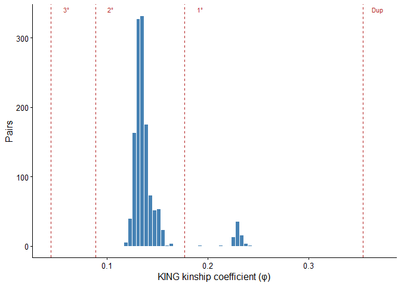
<figcaption aria-hidden="true">Distribution of pairwise KING kinship
coefficients.</figcaption>
</figure>

``` r
ggsave(file.path(OUT_DIR, "relatedness_hist.png"), last_plot(),
       width = 90, height = 70, units = "mm", dpi = 300)
```

------------------------------------------------------------------------

# 1 · PCA

LD-pruned SNPs (~995 k) were used for PCA via PLINK. The broken-stick
model identifies PCs explaining more variance than expected by chance.

``` r
pca      <- read.table(f_pca_vec, header = FALSE, sep = " ")
eigenval <- scan(f_pca_val, quiet = TRUE)

pca <- pca[, -1]   # drop FID column
names(pca) <- c("sample", paste0("PC", seq_len(ncol(pca) - 1)))

n_pc <- length(eigenval)
pve  <- eigenval / sum(eigenval) * 100
bs   <- vegan::bstick(n_pc) * 100

n_sig <- sum(pve > bs)
cat("PCs exceeding broken-stick null:", n_sig, "\n")
```

    ## PCs exceeding broken-stick null: 12

``` r
pve_df <- data.frame(PC = seq_len(n_pc), pve = pve, bs = bs)
```

``` r
p12 <- ggplot(pca, aes(PC1, PC2, label = sample, colour = sample)) +
  geom_point(size = 2.5) +
  geom_text_repel(size = 2.5, max.overlaps = 5) +
  stat_ellipse(colour = "grey50") +
  scale_colour_viridis_d() +
  xlab(paste0("PC1 (", signif(pve[1], 3), "%)")) +
  ylab(paste0("PC2 (", signif(pve[2], 3), "%)")) +
  theme(legend.position = "none")

p23 <- ggplot(pca, aes(PC2, PC3, label = sample, colour = sample)) +
  geom_point(size = 2.5) +
  geom_text_repel(size = 2.5, max.overlaps = 5) +
  stat_ellipse(colour = "grey50") +
  scale_colour_viridis_d() +
  xlab(paste0("PC2 (", signif(pve[2], 3), "%)")) +
  ylab(paste0("PC3 (", signif(pve[3], 3), "%)")) +
  theme(legend.position = "none")

p_scree <- ggplot(pve_df, aes(PC, pve)) +
  geom_col(fill = "steelblue") +
  geom_point(aes(y = bs)) + geom_line(aes(y = bs)) +
  labs(x = "PC", y = "Variance explained\n(%)",
       )

(p12 | p23) / p_scree + plot_layout(heights = c(2, 1))
```

<figure>
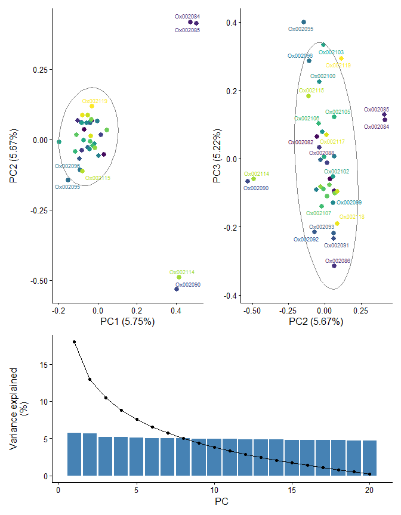
<figcaption aria-hidden="true">PCA of LD-pruned SNPs. Broken-stick null
shown on scree plot.</figcaption>
</figure>

``` r
ggsave(file.path(OUT_DIR, "pca_pc12.png"),    p12,     width=50, height=50, units="mm", dpi=300)
ggsave(file.path(OUT_DIR, "pca_pc23.png"),    p23,     width=50, height=50, units="mm", dpi=300)
ggsave(file.path(OUT_DIR, "pca_scree.png"),   p_scree, width=50,  height=50,  units="mm", dpi=300)
```

------------------------------------------------------------------------

# 2 · Population structure — sNMF

sNMF (sparse NMF) estimates ancestry proportions and selects *K* via
cross-entropy. Run on 100 k randomly subsampled LD-pruned SNPs.

**Checkpoint:** Q matrix and cross-entropy saved to
`output/r params$run_dir`/ on first run. On re-render these are loaded
directly, bypassing sNMF entirely.

If the `.snmf/` directory is present (downloaded from server), Q and
cross-entropy are read directly from the binary `.Q` and `.snmfClass`
files — `load.snmfProject()` is deliberately avoided because it stores
absolute server paths and fails locally.

``` r
# LEA writes .Q files as space-separated text, not binary
read_Q_bin <- function(path, n_samples, K)
  as.matrix(read.table(path, header = FALSE))

# Helper: extract cross-entropy from a .snmfClass file (saved by LEA with dput)
read_ce_bin <- function(path) {
  tryCatch(slot(dget(path), "crossEntropy"), error = function(e) NA_real_)
}

if (file.exists(ck_snmf) && file.exists(ck_ce)) {
  cat("Loading sNMF checkpoint...\n")
  Q_mat <- readRDS(ck_snmf)
  ce_df <- readRDS(ck_ce)

} else {
  snmf_dir    <- file.path(RUN_DIR, paste0(PREFIX, "_snmf_sub.snmf"))
  snmf_prefix <- paste0(PREFIX, "_snmf_sub")
  n_ind       <- nrow(pca)   # number of samples, already known from PCA

  if (dir.exists(snmf_dir)) {
    # ── Read directly from downloaded .snmf/ directory ──────────────────────
    cat("Reading Q and cross-entropy from binary snmf files...\n")
    rows <- list()
    Q_by_run <- list()
    for (k in 1:params$n_snmf_k) {
      for (r in 1:3) {
        q_file  <- file.path(snmf_dir, paste0("K",k), paste0("run",r),
                             paste0(snmf_prefix, "_r", r, ".", k, ".Q"))
        sc_file <- file.path(snmf_dir, paste0("K",k), paste0("run",r),
                             paste0(snmf_prefix, "_r", r, ".", k, ".snmfClass"))
        if (!file.exists(q_file) || !file.exists(sc_file)) next
        ce_val <- read_ce_bin(sc_file)
        rows[[length(rows)+1]] <- data.frame(K=k, rep=r, ce=ce_val)
        if (k == params$k_gwas)
          Q_by_run[[r]] <- read_Q_bin(q_file, n_ind, k)
      }
    }
    ce_df    <- bind_rows(rows)
    best_run <- ce_df[ce_df$K == params$k_gwas, ] |>
                  slice_min(ce, n=1) |> pull(rep)
    Q_mat    <- Q_by_run[[best_run]]

  } else {
    # ── Run sNMF fresh ───────────────────────────────────────────────────────
    cat("Running sNMF K=1:", params$n_snmf_k, "(3 reps)...\n")
    pruned  <- as.matrix(fread(f_pruned, header = FALSE))
    set.seed(225)
    sub_idx <- sample(ncol(pruned), min(100000L, ncol(pruned)))
    fwrite(as.data.table(pruned[, sub_idx]), file = f_snmf_lfmm,
           sep = "\t", col.names = FALSE)
    rm(pruned); gc()
    proj <- snmf(f_snmf_lfmm, K = 1:params$n_snmf_k,
                 entropy = TRUE, repetitions = 3,
                 CPU = max(1L, detectCores() - 1L), project = "new")

    ce_df <- expand.grid(K = 1:params$n_snmf_k, rep = 1:3) |>
      rowwise() |>
      mutate(ce = tryCatch(cross.entropy(proj, K=K, run=rep),
                           error = function(e) NA_real_)) |>
      ungroup()
    best_run <- ce_df[ce_df$K == params$k_gwas, ] |>
                  slice_min(ce, n=1) |> pull(rep)
    Q_mat <- Q(proj, K = params$k_gwas, run = best_run)
  }

  saveRDS(Q_mat, ck_snmf)
  saveRDS(ce_df, ck_ce)
  cat("sNMF checkpoint saved.\n")
}
```

    ## Loading sNMF checkpoint...

``` r
cat("Q matrix:", nrow(Q_mat), "samples x", ncol(Q_mat), "components\n")
```

    ## Q matrix: 37 samples x 1 components

``` r
mean_ce <- tapply(ce_df$ce, ce_df$K, mean, na.rm = TRUE)
k_best  <- as.integer(names(which.min(mean_ce)))
cat("Optimal K (min mean cross-entropy):", k_best, "\n")
```

    ## Optimal K (min mean cross-entropy): 1

``` r
cat("Using K =", params$k_gwas, "for LFMM2 (set via params$k_gwas)\n")
```

    ## Using K = 1 for LFMM2 (set via params$k_gwas)

``` r
ggplot(ce_df, aes(factor(K), ce)) +
  geom_jitter(width = 0.1, size = 2, alpha = 0.6, colour = "steelblue") +
  stat_summary(fun = mean, geom = "point", shape = 18,
               size = 4, colour = "firebrick") +
  stat_summary(fun.data = mean_se, geom = "errorbar",
               width = 0.2, colour = "firebrick") +
  labs(x = "K", y = "Cross-entropy")
```

<figure>
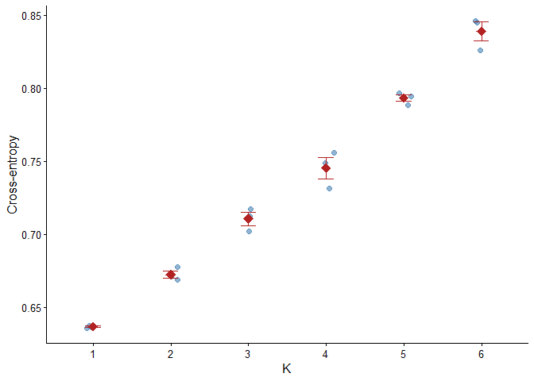
<figcaption aria-hidden="true">sNMF cross-entropy by K. Minimum
indicates optimal number of ancestral populations.</figcaption>
</figure>

``` r
ggsave(file.path(OUT_DIR, "snmf_crossentropy.png"), last_plot(),
       width = 50, height = 50, units = "mm", dpi = 300)
```

------------------------------------------------------------------------

# 3 · Genotype imputation

Missing genotypes (coded 9 in `.lfmm` format) are imputed independently
per site using the K=1 Q matrix from sNMF. Imputation is
site-independent given Q, so parallelised across SNP chunks.

**Checkpoint:** skips entirely if ./WWO_37WGS_pruned_imputed.lfmm
already exists.

``` r
if (file.exists(f_imputed)) {
  cat("Imputed file exists — skipping imputation.\n")
  cat("File:", f_imputed, "\n")
  cat("Size:", round(file.size(f_imputed) / 1e6, 1), "MB\n")
} else {
  cat("Imputed file not found — running parallel imputation...\n")

  Y         <- as.matrix(fread(f_full, header = FALSE))
  n_samples <- nrow(Y)
  n_snps    <- ncol(Y)
  cat("Full matrix:", n_samples, "x", n_snps, "\n")
  cat("Missing (9):", sum(Y == 9L),
      sprintf("(%.3f%%)\n", 100 * mean(Y == 9L)))

  # Impute one SNP chunk; writes to a temp file; returns path
  impute_chunk_to_file <- function(i, col_start, col_end, Y, tmp_dir) {
    chunk <- Y[, col_start:col_end, drop = FALSE]
    K     <- ncol(Q_mat)
    for (j in seq_len(ncol(chunk))) {
      geno    <- chunk[, j]
      missing <- geno == 9L
      if (!any(missing)) next
      obs   <- !missing
      Q_obs <- Q_mat[obs, , drop = FALSE]
      y_obs <- geno[obs]
      QQ    <- crossprod(Q_obs)
      Qy    <- crossprod(Q_obs, y_obs)
      F_j   <- tryCatch(
        solve(QQ + diag(1e-6, K), Qy),
        error = function(e) matrix(mean(y_obs) / 2, K, 1)
      )
      F_j <- pmax(0, pmin(1, F_j))
      p_miss <- Q_mat[missing, , drop = FALSE] %*% F_j
      p_miss <- pmax(0, pmin(1, p_miss))
      chunk[missing, j] <- rbinom(sum(missing), 2L, as.numeric(p_miss))
    }
    tmp_path <- file.path(tmp_dir, sprintf("chunk_%05d.tmp", i))
    fwrite(as.data.table(chunk), file = tmp_path, sep = " ", col.names = FALSE)
    tmp_path
  }

  chunk_size   <- 34000L
  tmp_dir      <- file.path(RUN_DIR, "impute_tmp")
  dir.create(tmp_dir, showWarnings = FALSE)
  chunk_starts <- seq(1L, n_snps, by = chunk_size)
  chunk_ends   <- pmin(chunk_starts + chunk_size - 1L, n_snps)
  n_chunks     <- length(chunk_starts)
  n_cores      <- max(1L, detectCores() - 1L)
  cat("Chunks:", n_chunks, "| Cores:", n_cores, "\n")

  if (.Platform$OS.type == "unix") {
    tmp_files <- unlist(mclapply(seq_len(n_chunks), function(i)
      impute_chunk_to_file(i, chunk_starts[i], chunk_ends[i], Y, tmp_dir),
      mc.cores = n_cores))
  } else {
    cl <- makeCluster(n_cores)
    clusterExport(cl, c("Q_mat", "impute_chunk_to_file", "tmp_dir",
                        "chunk_starts", "chunk_ends", "Y"), envir = environment())
    clusterEvalQ(cl, { library(data.table); set.seed(225) })
    tmp_files <- unlist(parLapply(cl, seq_len(n_chunks), function(i)
      impute_chunk_to_file(i, chunk_starts[i], chunk_ends[i], Y, tmp_dir)))
    stopCluster(cl)
  }

  # Stitch temp files horizontally, batch-reading to stay under R's 128-connection limit
  batch_size <- min(n_chunks, max(1L, 128L - nrow(showConnections()) - 5L))
  cat("Stitching with batch size:", batch_size, "\n")
  all_lines <- vector("list", n_chunks)
  for (b in seq(1L, n_chunks, by = batch_size)) {
    idx     <- b:min(b + batch_size - 1L, n_chunks)
    in_cons <- lapply(tmp_files[idx], file, open = "r")
    for (k in seq_along(idx))
      all_lines[[idx[k]]] <- readLines(in_cons[[k]])
    lapply(in_cons, close)
  }
  out_con <- file(f_imputed, open = "w")
  for (row_i in seq_len(n_samples))
    writeLines(paste(vapply(all_lines, `[`, character(1L), row_i), collapse = " "),
               out_con)
  close(out_con)
  rm(all_lines, Y); gc()
  unlink(tmp_files); unlink(tmp_dir, recursive = TRUE)
  cat("Imputation complete:", f_imputed, "\n")
}
```

    ## Imputed file exists — skipping imputation.
    ## File: ./WWO_37WGS_pruned_imputed.lfmm 
    ## Size: 75 MB

------------------------------------------------------------------------

# 4 · Phenotype preprocessing

``` r
raw <- read.csv(f_data, header = TRUE)
cat("Data:", nrow(raw), "rows x", ncol(raw), "cols\n")
```

    ## Data: 37 rows x 39 cols

``` r
if (nzchar(params$excl_sample)) {
  raw <- raw[raw$GENOME != params$excl_sample, ]
  cat("Excluded:", params$excl_sample, "| Remaining:", nrow(raw), "\n")
}

# Soil texture PCA — sand/silt/clay are compositional (sum to 100%)
soil_pca     <- prcomp(raw[, c("SAND", "SILT", "CLAY")], center = TRUE, scale. = TRUE)
soil_pve     <- soil_pca$sdev^2 / sum(soil_pca$sdev^2) * 100
raw$SOIL_PC1 <- soil_pca$x[, 1]
cat("Soil PC1 variance:", signif(soil_pve[1], 3), "%\n")
```

    ## Soil PC1 variance: 95.4 %

``` r
GWAS_VARS <- c("VIZ_COUNT", "MATURE_ACORNS", "IMMAT_ACORNS", "ENLARGED_CUPS",
               "FLOWERS", "CANOPY_CLOSURE", "SPRING_PHENO", "SOIL_PC1", "MIDNOV_LAI")

data <- raw[, c("GENOME", "TREE_ID", GWAS_VARS)]

# Log1p-transform right-skewed count variables
data[c("MATURE_ACORNS", "IMMAT_ACORNS")] <- log1p(data[c("MATURE_ACORNS", "IMMAT_ACORNS")])
```

``` r
plots <- lapply(GWAS_VARS, function(v)
  ggqqplot(data[[v]]) +
    theme(axis.title = element_blank(), plot.title = element_text(size = 9)))
ggarrange(plotlist = plots, ncol = 3, nrow = 3)
```

<figure>
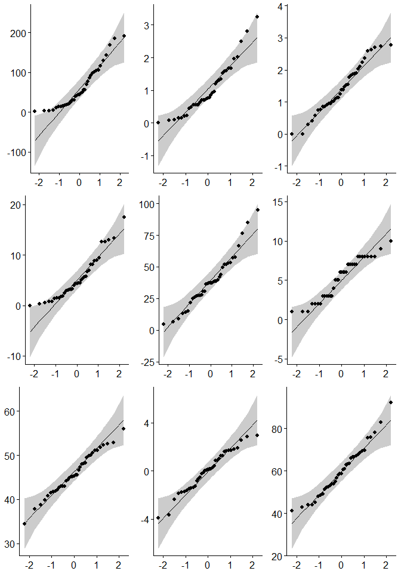
<figcaption aria-hidden="true">Q-Q plots of GWAS variables after
log-transformation of acorn counts.</figcaption>
</figure>

``` r
ggsave(file.path(OUT_DIR, "phenotype_qqplots.png"), last_plot(),
       width = 170, height = 170, units = "mm", dpi = 300)
```

``` r
knitr::kable(
  sapply(data[GWAS_VARS], function(x)
    round(c(mean=mean(x), sd=sd(x), min=min(x), max=max(x)), 3)) |>
    t() |> as.data.frame(),
  caption = "Descriptive statistics after transformation"
)
```

|                |   mean |     sd |    min |     max |
|:---------------|-------:|-------:|-------:|--------:|
| VIZ_COUNT      | 61.568 | 53.254 |  1.250 | 191.250 |
| MATURE_ACORNS  |  1.012 |  0.782 |  0.000 |   3.254 |
| IMMAT_ACORNS   |  1.422 |  0.769 |  0.000 |   2.785 |
| ENLARGED_CUPS  |  5.339 |  4.318 |  0.000 |  17.528 |
| FLOWERS        | 38.589 | 20.592 |  4.722 |  94.722 |
| CANOPY_CLOSURE |  5.270 |  2.578 |  1.000 |  10.000 |
| SPRING_PHENO   | 45.832 |  4.802 | 34.479 |  55.918 |
| SOIL_PC1       |  0.000 |  1.692 | -3.899 |   2.964 |
| MIDNOV_LAI     | 60.123 | 11.795 | 41.254 |  92.122 |

Descriptive statistics after transformation

``` r
raw$SOIL_CLASS <- gsub("_", " ", raw$SOIL_CLASS)
ggplot(raw, aes(soil_pca$x[,1], soil_pca$x[,2], colour = SOIL_CLASS)) +
  geom_point(size = 3) + scale_colour_npg() +
  xlab(paste0("PC1 (", signif(soil_pve[1],3), "%)")) +
  ylab(paste0("PC2 (", signif(soil_pve[2],3), "%)")) +
  labs(colour = "Soil class")
```

<figure>
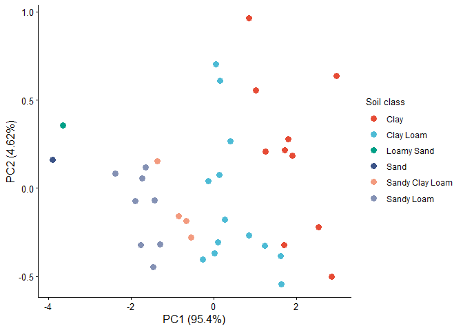
<figcaption aria-hidden="true">Soil texture PCA. PC1 enters GWAS as
SOIL_PC1.</figcaption>
</figure>

``` r
ggsave(file.path(OUT_DIR, "soil_pca.png"), last_plot(),
       width = 100, height = 90, units = "mm", dpi = 300)
```

------------------------------------------------------------------------

# 5 · GWAS — LFMM2

LFMM2 (Caye et al. 2019) fits a ridge-penalised LMM with K=1 latent
factor(s) absorbing genome-wide covariance (relatedness, structure).
Genomic control recalibrates p-values post-hoc.

**Checkpoints (in order of preference):** 1. ./lfmm2_res.rds —
server-produced via `gwas_lfmm.R` (parallel, GIF-corrected) 2.
output/n37/lfmm2_res.rds — local checkpoint from a previous render 3.
Run LFMM2 locally (slow — use server if possible)

``` r
if (file.exists(f_gwas_server)) {
  # ── Server format: list(p, q, z, gif, loci) ────────────────────────────────
  cat("Loading server GWAS results from", f_gwas_server, "\n")
  srv      <- readRDS(f_gwas_server)
  p_mat    <- as.matrix(srv$p)
  q_mat    <- as.matrix(srv$q)
  z_mat    <- as.matrix(srv$z)
  gif_df   <- srv$gif
  loci     <- as.data.frame(srv$loci)
  n_samples <- nrow(data)
  colnames(p_mat) <- colnames(q_mat) <- colnames(z_mat) <- GWAS_VARS
  rm(srv); gc()

} else if (file.exists(ck_gwas)) {
  # ── Local LEA checkpoint ────────────────────────────────────────────────────
  cat("Loading local GWAS checkpoint from", ck_gwas, "\n")
  gwas_ck   <- readRDS(ck_gwas)
  raw_res   <- gwas_ck$res
  loci      <- as.data.frame(gwas_ck$loci)
  n_samples <- gwas_ck$n_samples
  rm(gwas_ck)
  p_mat <- t(raw_res$pvalues)
  z_mat <- t(raw_res$zscores)
  colnames(p_mat) <- colnames(z_mat) <- GWAS_VARS
  gif_df <- data.frame(Trait = GWAS_VARS,
                       GIF   = round(as.numeric(raw_res$gif), 3))
  q_mat <- apply(p_mat, 2, function(p) qvalue(p)$qvalues)
  colnames(q_mat) <- GWAS_VARS
  rm(raw_res); gc()

} else {
  # ── Run locally (single-threaded; use server for large datasets) ────────────
  cat("No checkpoint found — running LFMM2 locally...\n")
  Y    <- as.matrix(fread(f_imputed, header = FALSE))
  loci <- as.data.frame(fread(f_pos, header = FALSE,
                               col.names = c("CHROM", "POS")))
  n_samples <- nrow(Y)
  cat("Matrix:", nrow(Y), "samples x", ncol(Y), "SNPs\n")
  X         <- as.matrix(data[, GWAS_VARS])
  lfmm2_fit <- lfmm2(input = Y, env = X, K = params$k_gwas)
  raw_res   <- lfmm2.test(lfmm2_fit, input = Y, env = X,
                           genomic.control = TRUE)
  rm(Y, lfmm2_fit); gc()
  p_mat <- t(raw_res$pvalues)
  z_mat <- t(raw_res$zscores)
  colnames(p_mat) <- colnames(z_mat) <- GWAS_VARS
  gif_df <- data.frame(Trait = GWAS_VARS,
                       GIF   = round(as.numeric(raw_res$gif), 3))
  q_mat <- apply(p_mat, 2, function(p) qvalue(p)$qvalues)
  colnames(q_mat) <- GWAS_VARS
  rm(raw_res); gc()
  saveRDS(list(p=p_mat, q=q_mat, z=z_mat, gif=gif_df, loci=loci), ck_gwas)
  cat("Checkpoint saved to", ck_gwas, "\n")
}
```

    ## Loading server GWAS results from ./lfmm2_res_WWO_37WGS_pruned_imputed.rds

    ##            used  (Mb) gc trigger   (Mb) max used  (Mb)
    ## Ncells 12697214 678.2   23735647 1267.7 17316488 924.9
    ## Vcells 57700243 440.3   83481513  637.0 59233371 452.0

``` r
cat("GWAS results loaded:", nrow(loci), "SNPs x", ncol(p_mat), "traits\n")
```

    ## GWAS results loaded: 1013644 SNPs x 9 traits

### Genomic inflation factors

GIF ≈ 1 is ideal. Values \> 2 indicate under-correction; \< 0.5
over-correction.

``` r
knitr::kable(gif_df, caption = "Genomic inflation factor (GIF) per trait")
```

| Trait          |    GIF |
|:---------------|-------:|
| VIZ_COUNT      | 1.0362 |
| MATURE_ACORNS  | 1.0179 |
| IMMAT_ACORNS   | 1.0015 |
| ENLARGED_CUPS  | 1.0033 |
| FLOWERS        | 1.0279 |
| CANOPY_CLOSURE | 1.0340 |
| SPRING_PHENO   | 1.0212 |
| SOIL_PC1       | 1.0610 |
| MIDNOV_LAI     | 1.0050 |

Genomic inflation factor (GIF) per trait

``` r
write.table(gif_df, file.path(OUT_DIR, "gwas_gif.tsv"),
            sep = "\t", quote = FALSE, row.names = FALSE)
```

``` r
lfmm_p <- as.data.frame(cbind(loci, p_mat))
lfmm_q <- as.data.frame(cbind(loci, q_mat))
lfmm_z <- as.data.frame(cbind(loci, z_mat))

write.table(lfmm_p, file.path(OUT_DIR, "lfmm.p.tsv"), sep="\t", quote=FALSE, row.names=FALSE)
write.table(lfmm_q, file.path(OUT_DIR, "lfmm.q.tsv"), sep="\t", quote=FALSE, row.names=FALSE)
write.table(lfmm_z, file.path(OUT_DIR, "lfmm.z.tsv"), sep="\t", quote=FALSE, row.names=FALSE)
```

``` r
per_trait <- colSums(q_mat < 0.05)
sig_any   <- rowSums(q_mat < 0.05) >= 1
cat("Total significant SNPs (Q<0.05, ≥1 trait):", sum(sig_any), "\n")
```

    ## Total significant SNPs (Q<0.05, ≥1 trait): 1530

``` r
knitr::kable(data.frame(Trait=names(per_trait), Sig_SNPs=per_trait),
             caption = "Significant SNPs per trait (Q < 0.05)")
```

|                | Trait          | Sig_SNPs |
|:---------------|:---------------|---------:|
| VIZ_COUNT      | VIZ_COUNT      |      464 |
| MATURE_ACORNS  | MATURE_ACORNS  |       89 |
| IMMAT_ACORNS   | IMMAT_ACORNS   |       76 |
| ENLARGED_CUPS  | ENLARGED_CUPS  |      441 |
| FLOWERS        | FLOWERS        |      197 |
| CANOPY_CLOSURE | CANOPY_CLOSURE |      114 |
| SPRING_PHENO   | SPRING_PHENO   |      106 |
| SOIL_PC1       | SOIL_PC1       |        8 |
| MIDNOV_LAI     | MIDNOV_LAI     |      123 |

Significant SNPs per trait (Q \< 0.05)

------------------------------------------------------------------------

# 6 · Annotation

Significant SNPs (Q \< 0.05) are overlapped with *Q. robur* CDS features
(Qrob PM1N annotation). CDS → Arabidopsis TAIR IDs via blastp (E \<
1×10⁻¹⁰).

``` r
if (file.exists(ck_annot)) {
  cat("Loading annotation checkpoint...\n")
  loci_annotated <- readRDS(ck_annot)
} else if (!ANNOTATION_AVAILABLE) {
  cat("NOTE: rtracklayer unavailable — skipping CDS annotation.\n")
  loci_annotated <- as.data.table(loci)
  loci_annotated$gene   <- NA_character_
  loci_annotated$strand <- NA_character_
  loci_annotated$tair   <- NA_character_
} else {
  cat("Building SNP annotation...\n")
  # Load GFF — keep CDS features only
  cds_gr <- import(f_gff)
  cds_gr <- cds_gr[cds_gr$type == "CDS"]
  mcols(cds_gr)$Parent <- as.character(
    vapply(mcols(cds_gr)$Parent, `[`, character(1), 1))

  # Araport blastp hits filtered at E < 1e-10; keep best hit per Q. robur transcript
  ann <- read.table(f_annot, sep="\t", header=FALSE)
  ann <- ann[ann$V11 < 1e-10, ]
  ann <- ann[order(ann$V11), ]                        # sort by e-value
  ann <- ann[!duplicated(ann$V1), c("V1","V2")]       # one Arabidopsis hit per Qrob protein
  colnames(ann) <- c("gene","tair")
  ann$gene <- gsub("^Qrob_P", "Qrob_T", ann$gene)   # protein → transcript ID

  # Build GRanges for all loci
  loci_gr <- GRanges(seqnames=loci$CHROM,
                     ranges=IRanges(start=loci$POS, end=loci$POS))
  hits    <- findOverlaps(loci_gr, cds_gr)
  hit_dt  <- data.table(
    idx    = queryHits(hits),
    gene   = mcols(cds_gr)$Parent[subjectHits(hits)],
    strand = as.character(strand(cds_gr)[subjectHits(hits)])
  )[, .SD[1], by=idx]   # one CDS per SNP

  loci_annotated <- as.data.table(loci)[, idx := .I]
  loci_annotated <- merge(loci_annotated, hit_dt, by="idx", all.x=TRUE)[, idx:=NULL]
  loci_annotated <- merge(loci_annotated, ann, by="gene", all.x=TRUE)

  # Look up Arabidopsis gene symbol and description via org.At.tair.db
  tair_loci <- unique(na.omit(gsub("\\.\\d+$", "", loci_annotated$tair)))
  if (ENRICHMENT_AVAILABLE && length(tair_loci) > 0) {
    sym_df <- tryCatch(
      AnnotationDbi::select(org.At.tair.db, keys=tair_loci, keytype="TAIR",
                            columns=c("SYMBOL","GENENAME")) |>
        dplyr::rename(tair_locus=TAIR, symbol=SYMBOL, description=GENENAME) |>
        dplyr::distinct(tair_locus, .keep_all=TRUE),
      error=function(e) { message("Symbol lookup failed: ", e$message); NULL }
    )
    if (!is.null(sym_df)) {
      loci_annotated[, tair_locus := gsub("\\.\\d+$", "", tair)]
      loci_annotated <- merge(loci_annotated, as.data.table(sym_df),
                              by="tair_locus", all.x=TRUE)[, tair_locus:=NULL]
    }
  } else {
    loci_annotated[, c("symbol","description") := NA_character_]
  }

  setcolorder(loci_annotated, c("CHROM","POS","gene","strand","tair","symbol","description"))

  saveRDS(loci_annotated, ck_annot)
  cat("Annotation checkpoint saved.\n")
}
```

    ## Loading annotation checkpoint...

``` r
cat("SNPs in CDS:", sum(!is.na(loci_annotated$gene)), "of", nrow(loci_annotated), "\n")
```

    ## SNPs in CDS: 41192 of 1013644

``` r
# Ensure symbol/description columns exist even when loaded from old checkpoint
if (!"symbol" %in% names(loci_annotated))
  loci_annotated[, c("symbol","description") := NA_character_]
write.table(loci_annotated, file.path(OUT_DIR, "loci_annotated.tsv"),
            sep="\t", quote=FALSE, row.names=FALSE)
```

``` r
p_long     <- pivot_longer(lfmm_p, all_of(GWAS_VARS), names_to="trait", values_to="p")
q_long_all <- pivot_longer(lfmm_q, all_of(GWAS_VARS), names_to="trait", values_to="q")
z_long     <- pivot_longer(lfmm_z, all_of(GWAS_VARS), names_to="trait", values_to="z")

sig_ann <- p_long |>
  left_join(q_long_all, by=c("CHROM","POS","trait")) |>
  left_join(z_long,     by=c("CHROM","POS","trait")) |>
  filter(q < 0.05) |>
  left_join(as.data.frame(loci_annotated), by=c("CHROM","POS")) |>
  arrange(trait, CHROM, POS)

# Primary output: one row per significant SNP × trait, with Arabidopsis annotation
write.csv(sig_ann |>
  dplyr::select(CHROM, POS, trait, z, p, q, gene, strand, tair, symbol, description),
  file.path(OUT_DIR, "sig_snps_annotated.csv"), row.names=FALSE, na="NA")

snp_summ <- sig_ann |>
  group_by(trait) |>
  summarise(total=n(), in_CDS=sum(!is.na(gene)),
            unique_genes=n_distinct(gene, na.rm=TRUE),
            with_symbol=sum(!is.na(symbol)), .groups="drop")
knitr::kable(snp_summ, caption="Significant SNP annotation summary per trait")
```

| trait          | total | in_CDS | unique_genes | with_symbol |
|:---------------|------:|-------:|-------------:|------------:|
| CANOPY_CLOSURE |   114 |      5 |            5 |           4 |
| ENLARGED_CUPS  |   441 |     21 |           21 |          14 |
| FLOWERS        |   197 |      4 |            4 |           3 |
| IMMAT_ACORNS   |    76 |      2 |            2 |           2 |
| MATURE_ACORNS  |    89 |      3 |            3 |           1 |
| MIDNOV_LAI     |   123 |      6 |            6 |           4 |
| SOIL_PC1       |     8 |      1 |            1 |           0 |
| SPRING_PHENO   |   106 |      2 |            2 |           1 |
| VIZ_COUNT      |   464 |     15 |           15 |           9 |

Significant SNP annotation summary per trait

``` r
write.csv(snp_summ, file.path(OUT_DIR, "sig_snp_summary.csv"), row.names=FALSE)
```

------------------------------------------------------------------------

# 7 · Visualisation

## P-value histograms

``` r
pivot_longer(lfmm_p, all_of(GWAS_VARS), names_to="trait", values_to="p") |>
  ggplot(aes(p)) +
  geom_histogram(bins=50, fill="steelblue", colour="white") +
  facet_wrap(~trait, ncol=3, scales="free_y") +
  scale_x_continuous(limits=c(0,1), expand=c(0,0)) +
  labs(x="P-value", y="Count")
```

<figure>
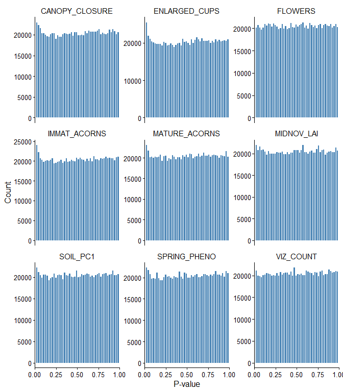
<figcaption aria-hidden="true">P-value histograms. Flat distribution =
well-calibrated after genomic control.</figcaption>
</figure>

``` r
ggsave(file.path(OUT_DIR, "pval_histograms.png"), last_plot(),
       width=170, height=130, units="mm", dpi=300)
```

## Q-value histograms

``` r
pivot_longer(lfmm_q, all_of(GWAS_VARS), names_to="trait", values_to="q") |>
  ggplot(aes(q)) +
  geom_histogram(bins=50, fill="darkorange", colour="white") +
  facet_wrap(~trait, ncol=3, scales="free_y") +
  scale_x_continuous(limits=c(0,1), expand=c(0,0)) +
  labs(x="Q-value", y="Count")
```

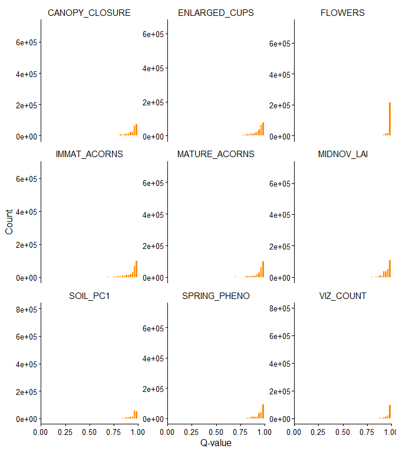<!-- -->

``` r
ggsave(file.path(OUT_DIR, "qval_histograms.png"), last_plot(),
       width=170, height=130, units="mm", dpi=300)
```

## Manhattan plots

``` r
chr_num <- function(x) suppressWarnings(as.integer(sub("Qrob_Chr0?", "", x)))
set.seed(42)
MAX_NONSIG <- 100000L

q_long_full <- pivot_longer(lfmm_q, all_of(GWAS_VARS), names_to="trait", values_to="q") |>
  left_join(pivot_longer(lfmm_p, all_of(GWAS_VARS), names_to="trait", values_to="p"),
            by=c("CHROM","POS","trait")) |>
  left_join(pivot_longer(lfmm_z, all_of(GWAS_VARS), names_to="trait", values_to="z"),
            by=c("CHROM","POS","trait")) |>
  mutate(chr = chr_num(CHROM), sig = q < 0.05) |>
  filter(!is.na(chr))

# Join gene symbols (annotation runs before this section)
sym_ann <- as.data.frame(loci_annotated) |>
  dplyr::select(CHROM, POS, symbol) |>
  dplyr::distinct(CHROM, POS, .keep_all=TRUE)
q_long_full <- left_join(q_long_full, sym_ann, by=c("CHROM","POS"))

for (tr in GWAS_VARS) {
  tmp_sig    <- filter(q_long_full, trait == tr, sig)
  tmp_nonsig <- filter(q_long_full, trait == tr, !sig)
  if (nrow(tmp_nonsig) > MAX_NONSIG)
    tmp_nonsig <- tmp_nonsig[sample(nrow(tmp_nonsig), MAX_NONSIG), ]
  tmp <- bind_rows(tmp_sig, tmp_nonsig) |> arrange(chr, POS)

  p <- ggplot(tmp, aes(POS/1e6, -log10(q), colour = sig)) +
    geom_point(data=filter(tmp, !sig), size=0.3, alpha=0.5) +
    geom_point(data=filter(tmp, sig),  size=0.8, alpha=0.9) +
    scale_colour_manual(values=c("FALSE"="grey70","TRUE"="steelblue"), guide="none") +
    geom_hline(yintercept=-log10(0.05), linetype="dashed",
               colour="firebrick", linewidth=0.5)

  if (any(!is.na(tmp_sig$symbol)))
    p <- p + geom_text_repel(
      data=filter(tmp, sig, !is.na(symbol)),
      aes(label=symbol),
      size=3, max.overlaps=30, colour="black",
      segment.size=0.4, segment.colour="black",
      box.padding=0.4, point.padding=0,
      min.segment.length=0, force_pull=0, nudge_y=1)

  p <- p +
    facet_grid(~factor(chr), scales="free_x", space="free", switch="x") +
    labs(x="Position (Mbp)", y=expression(-log[10](italic(Q))), title=tr) +
    scale_y_continuous(expand=expansion(mult=c(0,0.05))) +
    theme(panel.spacing.x=unit(0.05,"lines"), axis.text.x=element_blank(),
          strip.placement="outside", strip.text.x=element_text(size=7),
          panel.border=element_rect(colour="grey80", fill=NA))

  cat("###", tr, "\n\n"); print(p); cat("\n\n")
  ggsave(file.path(OUT_DIR, paste0("manhattan_", tr, ".png")),
         p, width=170, height=55, units="mm", dpi=300)
}
```

### VIZ_COUNT

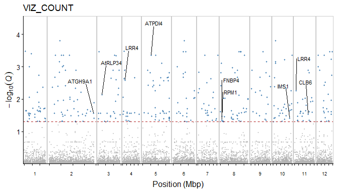<!-- -->\###
MATURE_ACORNS

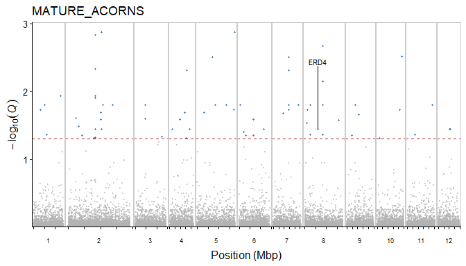<!-- -->\###
IMMAT_ACORNS

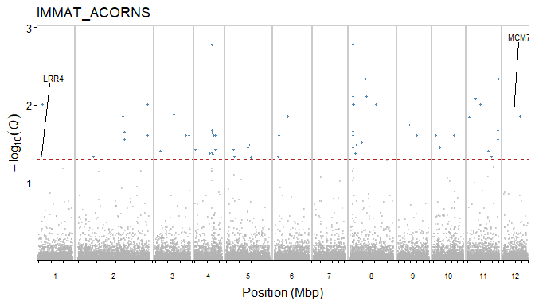<!-- -->\###
ENLARGED_CUPS

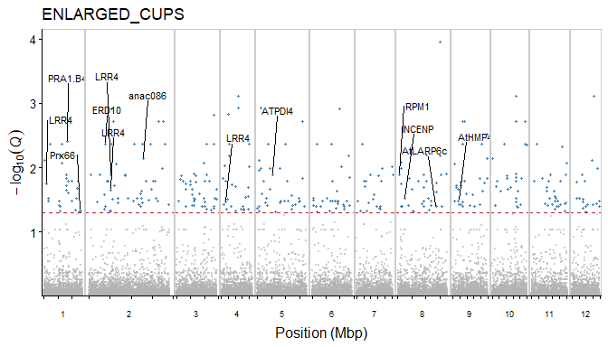<!-- -->\###
FLOWERS

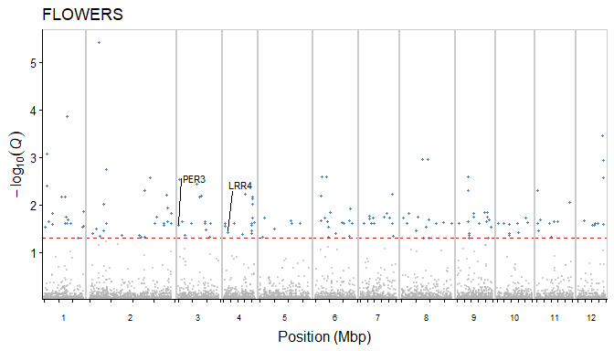<!-- -->\###
CANOPY_CLOSURE

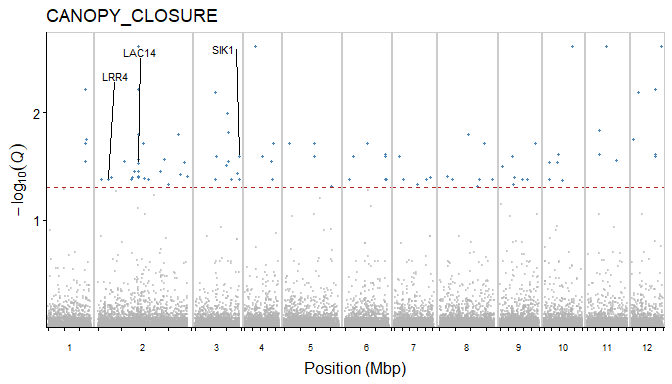<!-- -->\###
SPRING_PHENO

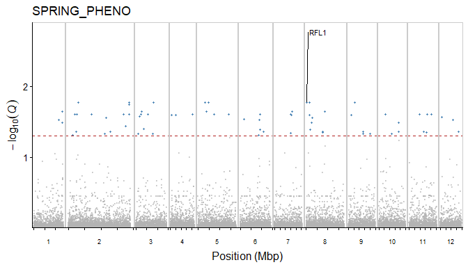<!-- -->\###
SOIL_PC1

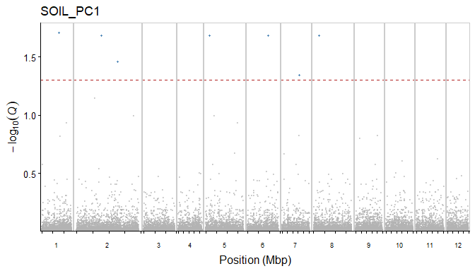<!-- -->\###
MIDNOV_LAI

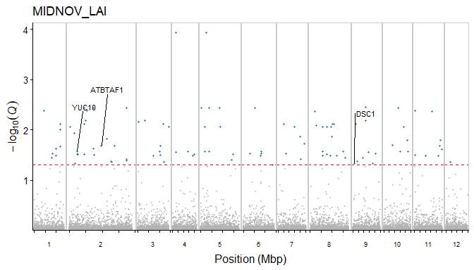<!-- -->

------------------------------------------------------------------------

# 8 · Functional enrichment (GSEA)

Gene set enrichment analysis via `gseGO` / `gseKEGG` (clusterProfiler).
All annotated genes are ranked by a signed GWAS score:

$$\text{score} = -\log_{10}(p) \times \text{sign}(z)$$

where *p* and *z* are from the best SNP within each gene body.

``` r
ck_enrich <- file.path(OUT_DIR, "enrichment_gsea.rds")
ek_df  <- NULL
ego_df <- NULL

if (!ENRICHMENT_AVAILABLE) {
  cat("Skipping enrichment — clusterProfiler not available on this system.\n")
} else if (file.exists(ck_enrich)) {
  cat("Loading GSEA enrichment checkpoint...\n")
  enrich <- readRDS(ck_enrich)
  ek_df  <- enrich$kegg
  ego_df <- enrich$go
} else {
  la_ann <- loci_annotated[!is.na(tair), .(CHROM, POS,
                                            tair_base = gsub("\\.\\d+$", "",
                                                             as.character(tair)))]
  gene_scores <- merge(
    as.data.table(q_long_full)[, .(CHROM, POS, trait,
                                   p_val = as.numeric(p),
                                   z_val = as.numeric(z))],
    la_ann, by=c("CHROM","POS")
  ) |>
    as.data.frame() |>
    filter(!is.na(tair_base), !is.na(p_val), !is.na(z_val), p_val > 0) |>
    mutate(score = -log10(p_val) * sign(z_val)) |>
    group_by(trait, tair_base) |>
    slice_max(order_by=abs(score), n=1, with_ties=FALSE) |>
    ungroup()

  ek_list <- list(); ego_list <- list()

  for (tr in GWAS_VARS) {
    d <- gene_scores |> filter(trait == tr)
    if (nrow(d) < 10) next

    ranked <- setNames(d$score, d$tair_base)
    ranked <- ranked[!is.na(names(ranked))]
    ranked <- sort(ranked, decreasing=TRUE)
    ranked <- ranked[!duplicated(names(ranked))]

    ego <- tryCatch(
      gseGO(geneList     = ranked,
            OrgDb        = org.At.tair.db,
            keyType      = "TAIR",
            ont          = "ALL",
            minGSSize    = 5,
            maxGSSize    = 500,
            pvalueCutoff = 0.05,
            eps          = 0,
            verbose      = FALSE),
      error = function(e) { message(tr, " gseGO: ", e$message); NULL })
    if (!is.null(ego) && nrow(as.data.frame(ego)) > 0)
      ego_list[[tr]] <- as.data.frame(ego) |>
        filter(p.adjust < 0.05) |>
        mutate(trait = tr)

    kegg_map <- tryCatch(
      bitr(names(ranked), fromType="TAIR", toType="ENTREZID",
           OrgDb=org.At.tair.db),
      error=function(e) NULL)
    if (is.null(kegg_map) || nrow(kegg_map) == 0) next

    ranked_kegg <- ranked[kegg_map$TAIR]
    names(ranked_kegg) <- kegg_map$ENTREZID
    ranked_kegg <- sort(ranked_kegg[!duplicated(names(ranked_kegg))],
                        decreasing=TRUE)

    ek <- tryCatch(
      gseKEGG(geneList     = ranked_kegg,
              organism     = "ath",
              minGSSize    = 5,
              maxGSSize    = 500,
              pvalueCutoff = 0.05,
              eps          = 0,
              verbose      = FALSE,
              use_internal_data = FALSE),
      error=function(e) { message(tr, " gseKEGG: ", e$message); NULL })
    if (!is.null(ek) && nrow(as.data.frame(ek)) > 0)
      ek_list[[tr]] <- as.data.frame(ek) |>
        filter(p.adjust < 0.05) |>
        mutate(trait = tr)
  }

  ego_df <- if (length(ego_list) > 0) bind_rows(ego_list) else NULL
  ek_df  <- if (length(ek_list)  > 0) bind_rows(ek_list)  else NULL
  saveRDS(list(kegg=ek_df, go=ego_df), ck_enrich)
}
```

    ## Loading GSEA enrichment checkpoint...

``` r
cat("KEGG terms:", if(is.null(ek_df)) 0 else nrow(ek_df), "\n")
```

    ## KEGG terms: 0

``` r
cat("GO terms:  ", if(is.null(ego_df)) 0 else nrow(ego_df), "\n")
```

    ## GO terms:   9

``` r
if (!is.null(ek_df))  write.table(ek_df,  file.path(OUT_DIR,"kegg_enrichment.tsv"),  sep="\t", row.names=FALSE)
if (!is.null(ego_df)) write.table(ego_df, file.path(OUT_DIR,"go_enrichment.tsv"),    sep="\t", row.names=FALSE)
```

``` r
if (!is.null(ek_df))
  knitr::kable(dplyr::select(ek_df, trait, ID, Description, setSize, NES, p.adjust),
               digits=4, caption="Significant KEGG pathways (GSEA)")
if (!is.null(ego_df))
  knitr::kable(head(dplyr::select(ego_df, trait, ONTOLOGY, ID, Description, setSize, NES, p.adjust), 30),
               digits=4, caption="Top GO terms (GSEA, max 30)")
```

|  | trait | ONTOLOGY | ID | Description | setSize | NES | p.adjust |
|:---|:---|:---|:---|:---|---:|---:|---:|
| <GO:0032950> | VIZ_COUNT | BP | <GO:0032950> | regulation of beta-glucan metabolic process | 6 | 1.9416 | 0.0221 |
| <GO:0032951> | VIZ_COUNT | BP | <GO:0032951> | regulation of beta-glucan biosynthetic process | 6 | 1.9416 | 0.0221 |
| <GO:2001006> | VIZ_COUNT | BP | <GO:2001006> | regulation of cellulose biosynthetic process | 6 | 1.9416 | 0.0221 |
| <GO:0098542> | VIZ_COUNT | BP | <GO:0098542> | defense response to other organism | 160 | 1.8326 | 0.0221 |
| <GO:0043207> | VIZ_COUNT | BP | <GO:0043207> | response to external biotic stimulus | 464 | 1.5467 | 0.0221 |
| <GO:0051707> | VIZ_COUNT | BP | <GO:0051707> | response to other organism | 464 | 1.5467 | 0.0221 |
| <GO:0009607> | VIZ_COUNT | BP | <GO:0009607> | response to biotic stimulus | 466 | 1.5449 | 0.0221 |
| <GO:0006952> | VIZ_COUNT | BP | <GO:0006952> | defense response | 436 | 1.5442 | 0.0221 |
| <GO:0044419> | VIZ_COUNT | BP | <GO:0044419> | biological process involved in interspecies interaction between organisms | 468 | 1.5429 | 0.0221 |

Top GO terms (GSEA, max 30)

------------------------------------------------------------------------

# 9 · Enrichment visualisation

``` r
if (ENRICHMENT_AVAILABLE && !is.null(ego_df) && nrow(ego_df) > 0) {

  ont_cols    <- c(BP="#0072B5", CC="#20854E", MF="#BC3C29")
  trait_order <- c("VIZ_COUNT","MATURE_ACORNS","IMMAT_ACORNS","ENLARGED_CUPS",
                   "FLOWERS","CANOPY_CLOSURE","SPRING_PHENO","MIDNOV_LAI","SOIL_PC1")

  go_top <- ego_df |>
    dplyr::filter(p.adjust < 0.05) |>
    dplyr::group_by(trait) |>
    dplyr::slice_min(order_by=p.adjust, n=5, with_ties=FALSE) |>
    dplyr::ungroup() |>
    dplyr::mutate(
      trait = factor(trait, levels=intersect(trait_order, trait)),
      label = ifelse(nchar(Description) > 45,
                     paste0(substr(Description,1,42),"..."), Description)
    )

  p_go <- ggplot(go_top, aes(x=NES, y=reorder(label, NES),
                              size=setSize, colour=ONTOLOGY)) +
    geom_vline(xintercept=0, linetype="dashed", colour="grey60") +
    geom_point(alpha=0.85) +
    facet_wrap(~trait, scales="free_y", ncol=3) +
    scale_colour_manual(values=ont_cols, name="Ontology") +
    scale_size_continuous(range=c(2,7), name="Set size") +
    labs(x="Normalised enrichment score (NES)", y=NULL) +
    theme(
      axis.text.y     = element_text(size=7),
      strip.text      = element_text(size=8, face="bold"),
      legend.position = "bottom",
      legend.box      = "horizontal"
    )

  print(p_go)
  ggsave(file.path(OUT_DIR, "go_dotplot.png"), p_go,
         width=170, height=180, units="mm", dpi=300)
} else {
  cat("No significant GO terms to plot.\n")
}
```

<figure>
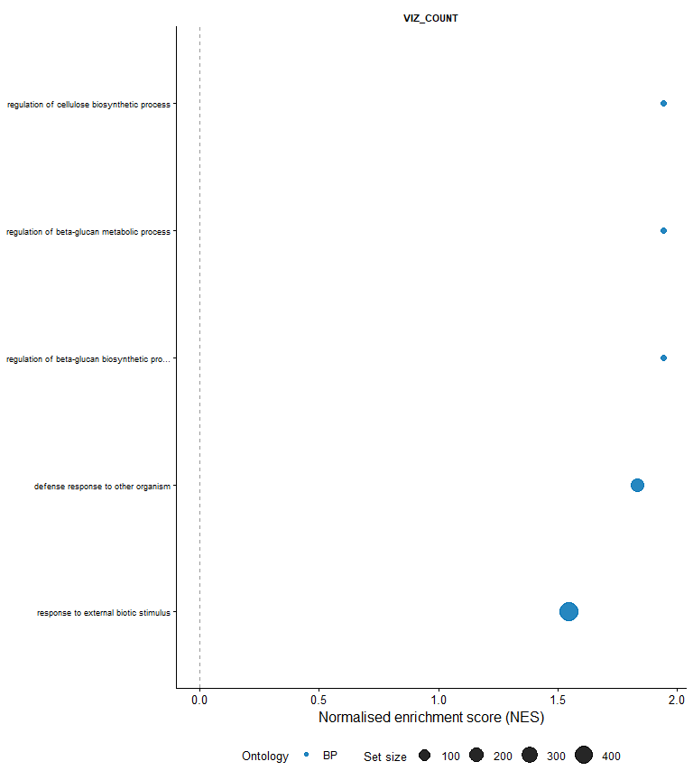
<figcaption aria-hidden="true">GO term GSEA dotplot. Top 5 terms per
trait (p.adjust &lt; 0.05). Point size = gene set size; colour =
ontology. Positive NES = enriched among high-scoring genes; negative NES
= enriched among low-scoring genes.</figcaption>
</figure>

``` r
if (ENRICHMENT_AVAILABLE && !is.null(ek_df) && nrow(ek_df) > 0) {
  trait_order <- c("VIZ_COUNT","MATURE_ACORNS","IMMAT_ACORNS","ENLARGED_CUPS",
                   "FLOWERS","CANOPY_CLOSURE","SPRING_PHENO","MIDNOV_LAI","SOIL_PC1")
  trait_pal <- setNames(
    c("#0072B5","#BC3C29","#20854E","#E18727","#7876B1","#6F99AD","#FFDC91","#EE4C97","#3B3B3B"),
    trait_order
  )

  p_kegg <- ggplot(ek_df, aes(x=NES,
                               y=reorder(Description, NES),
                               size=setSize, colour=trait)) +
    geom_vline(xintercept=0, linetype="dashed", colour="grey60") +
    geom_point(alpha=0.9) +
    scale_colour_manual(values=trait_pal[names(trait_pal) %in% ek_df$trait],
                        name="Trait") +
    scale_size_continuous(range=c(3,7), name="Set size") +
    labs(x="Normalised enrichment score (NES)", y=NULL) +
    theme(legend.position="right")

  print(p_kegg)
  ggsave(file.path(OUT_DIR, "kegg_dotplot.png"), p_kegg,
         width=120, height=60, units="mm", dpi=300)
} else {
  cat("No significant KEGG pathways to plot.\n")
}
```

    ## No significant KEGG pathways to plot.

------------------------------------------------------------------------

# 10 · Pleiotropy

SNPs jointly significant (Q \< 0.05) for pairs/groups of correlated
traits suggest shared genetic architecture. Three comparisons from
manuscript GLM:

| Group | Traits                                |
|-------|---------------------------------------|
| comp1 | VIZ_COUNT × CANOPY_CLOSURE            |
| comp2 | MATURE_ACORNS × SPRING_PHENO          |
| comp3 | ENLARGED_CUPS × SOIL_PC1 × MIDNOV_LAI |

``` r
overlap <- function(q_df, traits, q_thr=0.05) {
  miss <- setdiff(traits, colnames(q_df))
  if (length(miss) > 0) { warning("Missing: ", paste(miss,collapse=",")); return(NULL) }
  q_df[rowSums(q_df[,traits,drop=FALSE] < q_thr) == length(traits), ]
}

report <- function(df, label) {
  if (is.null(df) || nrow(df)==0) { cat(label,": no jointly significant SNPs\n"); return(invisible()) }
  cat(label,":", nrow(df), "jointly significant SNPs\n")
  merged <- merge(df[,c("CHROM","POS")], as.data.frame(loci_annotated), by=c("CHROM","POS"))
  fname  <- file.path(OUT_DIR, paste0(gsub("[^a-z0-9]","_",tolower(label)),".tsv"))
  write.table(merged, fname, sep="\t", row.names=FALSE, quote=FALSE)
  knitr::kable(head(merged,20), caption=paste(label,"— first 20 SNPs"))
}

report(overlap(lfmm_q, c("VIZ_COUNT","CANOPY_CLOSURE")),          "comp1 VIZ_COUNT x CANOPY_CLOSURE")
```

    ## comp1 VIZ_COUNT x CANOPY_CLOSURE : 1 jointly significant SNPs

| CHROM      |      POS | gene | strand | tair | symbol | description |
|:-----------|---------:|:-----|:-------|:-----|:-------|:------------|
| Qrob_Chr11 | 37348138 | NA   | NA     | NA   | NA     | NA          |

comp1 VIZ_COUNT x CANOPY_CLOSURE — first 20 SNPs

``` r
report(overlap(lfmm_q, c("MATURE_ACORNS","SPRING_PHENO")),         "comp2 MATURE_ACORNS x SPRING_PHENO")
```

    ## comp2 MATURE_ACORNS x SPRING_PHENO : no jointly significant SNPs

``` r
report(overlap(lfmm_q, c("ENLARGED_CUPS","SOIL_PC1","MIDNOV_LAI")),"comp3 ENLARGED_CUPS x SOIL_PC1 x MIDNOV_LAI")
```

    ## comp3 ENLARGED_CUPS x SOIL_PC1 x MIDNOV_LAI : no jointly significant SNPs

------------------------------------------------------------------------

# Session info

``` r
sessionInfo()
```

    ## R version 4.5.2 (2025-10-31 ucrt)
    ## Platform: x86_64-w64-mingw32/x64
    ## Running under: Windows 11 x64 (build 26200)
    ## 
    ## Matrix products: default
    ##   LAPACK version 3.12.1
    ## 
    ## locale:
    ## [1] LC_COLLATE=English_United Kingdom.utf8 
    ## [2] LC_CTYPE=English_United Kingdom.utf8   
    ## [3] LC_MONETARY=English_United Kingdom.utf8
    ## [4] LC_NUMERIC=C                           
    ## [5] LC_TIME=English_United Kingdom.utf8    
    ## 
    ## time zone: Europe/London
    ## tzcode source: internal
    ## 
    ## attached base packages:
    ## [1] stats4    parallel  stats     graphics  grDevices utils     datasets 
    ## [8] methods   base     
    ## 
    ## other attached packages:
    ##  [1] enrichplot_1.30.5      org.At.tair.db_3.22.0  AnnotationDbi_1.72.0  
    ##  [4] Biobase_2.70.0         clusterProfiler_4.18.4 rtracklayer_1.70.1    
    ##  [7] GenomicRanges_1.62.1   Seqinfo_1.0.0          IRanges_2.44.0        
    ## [10] S4Vectors_0.48.0       BiocGenerics_0.56.0    generics_0.1.4        
    ## [13] vegan_2.7-3            permute_0.9-10         qvalue_2.42.0         
    ## [16] ggsci_4.2.0            ggpubr_0.6.3           ggrepel_0.9.8         
    ## [19] data.table_1.18.2.1    LEA_3.22.0             ggcorrplot_0.1.4.1    
    ## [22] broom.mixed_0.2.9.7    lmerTest_3.2-1         lme4_2.0-1            
    ## [25] Matrix_1.7-4           broom_1.0.12           DHARMa_0.5.0          
    ## [28] multcomp_1.4-30        TH.data_1.1-5          MASS_7.3-65           
    ## [31] survival_3.8-3         mvtnorm_1.4-0          boot_1.3-32           
    ## [34] mgcv_1.9-3             nlme_3.1-168           iml_0.11.4            
    ## [37] VSURF_1.2.1            patchwork_1.3.2        scales_1.4.0          
    ## [40] car_3.1-5              carData_3.0-6          plotrix_3.8-14        
    ## [43] geomtextpath_0.2.0     viridis_0.6.5          viridisLite_0.4.2     
    ## [46] ggthemes_5.2.0         readxl_1.4.5           lubridate_1.9.4       
    ## [49] forcats_1.0.1          stringr_1.6.0          dplyr_1.1.4           
    ## [52] purrr_1.2.2            readr_2.1.6            tidyr_1.3.1           
    ## [55] tibble_3.3.0           ggplot2_4.0.1          tidyverse_2.0.0       
    ## [58] rmarkdown_2.30        
    ## 
    ## loaded via a namespace (and not attached):
    ##   [1] fs_1.6.7                    matrixStats_1.5.0          
    ##   [3] bitops_1.0-9                httr_1.4.8                 
    ##   [5] RColorBrewer_1.1-3          doParallel_1.0.17          
    ##   [7] numDeriv_2016.8-1.1         tools_4.5.2                
    ##   [9] backports_1.5.0             utf8_1.2.6                 
    ##  [11] R6_2.6.1                    lazyeval_0.2.2             
    ##  [13] withr_3.0.2                 gridExtra_2.3              
    ##  [15] cli_3.6.5                   textshaping_1.0.5          
    ##  [17] scatterpie_0.2.6            sandwich_3.1-1             
    ##  [19] labeling_0.4.3              S7_0.2.1                   
    ##  [21] randomForest_4.7-1.2        Rsamtools_2.26.0           
    ##  [23] systemfonts_1.3.2           yulab.utils_0.2.4          
    ##  [25] gson_0.1.0                  DOSE_4.4.0                 
    ##  [27] R.utils_2.13.0              parallelly_1.47.0          
    ##  [29] RSQLite_2.4.6               gridGraphics_0.5-1         
    ##  [31] BiocIO_1.20.0               vroom_1.7.0                
    ##  [33] GO.db_3.22.0                abind_1.4-8                
    ##  [35] R.methodsS3_1.8.2           lifecycle_1.0.5            
    ##  [37] yaml_2.3.12                 SummarizedExperiment_1.40.0
    ##  [39] SparseArray_1.10.9          grid_4.5.2                 
    ##  [41] blob_1.3.0                  qgam_2.0.0                 
    ##  [43] promises_1.5.0              crayon_1.5.3               
    ##  [45] ggtangle_0.1.2              lattice_0.22-7             
    ##  [47] cowplot_1.2.0               cigarillo_1.0.0            
    ##  [49] KEGGREST_1.50.0             pillar_1.11.1              
    ##  [51] knitr_1.51                  fgsea_1.36.2               
    ##  [53] rjson_0.2.23                codetools_0.2-20           
    ##  [55] fastmatch_1.1-8             glue_1.8.0                 
    ##  [57] ggiraph_0.9.6               fontLiberation_0.1.0       
    ##  [59] ggfun_0.2.0                 treeio_1.34.0              
    ##  [61] vctrs_0.7.3                 png_0.1-9                  
    ##  [63] Rdpack_2.6.6                cellranger_1.1.0           
    ##  [65] gtable_0.3.6                cachem_1.1.0               
    ##  [67] xfun_0.57                   rbibutils_2.4.1            
    ##  [69] S4Arrays_1.10.1             mime_0.13                  
    ##  [71] reformulas_0.4.4            iterators_1.0.14           
    ##  [73] gap_1.15.2                  ggtree_4.0.5               
    ##  [75] fontquiver_0.2.1            bit64_4.6.0-1              
    ##  [77] otel_0.2.0                  rpart_4.1.24               
    ##  [79] DBI_1.3.0                   tidyselect_1.2.1           
    ##  [81] bit_4.6.0                   compiler_4.5.2             
    ##  [83] curl_7.0.0                  fontBitstreamVera_0.1.1    
    ##  [85] DelayedArray_0.36.0         checkmate_2.3.4            
    ##  [87] rappdirs_0.3.4              digest_0.6.39              
    ##  [89] minqa_1.2.8                 XVector_0.50.0             
    ##  [91] htmltools_0.5.9             pkgconfig_2.0.3            
    ##  [93] MatrixGenerics_1.22.0       fastmap_1.2.0              
    ##  [95] htmlwidgets_1.6.4           rlang_1.2.0                
    ##  [97] shiny_1.13.0                farver_2.1.2               
    ##  [99] jsonlite_2.0.0              zoo_1.8-15                 
    ## [101] BiocParallel_1.44.0         GOSemSim_2.36.0            
    ## [103] R.oo_1.27.1                 RCurl_1.98-1.18            
    ## [105] magrittr_2.0.4              Formula_1.2-5              
    ## [107] ggplotify_0.1.3             Rcpp_1.1.1                 
    ## [109] gdtools_0.5.0               ape_5.8-1                  
    ## [111] ggnewscale_0.5.2            furrr_0.4.0                
    ## [113] stringi_1.8.7               Metrics_0.1.4              
    ## [115] plyr_1.8.9                  listenv_0.10.1             
    ## [117] Biostrings_2.78.0           splines_4.5.2              
    ## [119] hms_1.1.4                   igraph_2.3.2               
    ## [121] ranger_0.18.0               ggsignif_0.6.4             
    ## [123] reshape2_1.4.5              XML_3.99-0.23              
    ## [125] evaluate_1.0.5              tweenr_2.0.3               
    ## [127] nloptr_2.2.1                tzdb_0.5.0                 
    ## [129] foreach_1.5.2               httpuv_1.6.17              
    ## [131] polyclip_1.10-7             future_1.70.0              
    ## [133] ggforce_0.5.0               gap.datasets_0.0.6         
    ## [135] xtable_1.8-8                restfulr_0.0.16            
    ## [137] tidytree_0.4.7              tidydr_0.0.6               
    ## [139] rstatix_0.7.3               later_1.4.8                
    ## [141] ragg_1.5.1                  aplot_0.3.0                
    ## [143] memoise_2.0.1               GenomicAlignments_1.46.0   
    ## [145] cluster_2.1.8.1             timechange_0.3.0           
    ## [147] globals_0.19.1
